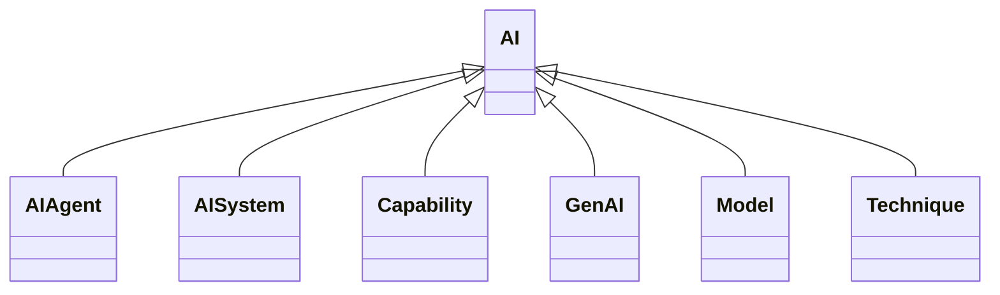

---
search:
  boost: 10.0
---

# Class: AI 


_A technical and scientific field devoted to the engineered system that_

_generates outputs such as content, forecasts, recommendations or_

_decisions for a given set of human-defined objectives_


<div data-search-exclude markdown="1">


URI: [ai:AI](https://w3id.org/lmodel/dpv/ai/AI)





## Inheritance
* **AI**
    * [AIAgent](AIAgent.md)
    * [AISystem](AISystem.md)
    * [Capability](Capability.md)
    * [GenAI](GenAI.md)
    * [Model](Model.md)
    * [Technique](Technique.md)


## Class Properties

| Property | Value |
| --- | --- |
| Class URI | [ai:AI](https://w3id.org/lmodel/dpv/ai/AI) |


## Slots

| Name | Cardinality and Range | Description | Inheritance |
| ---  | --- | --- | --- |


## In Subsets


* [AiSubset](AiSubset.md)


## Aliases


* Artificial Intelligence (AI)


## Identifier and Mapping Information


### Annotations

| property | value |
| --- | --- |
| dct_source | ISO/IEC 22989:2022 |
| upstream_iri | https://w3id.org/dpv/ai/owl#AI |
| dpv_extension_slug | ai |


### Schema Source


* from schema: https://w3id.org/lmodel/dpv/ai


## Mappings

| Mapping Type | Mapped Value |
| ---  | ---  |
| self | ai:AI |
| native | ai:AI |
| exact | dpv_ai:AI, dpv_ai_owl:AI |
| close | iso42001:AISystem |


## LinkML Source

<!-- TODO: investigate https://stackoverflow.com/questions/37606292/how-to-create-tabbed-code-blocks-in-mkdocs-or-sphinx -->

### Direct

<details>
```yaml
name: AI
annotations:
  dct_source:
    tag: dct_source
    value: ISO/IEC 22989:2022
  upstream_iri:
    tag: upstream_iri
    value: https://w3id.org/dpv/ai/owl#AI
  dpv_extension_slug:
    tag: dpv_extension_slug
    value: ai
description: 'A technical and scientific field devoted to the engineered system that

  generates outputs such as content, forecasts, recommendations or

  decisions for a given set of human-defined objectives'
in_subset:
- ai_subset
from_schema: https://w3id.org/lmodel/dpv/ai
aliases:
- Artificial Intelligence (AI)
exact_mappings:
- dpv_ai:AI
- dpv_ai_owl:AI
close_mappings:
- iso42001:AISystem
class_uri: ai:AI

```
</details>

### Induced

<details>
```yaml
name: AI
annotations:
  dct_source:
    tag: dct_source
    value: ISO/IEC 22989:2022
  upstream_iri:
    tag: upstream_iri
    value: https://w3id.org/dpv/ai/owl#AI
  dpv_extension_slug:
    tag: dpv_extension_slug
    value: ai
description: 'A technical and scientific field devoted to the engineered system that

  generates outputs such as content, forecasts, recommendations or

  decisions for a given set of human-defined objectives'
in_subset:
- ai_subset
from_schema: https://w3id.org/lmodel/dpv/ai
aliases:
- Artificial Intelligence (AI)
exact_mappings:
- dpv_ai:AI
- dpv_ai_owl:AI
close_mappings:
- iso42001:AISystem
class_uri: ai:AI

```
</details></div>