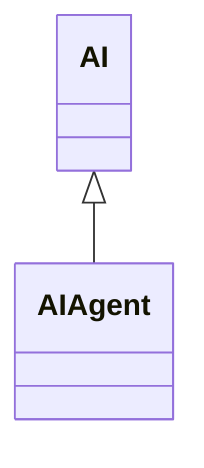

---
search:
  boost: 10.0
---

# Class: AIAgent 


_An AI Agent, also known as an 'intelligent agent', is a software agent_

_that utilises AI technologies_


<div data-search-exclude markdown="1">


URI: [ai:AIAgent](https://w3id.org/lmodel/dpv/ai/AIAgent)





## Inheritance
* [AI](AI.md)
    * **AIAgent**


## Class Properties

| Property | Value |
| --- | --- |
| Class URI | [ai:AIAgent](https://w3id.org/lmodel/dpv/ai/AIAgent) |


## Slots

| Name | Cardinality and Range | Description | Inheritance |
| ---  | --- | --- | --- |


## In Subsets


* [AiSubset](AiSubset.md)


## Aliases


* AI Agent


## Comments

* Other definitions of AI Agents may include the perception of environment
as some capacity to incorporate the environment through sensors (e.g.
computer vision) or data (e.g. web environments), and to produce changes
in outputs through some degree of autonomy (i.e. without human
intervention). The definition of 'AI Agent' provided in this extension
relaxes such requirements and instead focuses on classifying these
agents based solely on their use of AI technologies to allow
compatibility with the evolving definitions


## Identifier and Mapping Information


### Annotations

| property | value |
| --- | --- |
| upstream_iri | https://w3id.org/dpv/ai/owl#AIAgent |
| dpv_extension_slug | ai |


### Schema Source


* from schema: https://w3id.org/lmodel/dpv/ai


## Mappings

| Mapping Type | Mapped Value |
| ---  | ---  |
| self | ai:AIAgent |
| native | ai:AIAgent |
| exact | dpv_ai:AIAgent, dpv_ai_owl:AIAgent |
| close | iso42001:AISystem |


## LinkML Source

<!-- TODO: investigate https://stackoverflow.com/questions/37606292/how-to-create-tabbed-code-blocks-in-mkdocs-or-sphinx -->

### Direct

<details>
```yaml
name: AIAgent
annotations:
  upstream_iri:
    tag: upstream_iri
    value: https://w3id.org/dpv/ai/owl#AIAgent
  dpv_extension_slug:
    tag: dpv_extension_slug
    value: ai
description: 'An AI Agent, also known as an ''intelligent agent'', is a software agent

  that utilises AI technologies'
comments:
- 'Other definitions of AI Agents may include the perception of environment

  as some capacity to incorporate the environment through sensors (e.g.

  computer vision) or data (e.g. web environments), and to produce changes

  in outputs through some degree of autonomy (i.e. without human

  intervention). The definition of ''AI Agent'' provided in this extension

  relaxes such requirements and instead focuses on classifying these

  agents based solely on their use of AI technologies to allow

  compatibility with the evolving definitions'
in_subset:
- ai_subset
from_schema: https://w3id.org/lmodel/dpv/ai
aliases:
- AI Agent
exact_mappings:
- dpv_ai:AIAgent
- dpv_ai_owl:AIAgent
close_mappings:
- iso42001:AISystem
is_a: AI
class_uri: ai:AIAgent

```
</details>

### Induced

<details>
```yaml
name: AIAgent
annotations:
  upstream_iri:
    tag: upstream_iri
    value: https://w3id.org/dpv/ai/owl#AIAgent
  dpv_extension_slug:
    tag: dpv_extension_slug
    value: ai
description: 'An AI Agent, also known as an ''intelligent agent'', is a software agent

  that utilises AI technologies'
comments:
- 'Other definitions of AI Agents may include the perception of environment

  as some capacity to incorporate the environment through sensors (e.g.

  computer vision) or data (e.g. web environments), and to produce changes

  in outputs through some degree of autonomy (i.e. without human

  intervention). The definition of ''AI Agent'' provided in this extension

  relaxes such requirements and instead focuses on classifying these

  agents based solely on their use of AI technologies to allow

  compatibility with the evolving definitions'
in_subset:
- ai_subset
from_schema: https://w3id.org/lmodel/dpv/ai
aliases:
- AI Agent
exact_mappings:
- dpv_ai:AIAgent
- dpv_ai_owl:AIAgent
close_mappings:
- iso42001:AISystem
is_a: AI
class_uri: ai:AIAgent

```
</details></div>