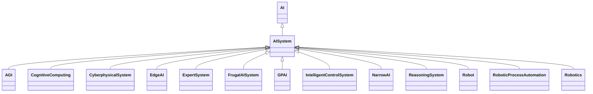

---
search:
  boost: 10.0
---

# Class: AISystem 


_An engineered system that generates outputs such as content, forecasts,_

_recommendations or decisions for a given set of human-defined objectives_

_(ISO/IEC 22989:2022 definition); or A machine-based system that, for_

_explicit or implicit objectives, infers, from the input it receives, how_

_to generate outputs such as predictions, content, recommendations, or_

_decisions that can influence physical or virtual environments. Different_

_AI systems vary in their levels of autonomy and adaptiveness after_

_deployment (OECD 2024 definition); or A machine-based system_

_demonstrating varying degrees of autonomy and adaptiveness after_

_deployment, generating outputs such as predictions, content,_

_recommendations, or decisions to influence physical or virtual_

_environments (EU Vocabularies' AI Taxonomy definition)_


<div data-search-exclude markdown="1">


URI: [ai:AISystem](https://w3id.org/lmodel/dpv/ai/AISystem)





## Inheritance
* [AI](AI.md)
    * **AISystem**
        * [AGI](AGI.md)
        * [CognitiveComputing](CognitiveComputing.md)
        * [CyberphysicalSystem](CyberphysicalSystem.md)
        * [EdgeAI](EdgeAI.md)
        * [ExpertSystem](ExpertSystem.md)
        * [FrugalAISystem](FrugalAISystem.md)
        * [GPAI](GPAI.md)
        * [IntelligentControlSystem](IntelligentControlSystem.md)
        * [NarrowAI](NarrowAI.md)
        * [ReasoningSystem](ReasoningSystem.md)
        * [Robot](Robot.md)
        * [RoboticProcessAutomation](RoboticProcessAutomation.md)
        * [Robotics](Robotics.md)


## Class Properties

| Property | Value |
| --- | --- |
| Class URI | [ai:AISystem](https://w3id.org/lmodel/dpv/ai/AISystem) |


## Slots

| Name | Cardinality and Range | Description | Inheritance |
| ---  | --- | --- | --- |


## In Subsets


* [AiSubset](AiSubset.md)


## Aliases


* AI System


## Identifier and Mapping Information


### Annotations

| property | value |
| --- | --- |
| dct_source |  ISO/IEC 22989:2022 |
| upstream_iri | https://w3id.org/dpv/ai/owl#AISystem |
| dpv_extension_slug | ai |


### Schema Source


* from schema: https://w3id.org/lmodel/dpv/ai


## Mappings

| Mapping Type | Mapped Value |
| ---  | ---  |
| self | ai:AISystem |
| native | ai:AISystem |
| exact | dpv_ai:AISystem, dpv_ai_owl:AISystem, iso42001:AISystem |


## LinkML Source

<!-- TODO: investigate https://stackoverflow.com/questions/37606292/how-to-create-tabbed-code-blocks-in-mkdocs-or-sphinx -->

### Direct

<details>
```yaml
name: AISystem
annotations:
  dct_source:
    tag: dct_source
    value: ' ISO/IEC 22989:2022'
  upstream_iri:
    tag: upstream_iri
    value: https://w3id.org/dpv/ai/owl#AISystem
  dpv_extension_slug:
    tag: dpv_extension_slug
    value: ai
description: 'An engineered system that generates outputs such as content, forecasts,

  recommendations or decisions for a given set of human-defined objectives

  (ISO/IEC 22989:2022 definition); or A machine-based system that, for

  explicit or implicit objectives, infers, from the input it receives, how

  to generate outputs such as predictions, content, recommendations, or

  decisions that can influence physical or virtual environments. Different

  AI systems vary in their levels of autonomy and adaptiveness after

  deployment (OECD 2024 definition); or A machine-based system

  demonstrating varying degrees of autonomy and adaptiveness after

  deployment, generating outputs such as predictions, content,

  recommendations, or decisions to influence physical or virtual

  environments (EU Vocabularies'' AI Taxonomy definition)'
in_subset:
- ai_subset
from_schema: https://w3id.org/lmodel/dpv/ai
aliases:
- AI System
exact_mappings:
- dpv_ai:AISystem
- dpv_ai_owl:AISystem
- iso42001:AISystem
is_a: AI
class_uri: ai:AISystem

```
</details>

### Induced

<details>
```yaml
name: AISystem
annotations:
  dct_source:
    tag: dct_source
    value: ' ISO/IEC 22989:2022'
  upstream_iri:
    tag: upstream_iri
    value: https://w3id.org/dpv/ai/owl#AISystem
  dpv_extension_slug:
    tag: dpv_extension_slug
    value: ai
description: 'An engineered system that generates outputs such as content, forecasts,

  recommendations or decisions for a given set of human-defined objectives

  (ISO/IEC 22989:2022 definition); or A machine-based system that, for

  explicit or implicit objectives, infers, from the input it receives, how

  to generate outputs such as predictions, content, recommendations, or

  decisions that can influence physical or virtual environments. Different

  AI systems vary in their levels of autonomy and adaptiveness after

  deployment (OECD 2024 definition); or A machine-based system

  demonstrating varying degrees of autonomy and adaptiveness after

  deployment, generating outputs such as predictions, content,

  recommendations, or decisions to influence physical or virtual

  environments (EU Vocabularies'' AI Taxonomy definition)'
in_subset:
- ai_subset
from_schema: https://w3id.org/lmodel/dpv/ai
aliases:
- AI System
exact_mappings:
- dpv_ai:AISystem
- dpv_ai_owl:AISystem
- iso42001:AISystem
is_a: AI
class_uri: ai:AISystem

```
</details></div>