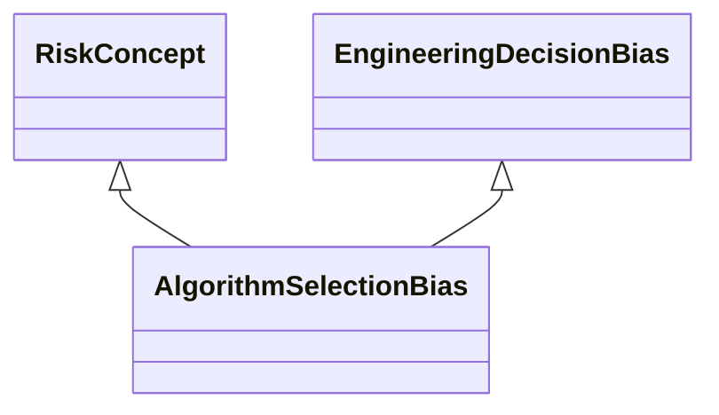

---
search:
  boost: 10.0
---

# Class: AlgorithmSelectionBias 


_Bias that occurs from the selection of machine learning algorithms built_

_into the AI system which introduce unwanted bias in predictions made by_

_the system because the type of algorithm used introduces a variation in_

_the performance of the ML model_


<div data-search-exclude markdown="1">


URI: [ai:AlgorithmSelectionBias](https://w3id.org/lmodel/dpv/ai/AlgorithmSelectionBias)





## Inheritance
* [RiskConcept](RiskConcept.md)
    * [AIBias](AIBias.md)
        * [EngineeringDecisionBias](EngineeringDecisionBias.md) [ [RiskConcept](RiskConcept.md)]
            * **AlgorithmSelectionBias** [ [RiskConcept](RiskConcept.md)]


## Class Properties

| Property | Value |
| --- | --- |
| Class URI | [ai:AlgorithmSelectionBias](https://w3id.org/lmodel/dpv/ai/AlgorithmSelectionBias) |


## Slots

| Name | Cardinality and Range | Description | Inheritance |
| ---  | --- | --- | --- |


## In Subsets


* [AiSubset](AiSubset.md)


## Aliases


* Algorithm Selection Bias


## Identifier and Mapping Information


### Annotations

| property | value |
| --- | --- |
| dct_source | ISO/IEC 24027:2021 |
| upstream_iri | https://w3id.org/dpv/ai/owl#AlgorithmSelectionBias |
| dpv_extension_slug | ai |


### Schema Source


* from schema: https://w3id.org/lmodel/dpv/ai


## Mappings

| Mapping Type | Mapped Value |
| ---  | ---  |
| self | ai:AlgorithmSelectionBias |
| native | ai:AlgorithmSelectionBias |
| exact | dpv_ai:AlgorithmSelectionBias, dpv_ai_owl:AlgorithmSelectionBias |


## LinkML Source

<!-- TODO: investigate https://stackoverflow.com/questions/37606292/how-to-create-tabbed-code-blocks-in-mkdocs-or-sphinx -->

### Direct

<details>
```yaml
name: AlgorithmSelectionBias
annotations:
  dct_source:
    tag: dct_source
    value: ISO/IEC 24027:2021
  upstream_iri:
    tag: upstream_iri
    value: https://w3id.org/dpv/ai/owl#AlgorithmSelectionBias
  dpv_extension_slug:
    tag: dpv_extension_slug
    value: ai
description: 'Bias that occurs from the selection of machine learning algorithms built

  into the AI system which introduce unwanted bias in predictions made by

  the system because the type of algorithm used introduces a variation in

  the performance of the ML model'
in_subset:
- ai_subset
from_schema: https://w3id.org/lmodel/dpv/ai
aliases:
- Algorithm Selection Bias
exact_mappings:
- dpv_ai:AlgorithmSelectionBias
- dpv_ai_owl:AlgorithmSelectionBias
is_a: EngineeringDecisionBias
mixins:
- RiskConcept
class_uri: ai:AlgorithmSelectionBias

```
</details>

### Induced

<details>
```yaml
name: AlgorithmSelectionBias
annotations:
  dct_source:
    tag: dct_source
    value: ISO/IEC 24027:2021
  upstream_iri:
    tag: upstream_iri
    value: https://w3id.org/dpv/ai/owl#AlgorithmSelectionBias
  dpv_extension_slug:
    tag: dpv_extension_slug
    value: ai
description: 'Bias that occurs from the selection of machine learning algorithms built

  into the AI system which introduce unwanted bias in predictions made by

  the system because the type of algorithm used introduces a variation in

  the performance of the ML model'
in_subset:
- ai_subset
from_schema: https://w3id.org/lmodel/dpv/ai
aliases:
- Algorithm Selection Bias
exact_mappings:
- dpv_ai:AlgorithmSelectionBias
- dpv_ai_owl:AlgorithmSelectionBias
is_a: EngineeringDecisionBias
mixins:
- RiskConcept
class_uri: ai:AlgorithmSelectionBias

```
</details></div>