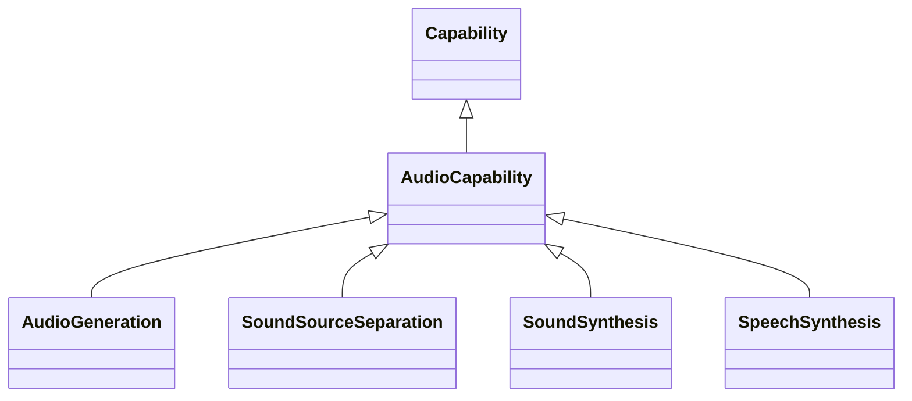

---
search:
  boost: 10.0
---

# Class: AudioCapability 


_Capabilities related to the processing and generation of audio_


<div data-search-exclude markdown="1">


URI: [ai:AudioCapability](https://w3id.org/lmodel/dpv/ai/AudioCapability)





## Inheritance
* [AI](AI.md)
    * [Capability](Capability.md)
        * **AudioCapability**
            * [AudioGeneration](AudioGeneration.md) [ [Capability](Capability.md) [ContentGeneration](ContentGeneration.md)]
            * [SoundSourceSeparation](SoundSourceSeparation.md) [ [Capability](Capability.md)]
            * [SoundSynthesis](SoundSynthesis.md) [ [Capability](Capability.md) [ContentGeneration](ContentGeneration.md)]
            * [SpeechSynthesis](SpeechSynthesis.md) [ [Capability](Capability.md) [ContentGeneration](ContentGeneration.md)]


## Class Properties

| Property | Value |
| --- | --- |
| Class URI | [ai:AudioCapability](https://w3id.org/lmodel/dpv/ai/AudioCapability) |


## Slots

| Name | Cardinality and Range | Description | Inheritance |
| ---  | --- | --- | --- |


## In Subsets


* [AiSubset](AiSubset.md)


## Aliases


* Audio Capability


## Identifier and Mapping Information


### Annotations

| property | value |
| --- | --- |
| upstream_iri | https://w3id.org/dpv/ai/owl#AudioCapability |
| dpv_extension_slug | ai |


### Schema Source


* from schema: https://w3id.org/lmodel/dpv/ai


## Mappings

| Mapping Type | Mapped Value |
| ---  | ---  |
| self | ai:AudioCapability |
| native | ai:AudioCapability |
| exact | dpv_ai:AudioCapability, dpv_ai_owl:AudioCapability |


## LinkML Source

<!-- TODO: investigate https://stackoverflow.com/questions/37606292/how-to-create-tabbed-code-blocks-in-mkdocs-or-sphinx -->

### Direct

<details>
```yaml
name: AudioCapability
annotations:
  upstream_iri:
    tag: upstream_iri
    value: https://w3id.org/dpv/ai/owl#AudioCapability
  dpv_extension_slug:
    tag: dpv_extension_slug
    value: ai
description: Capabilities related to the processing and generation of audio
in_subset:
- ai_subset
from_schema: https://w3id.org/lmodel/dpv/ai
aliases:
- Audio Capability
exact_mappings:
- dpv_ai:AudioCapability
- dpv_ai_owl:AudioCapability
is_a: Capability
class_uri: ai:AudioCapability

```
</details>

### Induced

<details>
```yaml
name: AudioCapability
annotations:
  upstream_iri:
    tag: upstream_iri
    value: https://w3id.org/dpv/ai/owl#AudioCapability
  dpv_extension_slug:
    tag: dpv_extension_slug
    value: ai
description: Capabilities related to the processing and generation of audio
in_subset:
- ai_subset
from_schema: https://w3id.org/lmodel/dpv/ai
aliases:
- Audio Capability
exact_mappings:
- dpv_ai:AudioCapability
- dpv_ai_owl:AudioCapability
is_a: Capability
class_uri: ai:AudioCapability

```
</details></div>