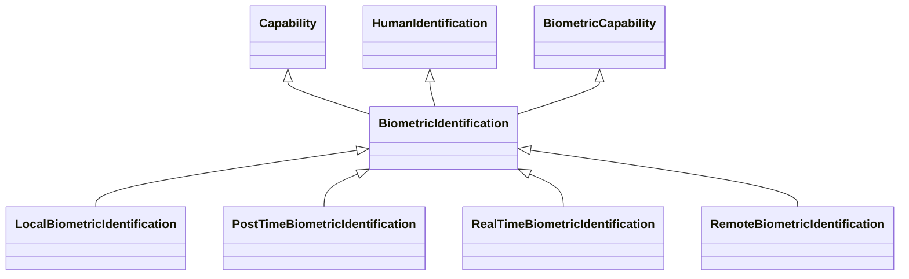

---
search:
  boost: 10.0
---

# Class: BiometricIdentification 


_Capability involving automated recognition of physical, physiological_

_and behavioural human features such as the face, eye movement, body_

_shape, voice, prosody, gait, posture, heart rate, blood pressure, odour,_

_keystrokes characteristics, for the purpose of establishing an_

_individual’s identity by comparing biometric data of that individual to_

_stored biometric data of individuals in a reference database,_

_irrespective of whether the individual has given its consent or not_


<div data-search-exclude markdown="1">


URI: [ai:BiometricIdentification](https://w3id.org/lmodel/dpv/ai/BiometricIdentification)





## Inheritance
* [AI](AI.md)
    * [Capability](Capability.md)
        * [HumanOrientedCapability](HumanOrientedCapability.md)
            * [BiometricCapability](BiometricCapability.md) [ [Capability](Capability.md)]
                * **BiometricIdentification** [ [Capability](Capability.md) [HumanIdentification](HumanIdentification.md)]
                    * [LocalBiometricIdentification](LocalBiometricIdentification.md) [ [Capability](Capability.md)]
                    * [PostTimeBiometricIdentification](PostTimeBiometricIdentification.md) [ [Capability](Capability.md)]
                    * [RealTimeBiometricIdentification](RealTimeBiometricIdentification.md) [ [Capability](Capability.md)]
                    * [RemoteBiometricIdentification](RemoteBiometricIdentification.md) [ [Capability](Capability.md)]


## Class Properties

| Property | Value |
| --- | --- |
| Class URI | [ai:BiometricIdentification](https://w3id.org/lmodel/dpv/ai/BiometricIdentification) |


## Slots

| Name | Cardinality and Range | Description | Inheritance |
| ---  | --- | --- | --- |


## In Subsets


* [AiSubset](AiSubset.md)


## Aliases


* Biometric Identification


## Identifier and Mapping Information


### Annotations

| property | value |
| --- | --- |
| upstream_iri | https://w3id.org/dpv/ai/owl#BiometricIdentification |
| dpv_extension_slug | ai |


### Schema Source


* from schema: https://w3id.org/lmodel/dpv/ai


## Mappings

| Mapping Type | Mapped Value |
| ---  | ---  |
| self | ai:BiometricIdentification |
| native | ai:BiometricIdentification |
| exact | dpv_ai:BiometricIdentification, dpv_ai_owl:BiometricIdentification |


## LinkML Source

<!-- TODO: investigate https://stackoverflow.com/questions/37606292/how-to-create-tabbed-code-blocks-in-mkdocs-or-sphinx -->

### Direct

<details>
```yaml
name: BiometricIdentification
annotations:
  upstream_iri:
    tag: upstream_iri
    value: https://w3id.org/dpv/ai/owl#BiometricIdentification
  dpv_extension_slug:
    tag: dpv_extension_slug
    value: ai
description: 'Capability involving automated recognition of physical, physiological

  and behavioural human features such as the face, eye movement, body

  shape, voice, prosody, gait, posture, heart rate, blood pressure, odour,

  keystrokes characteristics, for the purpose of establishing an

  individual’s identity by comparing biometric data of that individual to

  stored biometric data of individuals in a reference database,

  irrespective of whether the individual has given its consent or not'
in_subset:
- ai_subset
from_schema: https://w3id.org/lmodel/dpv/ai
aliases:
- Biometric Identification
exact_mappings:
- dpv_ai:BiometricIdentification
- dpv_ai_owl:BiometricIdentification
is_a: BiometricCapability
mixins:
- Capability
- HumanIdentification
class_uri: ai:BiometricIdentification

```
</details>

### Induced

<details>
```yaml
name: BiometricIdentification
annotations:
  upstream_iri:
    tag: upstream_iri
    value: https://w3id.org/dpv/ai/owl#BiometricIdentification
  dpv_extension_slug:
    tag: dpv_extension_slug
    value: ai
description: 'Capability involving automated recognition of physical, physiological

  and behavioural human features such as the face, eye movement, body

  shape, voice, prosody, gait, posture, heart rate, blood pressure, odour,

  keystrokes characteristics, for the purpose of establishing an

  individual’s identity by comparing biometric data of that individual to

  stored biometric data of individuals in a reference database,

  irrespective of whether the individual has given its consent or not'
in_subset:
- ai_subset
from_schema: https://w3id.org/lmodel/dpv/ai
aliases:
- Biometric Identification
exact_mappings:
- dpv_ai:BiometricIdentification
- dpv_ai_owl:BiometricIdentification
is_a: BiometricCapability
mixins:
- Capability
- HumanIdentification
class_uri: ai:BiometricIdentification

```
</details></div>