---
search:
  boost: 10.0
---

# Class: Capability 


_Capability or use of AI to achieve a technical goal or objective_


<div data-search-exclude markdown="1">


URI: [ai:Capability](https://w3id.org/lmodel/dpv/ai/Capability)

```mermaid
 classDiagram
    class Capability
    click Capability href "../Capability/"
      AI <|-- Capability
        click AI href "../AI/"
      

      Capability <|-- ActionRecognition
        click ActionRecognition href "../ActionRecognition/"
      Capability <|-- AudioCapability
        click AudioCapability href "../AudioCapability/"
      Capability <|-- AudioGeneration
        click AudioGeneration href "../AudioGeneration/"
      Capability <|-- AutomaticSummarisation
        click AutomaticSummarisation href "../AutomaticSummarisation/"
      Capability <|-- BehaviourAnalysis
        click BehaviourAnalysis href "../BehaviourAnalysis/"
      Capability <|-- BiometricCapability
        click BiometricCapability href "../BiometricCapability/"
      Capability <|-- BiometricCategorisation
        click BiometricCategorisation href "../BiometricCategorisation/"
      Capability <|-- BiometricEmotionRecognition
        click BiometricEmotionRecognition href "../BiometricEmotionRecognition/"
      Capability <|-- BiometricIdentification
        click BiometricIdentification href "../BiometricIdentification/"
      Capability <|-- ChatbotCapability
        click ChatbotCapability href "../ChatbotCapability/"
      Capability <|-- ComputationalCreativity
        click ComputationalCreativity href "../ComputationalCreativity/"
      Capability <|-- ComputerVision
        click ComputerVision href "../ComputerVision/"
      Capability <|-- ContentBasedRetrieval
        click ContentBasedRetrieval href "../ContentBasedRetrieval/"
      Capability <|-- ContentGeneration
        click ContentGeneration href "../ContentGeneration/"
      Capability <|-- ContextAwareRetrieval
        click ContextAwareRetrieval href "../ContextAwareRetrieval/"
      Capability <|-- DialogueManagement
        click DialogueManagement href "../DialogueManagement/"
      Capability <|-- EmotionRecognition
        click EmotionRecognition href "../EmotionRecognition/"
      Capability <|-- FaceRecognition
        click FaceRecognition href "../FaceRecognition/"
      Capability <|-- GestureRecognition
        click GestureRecognition href "../GestureRecognition/"
      Capability <|-- HumanIdentification
        click HumanIdentification href "../HumanIdentification/"
      Capability <|-- HumanOrientedCapability
        click HumanOrientedCapability href "../HumanOrientedCapability/"
      Capability <|-- ImageClassification
        click ImageClassification href "../ImageClassification/"
      Capability <|-- ImageGeneration
        click ImageGeneration href "../ImageGeneration/"
      Capability <|-- ImageRecognition
        click ImageRecognition href "../ImageRecognition/"
      Capability <|-- InformationRetrieval
        click InformationRetrieval href "../InformationRetrieval/"
      Capability <|-- LanguageCapability
        click LanguageCapability href "../LanguageCapability/"
      Capability <|-- LieDetection
        click LieDetection href "../LieDetection/"
      Capability <|-- LocalBiometricIdentification
        click LocalBiometricIdentification href "../LocalBiometricIdentification/"
      Capability <|-- MachineTranslation
        click MachineTranslation href "../MachineTranslation/"
      Capability <|-- MotionAnalysis
        click MotionAnalysis href "../MotionAnalysis/"
      Capability <|-- MultiModalRetrieval
        click MultiModalRetrieval href "../MultiModalRetrieval/"
      Capability <|-- MusicInformationRetrieval
        click MusicInformationRetrieval href "../MusicInformationRetrieval/"
      Capability <|-- NamedEntityRecognition
        click NamedEntityRecognition href "../NamedEntityRecognition/"
      Capability <|-- NaturalLanguageGeneration
        click NaturalLanguageGeneration href "../NaturalLanguageGeneration/"
      Capability <|-- NaturalLanguageProcessing
        click NaturalLanguageProcessing href "../NaturalLanguageProcessing/"
      Capability <|-- ObjectDetection
        click ObjectDetection href "../ObjectDetection/"
      Capability <|-- ObjectRecognition
        click ObjectRecognition href "../ObjectRecognition/"
      Capability <|-- PartOfSpeechTagging
        click PartOfSpeechTagging href "../PartOfSpeechTagging/"
      Capability <|-- PatternRecognition
        click PatternRecognition href "../PatternRecognition/"
      Capability <|-- PerceptionBasedAI
        click PerceptionBasedAI href "../PerceptionBasedAI/"
      Capability <|-- PersonalityTraitAnalysis
        click PersonalityTraitAnalysis href "../PersonalityTraitAnalysis/"
      Capability <|-- PostTimeBiometricIdentification
        click PostTimeBiometricIdentification href "../PostTimeBiometricIdentification/"
      Capability <|-- Profiling
        click Profiling href "../Profiling/"
      Capability <|-- QuestionAnswering
        click QuestionAnswering href "../QuestionAnswering/"
      Capability <|-- RealTimeBiometricIdentification
        click RealTimeBiometricIdentification href "../RealTimeBiometricIdentification/"
      Capability <|-- RelationshipExtraction
        click RelationshipExtraction href "../RelationshipExtraction/"
      Capability <|-- RemoteBiometricIdentification
        click RemoteBiometricIdentification href "../RemoteBiometricIdentification/"
      Capability <|-- RemoteSensing
        click RemoteSensing href "../RemoteSensing/"
      Capability <|-- SentimentAnalysis
        click SentimentAnalysis href "../SentimentAnalysis/"
      Capability <|-- SoundSourceSeparation
        click SoundSourceSeparation href "../SoundSourceSeparation/"
      Capability <|-- SoundSynthesis
        click SoundSynthesis href "../SoundSynthesis/"
      Capability <|-- SpeakerRecognition
        click SpeakerRecognition href "../SpeakerRecognition/"
      Capability <|-- SpeechRecognition
        click SpeechRecognition href "../SpeechRecognition/"
      Capability <|-- SpeechSynthesis
        click SpeechSynthesis href "../SpeechSynthesis/"
      Capability <|-- TextClassification
        click TextClassification href "../TextClassification/"
      Capability <|-- TextDataMining
        click TextDataMining href "../TextDataMining/"
      Capability <|-- VideoGeneration
        click VideoGeneration href "../VideoGeneration/"
      Capability <|-- VisualRecognition
        click VisualRecognition href "../VisualRecognition/"
      

      
```





## Inheritance
* [AI](AI.md)
    * **Capability**
        * [AudioCapability](AudioCapability.md)
        * [ComputerVision](ComputerVision.md)
        * [ContentGeneration](ContentGeneration.md)
        * [HumanOrientedCapability](HumanOrientedCapability.md)
        * [InformationRetrieval](InformationRetrieval.md)
        * [LanguageCapability](LanguageCapability.md)


## Class Properties

| Property | Value |
| --- | --- |
| Class URI | [ai:Capability](https://w3id.org/lmodel/dpv/ai/Capability) |


## Slots

| Name | Cardinality and Range | Description | Inheritance |
| ---  | --- | --- | --- |


## In Subsets


* [AiSubset](AiSubset.md)


## Aliases


* Capability


## Comments

* This concept refers to the application of an AI technique to achieve a
technical goal or function, and is necessary to distinguish the
'algorithm' (ai:Technique) from the 'application' (ai:Capability) and
'goal' (dpv:Purpose)


## Identifier and Mapping Information


### Annotations

| property | value |
| --- | --- |
| upstream_iri | https://w3id.org/dpv/ai/owl#Capability |
| dpv_extension_slug | ai |


### Schema Source


* from schema: https://w3id.org/lmodel/dpv/ai


## Mappings

| Mapping Type | Mapped Value |
| ---  | ---  |
| self | ai:Capability |
| native | ai:Capability |
| exact | dpv_ai:Capability, dpv_ai_owl:Capability |


## LinkML Source

<!-- TODO: investigate https://stackoverflow.com/questions/37606292/how-to-create-tabbed-code-blocks-in-mkdocs-or-sphinx -->

### Direct

<details>
```yaml
name: Capability
annotations:
  upstream_iri:
    tag: upstream_iri
    value: https://w3id.org/dpv/ai/owl#Capability
  dpv_extension_slug:
    tag: dpv_extension_slug
    value: ai
description: Capability or use of AI to achieve a technical goal or objective
comments:
- 'This concept refers to the application of an AI technique to achieve a

  technical goal or function, and is necessary to distinguish the

  ''algorithm'' (ai:Technique) from the ''application'' (ai:Capability) and

  ''goal'' (dpv:Purpose)'
in_subset:
- ai_subset
from_schema: https://w3id.org/lmodel/dpv/ai
aliases:
- Capability
exact_mappings:
- dpv_ai:Capability
- dpv_ai_owl:Capability
is_a: AI
class_uri: ai:Capability

```
</details>

### Induced

<details>
```yaml
name: Capability
annotations:
  upstream_iri:
    tag: upstream_iri
    value: https://w3id.org/dpv/ai/owl#Capability
  dpv_extension_slug:
    tag: dpv_extension_slug
    value: ai
description: Capability or use of AI to achieve a technical goal or objective
comments:
- 'This concept refers to the application of an AI technique to achieve a

  technical goal or function, and is necessary to distinguish the

  ''algorithm'' (ai:Technique) from the ''application'' (ai:Capability) and

  ''goal'' (dpv:Purpose)'
in_subset:
- ai_subset
from_schema: https://w3id.org/lmodel/dpv/ai
aliases:
- Capability
exact_mappings:
- dpv_ai:Capability
- dpv_ai_owl:Capability
is_a: AI
class_uri: ai:Capability

```
</details></div>