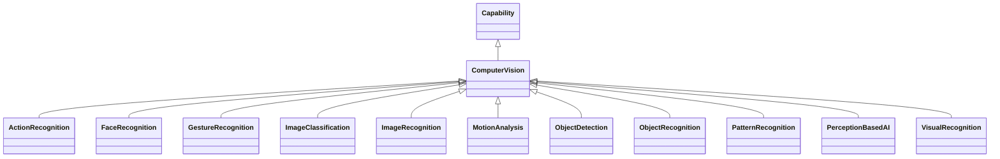

---
search:
  boost: 10.0
---

# Class: ComputerVision 


_Capability of a functional unit to acquire, process and interpret data_

_representing images or video_


<div data-search-exclude markdown="1">


URI: [ai:ComputerVision](https://w3id.org/lmodel/dpv/ai/ComputerVision)





## Inheritance
* [AI](AI.md)
    * [Capability](Capability.md)
        * **ComputerVision**
            * [ImageClassification](ImageClassification.md) [ [Capability](Capability.md)]
            * [ImageRecognition](ImageRecognition.md) [ [Capability](Capability.md)]
            * [MotionAnalysis](MotionAnalysis.md) [ [Capability](Capability.md)]
            * [ObjectDetection](ObjectDetection.md) [ [Capability](Capability.md)]
            * [ObjectRecognition](ObjectRecognition.md) [ [Capability](Capability.md)]
            * [PatternRecognition](PatternRecognition.md) [ [Capability](Capability.md)]
            * [PerceptionBasedAI](PerceptionBasedAI.md) [ [Capability](Capability.md)]
            * [VisualRecognition](VisualRecognition.md) [ [Capability](Capability.md)]


## Class Properties

| Property | Value |
| --- | --- |
| Class URI | [ai:ComputerVision](https://w3id.org/lmodel/dpv/ai/ComputerVision) |


## Slots

| Name | Cardinality and Range | Description | Inheritance |
| ---  | --- | --- | --- |


## In Subsets


* [AiSubset](AiSubset.md)


## Aliases


* Computer Vision


## Identifier and Mapping Information


### Annotations

| property | value |
| --- | --- |
| dct_source | ISO/IEC 22989:2022 3.7.1 |
| upstream_iri | https://w3id.org/dpv/ai/owl#ComputerVision |
| dpv_extension_slug | ai |


### Schema Source


* from schema: https://w3id.org/lmodel/dpv/ai


## Mappings

| Mapping Type | Mapped Value |
| ---  | ---  |
| self | ai:ComputerVision |
| native | ai:ComputerVision |
| exact | dpv_ai:ComputerVision, dpv_ai_owl:ComputerVision |


## LinkML Source

<!-- TODO: investigate https://stackoverflow.com/questions/37606292/how-to-create-tabbed-code-blocks-in-mkdocs-or-sphinx -->

### Direct

<details>
```yaml
name: ComputerVision
annotations:
  dct_source:
    tag: dct_source
    value: ISO/IEC 22989:2022 3.7.1
  upstream_iri:
    tag: upstream_iri
    value: https://w3id.org/dpv/ai/owl#ComputerVision
  dpv_extension_slug:
    tag: dpv_extension_slug
    value: ai
description: 'Capability of a functional unit to acquire, process and interpret data

  representing images or video'
in_subset:
- ai_subset
from_schema: https://w3id.org/lmodel/dpv/ai
aliases:
- Computer Vision
exact_mappings:
- dpv_ai:ComputerVision
- dpv_ai_owl:ComputerVision
is_a: Capability
class_uri: ai:ComputerVision

```
</details>

### Induced

<details>
```yaml
name: ComputerVision
annotations:
  dct_source:
    tag: dct_source
    value: ISO/IEC 22989:2022 3.7.1
  upstream_iri:
    tag: upstream_iri
    value: https://w3id.org/dpv/ai/owl#ComputerVision
  dpv_extension_slug:
    tag: dpv_extension_slug
    value: ai
description: 'Capability of a functional unit to acquire, process and interpret data

  representing images or video'
in_subset:
- ai_subset
from_schema: https://w3id.org/lmodel/dpv/ai
aliases:
- Computer Vision
exact_mappings:
- dpv_ai:ComputerVision
- dpv_ai_owl:ComputerVision
is_a: Capability
class_uri: ai:ComputerVision

```
</details></div>