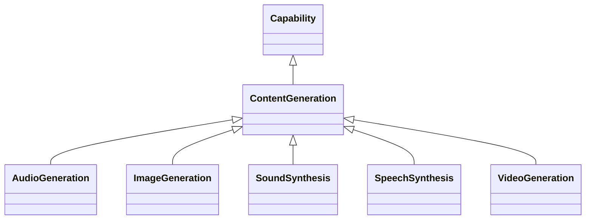

---
search:
  boost: 10.0
---

# Class: ContentGeneration 


_Capability to generate new content that is distinct from merely deriving_

_or transforming existing content_


<div data-search-exclude markdown="1">


URI: [ai:ContentGeneration](https://w3id.org/lmodel/dpv/ai/ContentGeneration)





## Inheritance
* [AI](AI.md)
    * [Capability](Capability.md)
        * **ContentGeneration**
            * [ImageGeneration](ImageGeneration.md) [ [Capability](Capability.md)]
            * [VideoGeneration](VideoGeneration.md) [ [Capability](Capability.md)]


## Class Properties

| Property | Value |
| --- | --- |
| Class URI | [ai:ContentGeneration](https://w3id.org/lmodel/dpv/ai/ContentGeneration) |


## Slots

| Name | Cardinality and Range | Description | Inheritance |
| ---  | --- | --- | --- |


## In Subsets


* [AiSubset](AiSubset.md)


## Aliases


* Content Generation


## Identifier and Mapping Information


### Annotations

| property | value |
| --- | --- |
| upstream_iri | https://w3id.org/dpv/ai/owl#ContentGeneration |
| dpv_extension_slug | ai |


### Schema Source


* from schema: https://w3id.org/lmodel/dpv/ai


## Mappings

| Mapping Type | Mapped Value |
| ---  | ---  |
| self | ai:ContentGeneration |
| native | ai:ContentGeneration |
| exact | dpv_ai:ContentGeneration, dpv_ai_owl:ContentGeneration |


## LinkML Source

<!-- TODO: investigate https://stackoverflow.com/questions/37606292/how-to-create-tabbed-code-blocks-in-mkdocs-or-sphinx -->

### Direct

<details>
```yaml
name: ContentGeneration
annotations:
  upstream_iri:
    tag: upstream_iri
    value: https://w3id.org/dpv/ai/owl#ContentGeneration
  dpv_extension_slug:
    tag: dpv_extension_slug
    value: ai
description: 'Capability to generate new content that is distinct from merely deriving

  or transforming existing content'
in_subset:
- ai_subset
from_schema: https://w3id.org/lmodel/dpv/ai
aliases:
- Content Generation
exact_mappings:
- dpv_ai:ContentGeneration
- dpv_ai_owl:ContentGeneration
is_a: Capability
class_uri: ai:ContentGeneration

```
</details>

### Induced

<details>
```yaml
name: ContentGeneration
annotations:
  upstream_iri:
    tag: upstream_iri
    value: https://w3id.org/dpv/ai/owl#ContentGeneration
  dpv_extension_slug:
    tag: dpv_extension_slug
    value: ai
description: 'Capability to generate new content that is distinct from merely deriving

  or transforming existing content'
in_subset:
- ai_subset
from_schema: https://w3id.org/lmodel/dpv/ai
aliases:
- Content Generation
exact_mappings:
- dpv_ai:ContentGeneration
- dpv_ai_owl:ContentGeneration
is_a: Capability
class_uri: ai:ContentGeneration

```
</details></div>