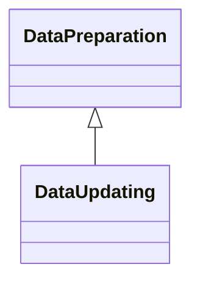

---
search:
  boost: 10.0
---

# Class: DataUpdating 


_Processing operation where data is updated, e.g. by adding the latest_

_records_


<div data-search-exclude markdown="1">


URI: [ai:DataUpdating](https://w3id.org/lmodel/dpv/ai/DataUpdating)





## Inheritance
* [DataOperation](DataOperation.md)
    * [DataPreparation](DataPreparation.md)
        * **DataUpdating**


## Class Properties

| Property | Value |
| --- | --- |
| Class URI | [ai:DataUpdating](https://w3id.org/lmodel/dpv/ai/DataUpdating) |


## Slots

| Name | Cardinality and Range | Description | Inheritance |
| ---  | --- | --- | --- |


## In Subsets


* [AiSubset](AiSubset.md)


## Aliases


* Data Updating


## Identifier and Mapping Information


### Annotations

| property | value |
| --- | --- |
| upstream_iri | https://w3id.org/dpv/ai/owl#DataUpdating |
| dpv_extension_slug | ai |


### Schema Source


* from schema: https://w3id.org/lmodel/dpv/ai


## Mappings

| Mapping Type | Mapped Value |
| ---  | ---  |
| self | ai:DataUpdating |
| native | ai:DataUpdating |
| exact | dpv_ai:DataUpdating, dpv_ai_owl:DataUpdating |
| close | iso42001:DataResource |


## LinkML Source

<!-- TODO: investigate https://stackoverflow.com/questions/37606292/how-to-create-tabbed-code-blocks-in-mkdocs-or-sphinx -->

### Direct

<details>
```yaml
name: DataUpdating
annotations:
  upstream_iri:
    tag: upstream_iri
    value: https://w3id.org/dpv/ai/owl#DataUpdating
  dpv_extension_slug:
    tag: dpv_extension_slug
    value: ai
description: 'Processing operation where data is updated, e.g. by adding the latest

  records'
in_subset:
- ai_subset
from_schema: https://w3id.org/lmodel/dpv/ai
aliases:
- Data Updating
exact_mappings:
- dpv_ai:DataUpdating
- dpv_ai_owl:DataUpdating
close_mappings:
- iso42001:DataResource
is_a: DataPreparation
class_uri: ai:DataUpdating

```
</details>

### Induced

<details>
```yaml
name: DataUpdating
annotations:
  upstream_iri:
    tag: upstream_iri
    value: https://w3id.org/dpv/ai/owl#DataUpdating
  dpv_extension_slug:
    tag: dpv_extension_slug
    value: ai
description: 'Processing operation where data is updated, e.g. by adding the latest

  records'
in_subset:
- ai_subset
from_schema: https://w3id.org/lmodel/dpv/ai
aliases:
- Data Updating
exact_mappings:
- dpv_ai:DataUpdating
- dpv_ai_owl:DataUpdating
close_mappings:
- iso42001:DataResource
is_a: DataPreparation
class_uri: ai:DataUpdating

```
</details></div>