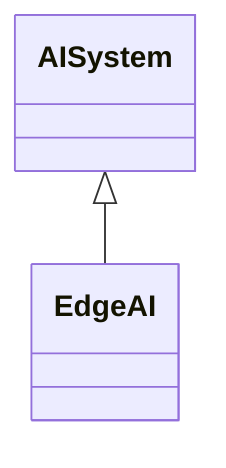

---
search:
  boost: 10.0
---

# Class: EdgeAI 


_The deployment and execution of AI and ML models on Edge devices,_

_including smartphones, IoT sensors, industrial controllers, and other_

_resource-constrained devices located at the Edge of the network and_

_closer to the data sources_


<div data-search-exclude markdown="1">


URI: [ai:EdgeAI](https://w3id.org/lmodel/dpv/ai/EdgeAI)





## Inheritance
* [AI](AI.md)
    * [AISystem](AISystem.md)
        * **EdgeAI**


## Class Properties

| Property | Value |
| --- | --- |
| Class URI | [ai:EdgeAI](https://w3id.org/lmodel/dpv/ai/EdgeAI) |


## Slots

| Name | Cardinality and Range | Description | Inheritance |
| ---  | --- | --- | --- |


## In Subsets


* [AiSubset](AiSubset.md)


## Aliases


* Edge AI


## Identifier and Mapping Information


### Annotations

| property | value |
| --- | --- |
| upstream_iri | https://w3id.org/dpv/ai/owl#EdgeAI |
| dpv_extension_slug | ai |


### Schema Source


* from schema: https://w3id.org/lmodel/dpv/ai


## Mappings

| Mapping Type | Mapped Value |
| ---  | ---  |
| self | ai:EdgeAI |
| native | ai:EdgeAI |
| exact | dpv_ai:EdgeAI, dpv_ai_owl:EdgeAI |


## LinkML Source

<!-- TODO: investigate https://stackoverflow.com/questions/37606292/how-to-create-tabbed-code-blocks-in-mkdocs-or-sphinx -->

### Direct

<details>
```yaml
name: EdgeAI
annotations:
  upstream_iri:
    tag: upstream_iri
    value: https://w3id.org/dpv/ai/owl#EdgeAI
  dpv_extension_slug:
    tag: dpv_extension_slug
    value: ai
description: 'The deployment and execution of AI and ML models on Edge devices,

  including smartphones, IoT sensors, industrial controllers, and other

  resource-constrained devices located at the Edge of the network and

  closer to the data sources'
in_subset:
- ai_subset
from_schema: https://w3id.org/lmodel/dpv/ai
aliases:
- Edge AI
exact_mappings:
- dpv_ai:EdgeAI
- dpv_ai_owl:EdgeAI
is_a: AISystem
class_uri: ai:EdgeAI

```
</details>

### Induced

<details>
```yaml
name: EdgeAI
annotations:
  upstream_iri:
    tag: upstream_iri
    value: https://w3id.org/dpv/ai/owl#EdgeAI
  dpv_extension_slug:
    tag: dpv_extension_slug
    value: ai
description: 'The deployment and execution of AI and ML models on Edge devices,

  including smartphones, IoT sensors, industrial controllers, and other

  resource-constrained devices located at the Edge of the network and

  closer to the data sources'
in_subset:
- ai_subset
from_schema: https://w3id.org/lmodel/dpv/ai
aliases:
- Edge AI
exact_mappings:
- dpv_ai:EdgeAI
- dpv_ai_owl:EdgeAI
is_a: AISystem
class_uri: ai:EdgeAI

```
</details></div>