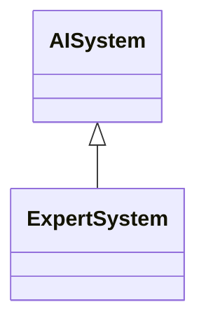

---
search:
  boost: 10.0
---

# Class: ExpertSystem 


_AI system that accumulates, combines and encapsulates knowledge provided_

_by a human expert or experts in a specific domain to infer solutions to_

_problems (ISO/IEC 22989:2022 definition); Artificial intelligence system_

_emulating human expert decision-making abilities, addressing complex_

_problems through reasoning across knowledge bases primarily represented_

_as if-then rules, and comprising two sub-systems: an inference engine_

_for applying rules to known facts and deducing new facts, and a_

_knowledge base containing facts and rules; potentially featuring_

_explanation and debugging capabilities (EU Vocabularies' AI Taxonomy_

_definition)_


<div data-search-exclude markdown="1">


URI: [ai:ExpertSystem](https://w3id.org/lmodel/dpv/ai/ExpertSystem)





## Inheritance
* [AI](AI.md)
    * [AISystem](AISystem.md)
        * **ExpertSystem**


## Class Properties

| Property | Value |
| --- | --- |
| Class URI | [ai:ExpertSystem](https://w3id.org/lmodel/dpv/ai/ExpertSystem) |


## Slots

| Name | Cardinality and Range | Description | Inheritance |
| ---  | --- | --- | --- |


## In Subsets


* [AiSubset](AiSubset.md)


## Aliases


* Expert System


## Identifier and Mapping Information


### Annotations

| property | value |
| --- | --- |
| upstream_iri | https://w3id.org/dpv/ai/owl#ExpertSystem |
| dpv_extension_slug | ai |


### Schema Source


* from schema: https://w3id.org/lmodel/dpv/ai


## Mappings

| Mapping Type | Mapped Value |
| ---  | ---  |
| self | ai:ExpertSystem |
| native | ai:ExpertSystem |
| exact | dpv_ai:ExpertSystem, dpv_ai_owl:ExpertSystem |


## LinkML Source

<!-- TODO: investigate https://stackoverflow.com/questions/37606292/how-to-create-tabbed-code-blocks-in-mkdocs-or-sphinx -->

### Direct

<details>
```yaml
name: ExpertSystem
annotations:
  upstream_iri:
    tag: upstream_iri
    value: https://w3id.org/dpv/ai/owl#ExpertSystem
  dpv_extension_slug:
    tag: dpv_extension_slug
    value: ai
description: 'AI system that accumulates, combines and encapsulates knowledge provided

  by a human expert or experts in a specific domain to infer solutions to

  problems (ISO/IEC 22989:2022 definition); Artificial intelligence system

  emulating human expert decision-making abilities, addressing complex

  problems through reasoning across knowledge bases primarily represented

  as if-then rules, and comprising two sub-systems: an inference engine

  for applying rules to known facts and deducing new facts, and a

  knowledge base containing facts and rules; potentially featuring

  explanation and debugging capabilities (EU Vocabularies'' AI Taxonomy

  definition)'
in_subset:
- ai_subset
from_schema: https://w3id.org/lmodel/dpv/ai
aliases:
- Expert System
exact_mappings:
- dpv_ai:ExpertSystem
- dpv_ai_owl:ExpertSystem
is_a: AISystem
class_uri: ai:ExpertSystem

```
</details>

### Induced

<details>
```yaml
name: ExpertSystem
annotations:
  upstream_iri:
    tag: upstream_iri
    value: https://w3id.org/dpv/ai/owl#ExpertSystem
  dpv_extension_slug:
    tag: dpv_extension_slug
    value: ai
description: 'AI system that accumulates, combines and encapsulates knowledge provided

  by a human expert or experts in a specific domain to infer solutions to

  problems (ISO/IEC 22989:2022 definition); Artificial intelligence system

  emulating human expert decision-making abilities, addressing complex

  problems through reasoning across knowledge bases primarily represented

  as if-then rules, and comprising two sub-systems: an inference engine

  for applying rules to known facts and deducing new facts, and a

  knowledge base containing facts and rules; potentially featuring

  explanation and debugging capabilities (EU Vocabularies'' AI Taxonomy

  definition)'
in_subset:
- ai_subset
from_schema: https://w3id.org/lmodel/dpv/ai
aliases:
- Expert System
exact_mappings:
- dpv_ai:ExpertSystem
- dpv_ai_owl:ExpertSystem
is_a: AISystem
class_uri: ai:ExpertSystem

```
</details></div>