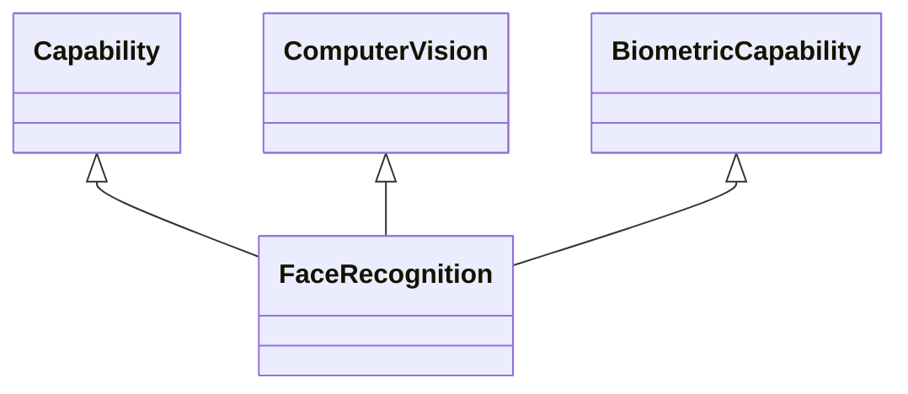

---
search:
  boost: 10.0
---

# Class: FaceRecognition 


_Capability involving automatic pattern recognition for comparing stored_

_images of human faces with the image of an actual face, indicating any_

_matching, if it exists, and any data, if they exist, identifying the_

_person to whom the face belongs_


<div data-search-exclude markdown="1">


URI: [ai:FaceRecognition](https://w3id.org/lmodel/dpv/ai/FaceRecognition)





## Inheritance
* [AI](AI.md)
    * [Capability](Capability.md)
        * [HumanOrientedCapability](HumanOrientedCapability.md)
            * [BiometricCapability](BiometricCapability.md) [ [Capability](Capability.md)]
                * **FaceRecognition** [ [Capability](Capability.md) [ComputerVision](ComputerVision.md)]


## Class Properties

| Property | Value |
| --- | --- |
| Class URI | [ai:FaceRecognition](https://w3id.org/lmodel/dpv/ai/FaceRecognition) |


## Slots

| Name | Cardinality and Range | Description | Inheritance |
| ---  | --- | --- | --- |


## In Subsets


* [AiSubset](AiSubset.md)


## Aliases


* Face Recognition


## Comments

* EU Vocabularies' AI taxonomy defines 'Facial Recognition as "computer
vision technology employing biometric analysis and mapping of facial
characteristics for facial identification purposes, recognising and
verifying an individual's identity", which not only refers to the
capability for face recognition but also indicates the *purposes* for
which this is being used. In DPV, such purposes are defined separately
within the main DPV


## Identifier and Mapping Information


### Annotations

| property | value |
| --- | --- |
| dct_source | ISO/IEC 22989:2022 3.7.2 |
| upstream_iri | https://w3id.org/dpv/ai/owl#FaceRecognition |
| dpv_extension_slug | ai |


### Schema Source


* from schema: https://w3id.org/lmodel/dpv/ai


## Mappings

| Mapping Type | Mapped Value |
| ---  | ---  |
| self | ai:FaceRecognition |
| native | ai:FaceRecognition |
| exact | dpv_ai:FaceRecognition, dpv_ai_owl:FaceRecognition |


## LinkML Source

<!-- TODO: investigate https://stackoverflow.com/questions/37606292/how-to-create-tabbed-code-blocks-in-mkdocs-or-sphinx -->

### Direct

<details>
```yaml
name: FaceRecognition
annotations:
  dct_source:
    tag: dct_source
    value: ISO/IEC 22989:2022 3.7.2
  upstream_iri:
    tag: upstream_iri
    value: https://w3id.org/dpv/ai/owl#FaceRecognition
  dpv_extension_slug:
    tag: dpv_extension_slug
    value: ai
description: 'Capability involving automatic pattern recognition for comparing stored

  images of human faces with the image of an actual face, indicating any

  matching, if it exists, and any data, if they exist, identifying the

  person to whom the face belongs'
comments:
- 'EU Vocabularies'' AI taxonomy defines ''Facial Recognition as "computer

  vision technology employing biometric analysis and mapping of facial

  characteristics for facial identification purposes, recognising and

  verifying an individual''s identity", which not only refers to the

  capability for face recognition but also indicates the *purposes* for

  which this is being used. In DPV, such purposes are defined separately

  within the main DPV'
in_subset:
- ai_subset
from_schema: https://w3id.org/lmodel/dpv/ai
aliases:
- Face Recognition
exact_mappings:
- dpv_ai:FaceRecognition
- dpv_ai_owl:FaceRecognition
is_a: BiometricCapability
mixins:
- Capability
- ComputerVision
class_uri: ai:FaceRecognition

```
</details>

### Induced

<details>
```yaml
name: FaceRecognition
annotations:
  dct_source:
    tag: dct_source
    value: ISO/IEC 22989:2022 3.7.2
  upstream_iri:
    tag: upstream_iri
    value: https://w3id.org/dpv/ai/owl#FaceRecognition
  dpv_extension_slug:
    tag: dpv_extension_slug
    value: ai
description: 'Capability involving automatic pattern recognition for comparing stored

  images of human faces with the image of an actual face, indicating any

  matching, if it exists, and any data, if they exist, identifying the

  person to whom the face belongs'
comments:
- 'EU Vocabularies'' AI taxonomy defines ''Facial Recognition as "computer

  vision technology employing biometric analysis and mapping of facial

  characteristics for facial identification purposes, recognising and

  verifying an individual''s identity", which not only refers to the

  capability for face recognition but also indicates the *purposes* for

  which this is being used. In DPV, such purposes are defined separately

  within the main DPV'
in_subset:
- ai_subset
from_schema: https://w3id.org/lmodel/dpv/ai
aliases:
- Face Recognition
exact_mappings:
- dpv_ai:FaceRecognition
- dpv_ai_owl:FaceRecognition
is_a: BiometricCapability
mixins:
- Capability
- ComputerVision
class_uri: ai:FaceRecognition

```
</details></div>