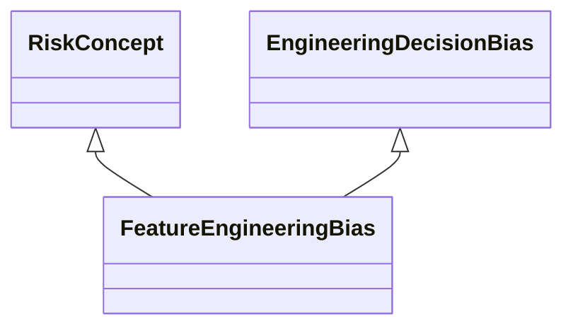

---
search:
  boost: 10.0
---

# Class: FeatureEngineeringBias 


_Bias that occurs from steps such as encoding, data type conversion,_

_dimensionality reduction and feature selection which are subject to_

_choices made by the AI developer and introduce bias in the ML model_


<div data-search-exclude markdown="1">


URI: [ai:FeatureEngineeringBias](https://w3id.org/lmodel/dpv/ai/FeatureEngineeringBias)





## Inheritance
* [RiskConcept](RiskConcept.md)
    * [AIBias](AIBias.md)
        * [EngineeringDecisionBias](EngineeringDecisionBias.md) [ [RiskConcept](RiskConcept.md)]
            * **FeatureEngineeringBias** [ [RiskConcept](RiskConcept.md)]


## Class Properties

| Property | Value |
| --- | --- |
| Class URI | [ai:FeatureEngineeringBias](https://w3id.org/lmodel/dpv/ai/FeatureEngineeringBias) |


## Slots

| Name | Cardinality and Range | Description | Inheritance |
| ---  | --- | --- | --- |


## In Subsets


* [AiSubset](AiSubset.md)


## Aliases


* Feature Engineering Bias


## Identifier and Mapping Information


### Annotations

| property | value |
| --- | --- |
| dct_source | ISO/IEC 24027:2021 |
| upstream_iri | https://w3id.org/dpv/ai/owl#FeatureEngineeringBias |
| dpv_extension_slug | ai |


### Schema Source


* from schema: https://w3id.org/lmodel/dpv/ai


## Mappings

| Mapping Type | Mapped Value |
| ---  | ---  |
| self | ai:FeatureEngineeringBias |
| native | ai:FeatureEngineeringBias |
| exact | dpv_ai:FeatureEngineeringBias, dpv_ai_owl:FeatureEngineeringBias |


## LinkML Source

<!-- TODO: investigate https://stackoverflow.com/questions/37606292/how-to-create-tabbed-code-blocks-in-mkdocs-or-sphinx -->

### Direct

<details>
```yaml
name: FeatureEngineeringBias
annotations:
  dct_source:
    tag: dct_source
    value: ISO/IEC 24027:2021
  upstream_iri:
    tag: upstream_iri
    value: https://w3id.org/dpv/ai/owl#FeatureEngineeringBias
  dpv_extension_slug:
    tag: dpv_extension_slug
    value: ai
description: 'Bias that occurs from steps such as encoding, data type conversion,

  dimensionality reduction and feature selection which are subject to

  choices made by the AI developer and introduce bias in the ML model'
in_subset:
- ai_subset
from_schema: https://w3id.org/lmodel/dpv/ai
aliases:
- Feature Engineering Bias
exact_mappings:
- dpv_ai:FeatureEngineeringBias
- dpv_ai_owl:FeatureEngineeringBias
is_a: EngineeringDecisionBias
mixins:
- RiskConcept
class_uri: ai:FeatureEngineeringBias

```
</details>

### Induced

<details>
```yaml
name: FeatureEngineeringBias
annotations:
  dct_source:
    tag: dct_source
    value: ISO/IEC 24027:2021
  upstream_iri:
    tag: upstream_iri
    value: https://w3id.org/dpv/ai/owl#FeatureEngineeringBias
  dpv_extension_slug:
    tag: dpv_extension_slug
    value: ai
description: 'Bias that occurs from steps such as encoding, data type conversion,

  dimensionality reduction and feature selection which are subject to

  choices made by the AI developer and introduce bias in the ML model'
in_subset:
- ai_subset
from_schema: https://w3id.org/lmodel/dpv/ai
aliases:
- Feature Engineering Bias
exact_mappings:
- dpv_ai:FeatureEngineeringBias
- dpv_ai_owl:FeatureEngineeringBias
is_a: EngineeringDecisionBias
mixins:
- RiskConcept
class_uri: ai:FeatureEngineeringBias

```
</details></div>