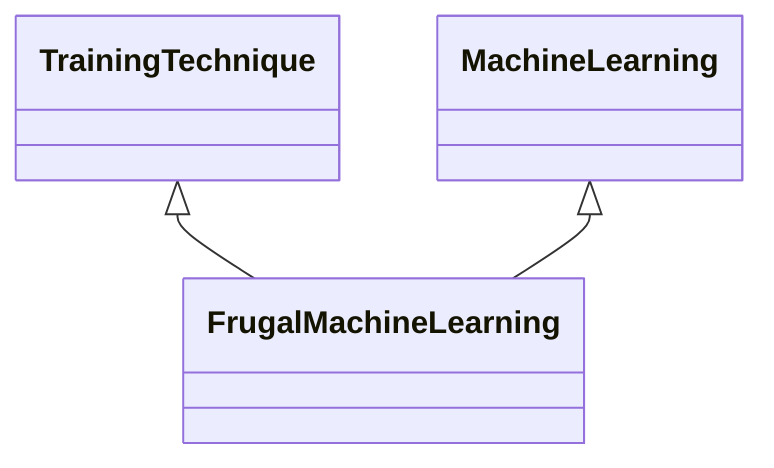

---
search:
  boost: 10.0
---

# Class: FrugalMachineLearning 


_Machine learning techniques that aim to make models more efficient,_

_cost-effective, and accessible while maintaining or even improving their_

_performance_


<div data-search-exclude markdown="1">


URI: [ai:FrugalMachineLearning](https://w3id.org/lmodel/dpv/ai/FrugalMachineLearning)





## Inheritance
* [AI](AI.md)
    * [Technique](Technique.md)
        * [MachineLearning](MachineLearning.md)
            * **FrugalMachineLearning** [ [TrainingTechnique](TrainingTechnique.md)]


## Class Properties

| Property | Value |
| --- | --- |
| Class URI | [ai:FrugalMachineLearning](https://w3id.org/lmodel/dpv/ai/FrugalMachineLearning) |


## Slots

| Name | Cardinality and Range | Description | Inheritance |
| ---  | --- | --- | --- |


## In Subsets


* [AiSubset](AiSubset.md)


## Aliases


* Frugal Machine Learning


## Identifier and Mapping Information


### Annotations

| property | value |
| --- | --- |
| upstream_iri | https://w3id.org/dpv/ai/owl#FrugalMachineLearning |
| dpv_extension_slug | ai |


### Schema Source


* from schema: https://w3id.org/lmodel/dpv/ai


## Mappings

| Mapping Type | Mapped Value |
| ---  | ---  |
| self | ai:FrugalMachineLearning |
| native | ai:FrugalMachineLearning |
| exact | dpv_ai:FrugalMachineLearning, dpv_ai_owl:FrugalMachineLearning |


## LinkML Source

<!-- TODO: investigate https://stackoverflow.com/questions/37606292/how-to-create-tabbed-code-blocks-in-mkdocs-or-sphinx -->

### Direct

<details>
```yaml
name: FrugalMachineLearning
annotations:
  upstream_iri:
    tag: upstream_iri
    value: https://w3id.org/dpv/ai/owl#FrugalMachineLearning
  dpv_extension_slug:
    tag: dpv_extension_slug
    value: ai
description: 'Machine learning techniques that aim to make models more efficient,

  cost-effective, and accessible while maintaining or even improving their

  performance'
in_subset:
- ai_subset
from_schema: https://w3id.org/lmodel/dpv/ai
aliases:
- Frugal Machine Learning
exact_mappings:
- dpv_ai:FrugalMachineLearning
- dpv_ai_owl:FrugalMachineLearning
is_a: MachineLearning
mixins:
- TrainingTechnique
class_uri: ai:FrugalMachineLearning

```
</details>

### Induced

<details>
```yaml
name: FrugalMachineLearning
annotations:
  upstream_iri:
    tag: upstream_iri
    value: https://w3id.org/dpv/ai/owl#FrugalMachineLearning
  dpv_extension_slug:
    tag: dpv_extension_slug
    value: ai
description: 'Machine learning techniques that aim to make models more efficient,

  cost-effective, and accessible while maintaining or even improving their

  performance'
in_subset:
- ai_subset
from_schema: https://w3id.org/lmodel/dpv/ai
aliases:
- Frugal Machine Learning
exact_mappings:
- dpv_ai:FrugalMachineLearning
- dpv_ai_owl:FrugalMachineLearning
is_a: MachineLearning
mixins:
- TrainingTechnique
class_uri: ai:FrugalMachineLearning

```
</details></div>