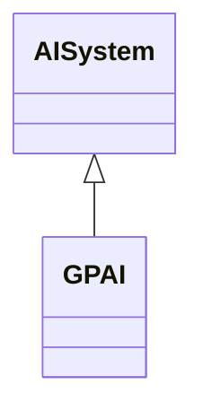

---
search:
  boost: 10.0
---

# Class: GPAI 


_Artificial intelligence system based on a general-purpose model and_

_capable of serving a variety of purposes, either in direct use or_

_integrated with other AI systems_


<div data-search-exclude markdown="1">


URI: [ai:GPAI](https://w3id.org/lmodel/dpv/ai/GPAI)





## Inheritance
* [AI](AI.md)
    * [AISystem](AISystem.md)
        * **GPAI**


## Class Properties

| Property | Value |
| --- | --- |
| Class URI | [ai:GPAI](https://w3id.org/lmodel/dpv/ai/GPAI) |


## Slots

| Name | Cardinality and Range | Description | Inheritance |
| ---  | --- | --- | --- |


## In Subsets


* [AiSubset](AiSubset.md)


## Aliases


* General-Purpose AI System (GPAI)


## Identifier and Mapping Information


### Annotations

| property | value |
| --- | --- |
| upstream_iri | https://w3id.org/dpv/ai/owl#GPAI |
| dpv_extension_slug | ai |


### Schema Source


* from schema: https://w3id.org/lmodel/dpv/ai


## Mappings

| Mapping Type | Mapped Value |
| ---  | ---  |
| self | ai:GPAI |
| native | ai:GPAI |
| exact | dpv_ai:GPAI, dpv_ai_owl:GPAI |
| close | iso42001:AISystem |


## LinkML Source

<!-- TODO: investigate https://stackoverflow.com/questions/37606292/how-to-create-tabbed-code-blocks-in-mkdocs-or-sphinx -->

### Direct

<details>
```yaml
name: GPAI
annotations:
  upstream_iri:
    tag: upstream_iri
    value: https://w3id.org/dpv/ai/owl#GPAI
  dpv_extension_slug:
    tag: dpv_extension_slug
    value: ai
description: 'Artificial intelligence system based on a general-purpose model and

  capable of serving a variety of purposes, either in direct use or

  integrated with other AI systems'
in_subset:
- ai_subset
from_schema: https://w3id.org/lmodel/dpv/ai
aliases:
- General-Purpose AI System (GPAI)
exact_mappings:
- dpv_ai:GPAI
- dpv_ai_owl:GPAI
close_mappings:
- iso42001:AISystem
is_a: AISystem
class_uri: ai:GPAI

```
</details>

### Induced

<details>
```yaml
name: GPAI
annotations:
  upstream_iri:
    tag: upstream_iri
    value: https://w3id.org/dpv/ai/owl#GPAI
  dpv_extension_slug:
    tag: dpv_extension_slug
    value: ai
description: 'Artificial intelligence system based on a general-purpose model and

  capable of serving a variety of purposes, either in direct use or

  integrated with other AI systems'
in_subset:
- ai_subset
from_schema: https://w3id.org/lmodel/dpv/ai
aliases:
- General-Purpose AI System (GPAI)
exact_mappings:
- dpv_ai:GPAI
- dpv_ai_owl:GPAI
close_mappings:
- iso42001:AISystem
is_a: AISystem
class_uri: ai:GPAI

```
</details></div>