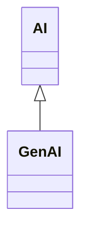

---
search:
  boost: 10.0
---

# Class: GenAI 


_Use of artificial intelligence models that can learn from and mimic_

_large amounts of data to create content such as text, images, music,_

_videos, code, and more, based on inputs or prompts_


<div data-search-exclude markdown="1">


URI: [ai:GenAI](https://w3id.org/lmodel/dpv/ai/GenAI)





## Inheritance
* [AI](AI.md)
    * **GenAI**


## Class Properties

| Property | Value |
| --- | --- |
| Class URI | [ai:GenAI](https://w3id.org/lmodel/dpv/ai/GenAI) |


## Slots

| Name | Cardinality and Range | Description | Inheritance |
| ---  | --- | --- | --- |


## In Subsets


* [AiSubset](AiSubset.md)


## Aliases


* Generative AI


## Identifier and Mapping Information


### Annotations

| property | value |
| --- | --- |
| upstream_iri | https://w3id.org/dpv/ai/owl#GenAI |
| dpv_extension_slug | ai |


### Schema Source


* from schema: https://w3id.org/lmodel/dpv/ai


## Mappings

| Mapping Type | Mapped Value |
| ---  | ---  |
| self | ai:GenAI |
| native | ai:GenAI |
| exact | dpv_ai:GenAI, dpv_ai_owl:GenAI |
| close | iso42001:AISystem |


## LinkML Source

<!-- TODO: investigate https://stackoverflow.com/questions/37606292/how-to-create-tabbed-code-blocks-in-mkdocs-or-sphinx -->

### Direct

<details>
```yaml
name: GenAI
annotations:
  upstream_iri:
    tag: upstream_iri
    value: https://w3id.org/dpv/ai/owl#GenAI
  dpv_extension_slug:
    tag: dpv_extension_slug
    value: ai
description: 'Use of artificial intelligence models that can learn from and mimic

  large amounts of data to create content such as text, images, music,

  videos, code, and more, based on inputs or prompts'
in_subset:
- ai_subset
from_schema: https://w3id.org/lmodel/dpv/ai
aliases:
- Generative AI
exact_mappings:
- dpv_ai:GenAI
- dpv_ai_owl:GenAI
close_mappings:
- iso42001:AISystem
is_a: AI
class_uri: ai:GenAI

```
</details>

### Induced

<details>
```yaml
name: GenAI
annotations:
  upstream_iri:
    tag: upstream_iri
    value: https://w3id.org/dpv/ai/owl#GenAI
  dpv_extension_slug:
    tag: dpv_extension_slug
    value: ai
description: 'Use of artificial intelligence models that can learn from and mimic

  large amounts of data to create content such as text, images, music,

  videos, code, and more, based on inputs or prompts'
in_subset:
- ai_subset
from_schema: https://w3id.org/lmodel/dpv/ai
aliases:
- Generative AI
exact_mappings:
- dpv_ai:GenAI
- dpv_ai_owl:GenAI
close_mappings:
- iso42001:AISystem
is_a: AI
class_uri: ai:GenAI

```
</details></div>