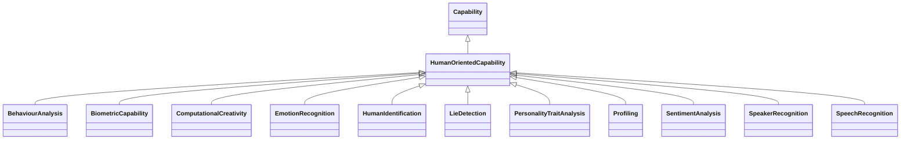

---
search:
  boost: 10.0
---

# Class: HumanOrientedCapability 


_Capabilities that are inherently about humans or oriented towards human_

_characteristics and activities_


<div data-search-exclude markdown="1">


URI: [ai:HumanOrientedCapability](https://w3id.org/lmodel/dpv/ai/HumanOrientedCapability)





## Inheritance
* [AI](AI.md)
    * [Capability](Capability.md)
        * **HumanOrientedCapability**
            * [BehaviourAnalysis](BehaviourAnalysis.md) [ [Capability](Capability.md)]
            * [BiometricCapability](BiometricCapability.md) [ [Capability](Capability.md)]
            * [ComputationalCreativity](ComputationalCreativity.md) [ [Capability](Capability.md)]
            * [EmotionRecognition](EmotionRecognition.md) [ [Capability](Capability.md)]
            * [HumanIdentification](HumanIdentification.md) [ [Capability](Capability.md)]
            * [LieDetection](LieDetection.md) [ [Capability](Capability.md)]
            * [PersonalityTraitAnalysis](PersonalityTraitAnalysis.md) [ [Capability](Capability.md)]
            * [Profiling](Profiling.md) [ [Capability](Capability.md)]
            * [SentimentAnalysis](SentimentAnalysis.md) [ [Capability](Capability.md) [LanguageCapability](LanguageCapability.md)]


## Class Properties

| Property | Value |
| --- | --- |
| Class URI | [ai:HumanOrientedCapability](https://w3id.org/lmodel/dpv/ai/HumanOrientedCapability) |


## Slots

| Name | Cardinality and Range | Description | Inheritance |
| ---  | --- | --- | --- |


## In Subsets


* [AiSubset](AiSubset.md)


## Aliases


* Human-Oriented Capability


## Identifier and Mapping Information


### Annotations

| property | value |
| --- | --- |
| upstream_iri | https://w3id.org/dpv/ai/owl#HumanOrientedCapability |
| dpv_extension_slug | ai |


### Schema Source


* from schema: https://w3id.org/lmodel/dpv/ai


## Mappings

| Mapping Type | Mapped Value |
| ---  | ---  |
| self | ai:HumanOrientedCapability |
| native | ai:HumanOrientedCapability |
| exact | dpv_ai:HumanOrientedCapability, dpv_ai_owl:HumanOrientedCapability |


## LinkML Source

<!-- TODO: investigate https://stackoverflow.com/questions/37606292/how-to-create-tabbed-code-blocks-in-mkdocs-or-sphinx -->

### Direct

<details>
```yaml
name: HumanOrientedCapability
annotations:
  upstream_iri:
    tag: upstream_iri
    value: https://w3id.org/dpv/ai/owl#HumanOrientedCapability
  dpv_extension_slug:
    tag: dpv_extension_slug
    value: ai
description: 'Capabilities that are inherently about humans or oriented towards human

  characteristics and activities'
in_subset:
- ai_subset
from_schema: https://w3id.org/lmodel/dpv/ai
aliases:
- Human-Oriented Capability
exact_mappings:
- dpv_ai:HumanOrientedCapability
- dpv_ai_owl:HumanOrientedCapability
is_a: Capability
class_uri: ai:HumanOrientedCapability

```
</details>

### Induced

<details>
```yaml
name: HumanOrientedCapability
annotations:
  upstream_iri:
    tag: upstream_iri
    value: https://w3id.org/dpv/ai/owl#HumanOrientedCapability
  dpv_extension_slug:
    tag: dpv_extension_slug
    value: ai
description: 'Capabilities that are inherently about humans or oriented towards human

  characteristics and activities'
in_subset:
- ai_subset
from_schema: https://w3id.org/lmodel/dpv/ai
aliases:
- Human-Oriented Capability
exact_mappings:
- dpv_ai:HumanOrientedCapability
- dpv_ai_owl:HumanOrientedCapability
is_a: Capability
class_uri: ai:HumanOrientedCapability

```
</details></div>