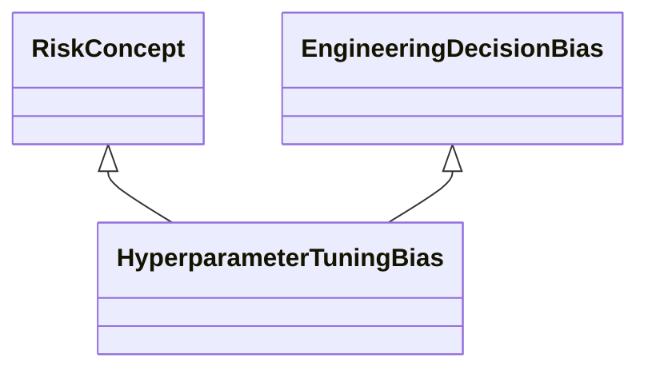

---
search:
  boost: 10.0
---

# Class: HyperparameterTuningBias 


_Bias that occurs from hyperparameters defining how the model is_

_structured and which cannot be directly trained from the data like model_

_parameters, where hyperparameters affect the model functioning and_

_accuracy of the model_


<div data-search-exclude markdown="1">


URI: [ai:HyperparameterTuningBias](https://w3id.org/lmodel/dpv/ai/HyperparameterTuningBias)





## Inheritance
* [RiskConcept](RiskConcept.md)
    * [AIBias](AIBias.md)
        * [EngineeringDecisionBias](EngineeringDecisionBias.md) [ [RiskConcept](RiskConcept.md)]
            * **HyperparameterTuningBias** [ [RiskConcept](RiskConcept.md)]


## Class Properties

| Property | Value |
| --- | --- |
| Class URI | [ai:HyperparameterTuningBias](https://w3id.org/lmodel/dpv/ai/HyperparameterTuningBias) |


## Slots

| Name | Cardinality and Range | Description | Inheritance |
| ---  | --- | --- | --- |


## In Subsets


* [AiSubset](AiSubset.md)


## Aliases


* Hyperparameter Tuning Bias


## Identifier and Mapping Information


### Annotations

| property | value |
| --- | --- |
| dct_source | ISO/IEC 24027:2021 |
| upstream_iri | https://w3id.org/dpv/ai/owl#HyperparameterTuningBias |
| dpv_extension_slug | ai |


### Schema Source


* from schema: https://w3id.org/lmodel/dpv/ai


## Mappings

| Mapping Type | Mapped Value |
| ---  | ---  |
| self | ai:HyperparameterTuningBias |
| native | ai:HyperparameterTuningBias |
| exact | dpv_ai:HyperparameterTuningBias, dpv_ai_owl:HyperparameterTuningBias |


## LinkML Source

<!-- TODO: investigate https://stackoverflow.com/questions/37606292/how-to-create-tabbed-code-blocks-in-mkdocs-or-sphinx -->

### Direct

<details>
```yaml
name: HyperparameterTuningBias
annotations:
  dct_source:
    tag: dct_source
    value: ISO/IEC 24027:2021
  upstream_iri:
    tag: upstream_iri
    value: https://w3id.org/dpv/ai/owl#HyperparameterTuningBias
  dpv_extension_slug:
    tag: dpv_extension_slug
    value: ai
description: 'Bias that occurs from hyperparameters defining how the model is

  structured and which cannot be directly trained from the data like model

  parameters, where hyperparameters affect the model functioning and

  accuracy of the model'
in_subset:
- ai_subset
from_schema: https://w3id.org/lmodel/dpv/ai
aliases:
- Hyperparameter Tuning Bias
exact_mappings:
- dpv_ai:HyperparameterTuningBias
- dpv_ai_owl:HyperparameterTuningBias
is_a: EngineeringDecisionBias
mixins:
- RiskConcept
class_uri: ai:HyperparameterTuningBias

```
</details>

### Induced

<details>
```yaml
name: HyperparameterTuningBias
annotations:
  dct_source:
    tag: dct_source
    value: ISO/IEC 24027:2021
  upstream_iri:
    tag: upstream_iri
    value: https://w3id.org/dpv/ai/owl#HyperparameterTuningBias
  dpv_extension_slug:
    tag: dpv_extension_slug
    value: ai
description: 'Bias that occurs from hyperparameters defining how the model is

  structured and which cannot be directly trained from the data like model

  parameters, where hyperparameters affect the model functioning and

  accuracy of the model'
in_subset:
- ai_subset
from_schema: https://w3id.org/lmodel/dpv/ai
aliases:
- Hyperparameter Tuning Bias
exact_mappings:
- dpv_ai:HyperparameterTuningBias
- dpv_ai_owl:HyperparameterTuningBias
is_a: EngineeringDecisionBias
mixins:
- RiskConcept
class_uri: ai:HyperparameterTuningBias

```
</details></div>