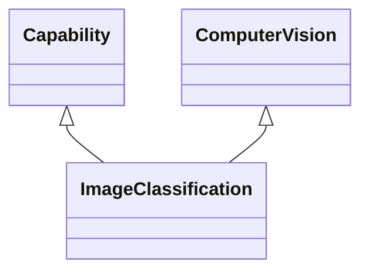

---
search:
  boost: 10.0
---

# Class: ImageClassification 


_Capability of categorising and labelling groups of pixels or vectors_

_within an image based on particular rules, involving the assignment of_

_images to predefined classes or categories_


<div data-search-exclude markdown="1">


URI: [ai:ImageClassification](https://w3id.org/lmodel/dpv/ai/ImageClassification)





## Inheritance
* [AI](AI.md)
    * [Capability](Capability.md)
        * [ComputerVision](ComputerVision.md)
            * **ImageClassification** [ [Capability](Capability.md)]


## Class Properties

| Property | Value |
| --- | --- |
| Class URI | [ai:ImageClassification](https://w3id.org/lmodel/dpv/ai/ImageClassification) |


## Slots

| Name | Cardinality and Range | Description | Inheritance |
| ---  | --- | --- | --- |


## In Subsets


* [AiSubset](AiSubset.md)


## Aliases


* Image Classification


## Identifier and Mapping Information


### Annotations

| property | value |
| --- | --- |
| upstream_iri | https://w3id.org/dpv/ai/owl#ImageClassification |
| dpv_extension_slug | ai |


### Schema Source


* from schema: https://w3id.org/lmodel/dpv/ai


## Mappings

| Mapping Type | Mapped Value |
| ---  | ---  |
| self | ai:ImageClassification |
| native | ai:ImageClassification |
| exact | dpv_ai:ImageClassification, dpv_ai_owl:ImageClassification |


## LinkML Source

<!-- TODO: investigate https://stackoverflow.com/questions/37606292/how-to-create-tabbed-code-blocks-in-mkdocs-or-sphinx -->

### Direct

<details>
```yaml
name: ImageClassification
annotations:
  upstream_iri:
    tag: upstream_iri
    value: https://w3id.org/dpv/ai/owl#ImageClassification
  dpv_extension_slug:
    tag: dpv_extension_slug
    value: ai
description: 'Capability of categorising and labelling groups of pixels or vectors

  within an image based on particular rules, involving the assignment of

  images to predefined classes or categories'
in_subset:
- ai_subset
from_schema: https://w3id.org/lmodel/dpv/ai
aliases:
- Image Classification
exact_mappings:
- dpv_ai:ImageClassification
- dpv_ai_owl:ImageClassification
is_a: ComputerVision
mixins:
- Capability
class_uri: ai:ImageClassification

```
</details>

### Induced

<details>
```yaml
name: ImageClassification
annotations:
  upstream_iri:
    tag: upstream_iri
    value: https://w3id.org/dpv/ai/owl#ImageClassification
  dpv_extension_slug:
    tag: dpv_extension_slug
    value: ai
description: 'Capability of categorising and labelling groups of pixels or vectors

  within an image based on particular rules, involving the assignment of

  images to predefined classes or categories'
in_subset:
- ai_subset
from_schema: https://w3id.org/lmodel/dpv/ai
aliases:
- Image Classification
exact_mappings:
- dpv_ai:ImageClassification
- dpv_ai_owl:ImageClassification
is_a: ComputerVision
mixins:
- Capability
class_uri: ai:ImageClassification

```
</details></div>