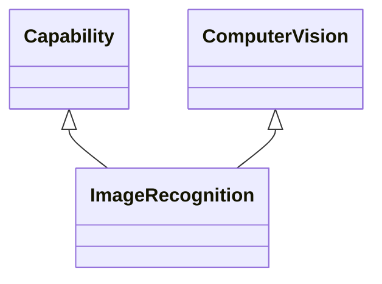

---
search:
  boost: 10.0
---

# Class: ImageRecognition 


_Capability for image classification process that classifies object(s),_

_pattern(s) or concept(s) in an image_


<div data-search-exclude markdown="1">


URI: [ai:ImageRecognition](https://w3id.org/lmodel/dpv/ai/ImageRecognition)





## Inheritance
* [AI](AI.md)
    * [Capability](Capability.md)
        * [ComputerVision](ComputerVision.md)
            * **ImageRecognition** [ [Capability](Capability.md)]


## Class Properties

| Property | Value |
| --- | --- |
| Class URI | [ai:ImageRecognition](https://w3id.org/lmodel/dpv/ai/ImageRecognition) |


## Slots

| Name | Cardinality and Range | Description | Inheritance |
| ---  | --- | --- | --- |


## In Subsets


* [AiSubset](AiSubset.md)


## Aliases


* Image Recognition


## Identifier and Mapping Information


### Annotations

| property | value |
| --- | --- |
| dct_source | ISO/IEC 22989:2022 3.7.4 |
| upstream_iri | https://w3id.org/dpv/ai/owl#ImageRecognition |
| dpv_extension_slug | ai |


### Schema Source


* from schema: https://w3id.org/lmodel/dpv/ai


## Mappings

| Mapping Type | Mapped Value |
| ---  | ---  |
| self | ai:ImageRecognition |
| native | ai:ImageRecognition |
| exact | dpv_ai:ImageRecognition, dpv_ai_owl:ImageRecognition |


## LinkML Source

<!-- TODO: investigate https://stackoverflow.com/questions/37606292/how-to-create-tabbed-code-blocks-in-mkdocs-or-sphinx -->

### Direct

<details>
```yaml
name: ImageRecognition
annotations:
  dct_source:
    tag: dct_source
    value: ISO/IEC 22989:2022 3.7.4
  upstream_iri:
    tag: upstream_iri
    value: https://w3id.org/dpv/ai/owl#ImageRecognition
  dpv_extension_slug:
    tag: dpv_extension_slug
    value: ai
description: 'Capability for image classification process that classifies object(s),

  pattern(s) or concept(s) in an image'
in_subset:
- ai_subset
from_schema: https://w3id.org/lmodel/dpv/ai
aliases:
- Image Recognition
exact_mappings:
- dpv_ai:ImageRecognition
- dpv_ai_owl:ImageRecognition
is_a: ComputerVision
mixins:
- Capability
class_uri: ai:ImageRecognition

```
</details>

### Induced

<details>
```yaml
name: ImageRecognition
annotations:
  dct_source:
    tag: dct_source
    value: ISO/IEC 22989:2022 3.7.4
  upstream_iri:
    tag: upstream_iri
    value: https://w3id.org/dpv/ai/owl#ImageRecognition
  dpv_extension_slug:
    tag: dpv_extension_slug
    value: ai
description: 'Capability for image classification process that classifies object(s),

  pattern(s) or concept(s) in an image'
in_subset:
- ai_subset
from_schema: https://w3id.org/lmodel/dpv/ai
aliases:
- Image Recognition
exact_mappings:
- dpv_ai:ImageRecognition
- dpv_ai_owl:ImageRecognition
is_a: ComputerVision
mixins:
- Capability
class_uri: ai:ImageRecognition

```
</details></div>