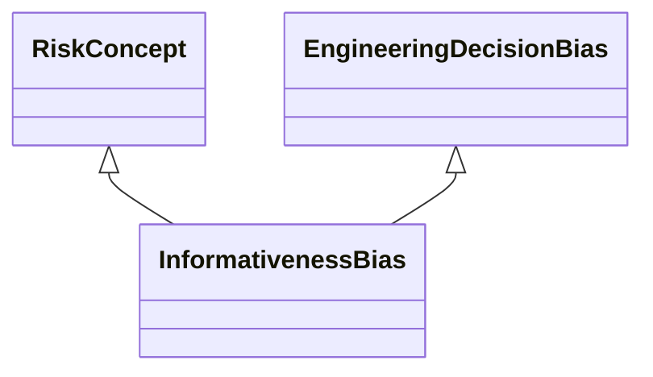

---
search:
  boost: 10.0
---

# Class: InformativenessBias 


_Bias that occurs or some groups, the mapping between inputs present in_

_the data and outputs are more difficult to learn and where a model that_

_only has one feature set available, can be biased against the group_

_whose relationships are difficult to learn from available data_


<div data-search-exclude markdown="1">


URI: [ai:InformativenessBias](https://w3id.org/lmodel/dpv/ai/InformativenessBias)





## Inheritance
* [RiskConcept](RiskConcept.md)
    * [AIBias](AIBias.md)
        * [EngineeringDecisionBias](EngineeringDecisionBias.md) [ [RiskConcept](RiskConcept.md)]
            * **InformativenessBias** [ [RiskConcept](RiskConcept.md)]


## Class Properties

| Property | Value |
| --- | --- |
| Class URI | [ai:InformativenessBias](https://w3id.org/lmodel/dpv/ai/InformativenessBias) |


## Slots

| Name | Cardinality and Range | Description | Inheritance |
| ---  | --- | --- | --- |


## In Subsets


* [AiSubset](AiSubset.md)


## Aliases


* Informativeness Bias


## Comments

* This can happen when some features are highly informative about one
group, while a different set of features is highly informative about
another group. If this is the case, then a model that only has one
feature set available, can be biased against the group whose
relationships are difficult to learn from available data


## Identifier and Mapping Information


### Annotations

| property | value |
| --- | --- |
| dct_source | ISO/IEC 24027:2021 |
| upstream_iri | https://w3id.org/dpv/ai/owl#InformativenessBias |
| dpv_extension_slug | ai |


### Schema Source


* from schema: https://w3id.org/lmodel/dpv/ai


## Mappings

| Mapping Type | Mapped Value |
| ---  | ---  |
| self | ai:InformativenessBias |
| native | ai:InformativenessBias |
| exact | dpv_ai:InformativenessBias, dpv_ai_owl:InformativenessBias |


## LinkML Source

<!-- TODO: investigate https://stackoverflow.com/questions/37606292/how-to-create-tabbed-code-blocks-in-mkdocs-or-sphinx -->

### Direct

<details>
```yaml
name: InformativenessBias
annotations:
  dct_source:
    tag: dct_source
    value: ISO/IEC 24027:2021
  upstream_iri:
    tag: upstream_iri
    value: https://w3id.org/dpv/ai/owl#InformativenessBias
  dpv_extension_slug:
    tag: dpv_extension_slug
    value: ai
description: 'Bias that occurs or some groups, the mapping between inputs present
  in

  the data and outputs are more difficult to learn and where a model that

  only has one feature set available, can be biased against the group

  whose relationships are difficult to learn from available data'
comments:
- 'This can happen when some features are highly informative about one

  group, while a different set of features is highly informative about

  another group. If this is the case, then a model that only has one

  feature set available, can be biased against the group whose

  relationships are difficult to learn from available data'
in_subset:
- ai_subset
from_schema: https://w3id.org/lmodel/dpv/ai
aliases:
- Informativeness Bias
exact_mappings:
- dpv_ai:InformativenessBias
- dpv_ai_owl:InformativenessBias
is_a: EngineeringDecisionBias
mixins:
- RiskConcept
class_uri: ai:InformativenessBias

```
</details>

### Induced

<details>
```yaml
name: InformativenessBias
annotations:
  dct_source:
    tag: dct_source
    value: ISO/IEC 24027:2021
  upstream_iri:
    tag: upstream_iri
    value: https://w3id.org/dpv/ai/owl#InformativenessBias
  dpv_extension_slug:
    tag: dpv_extension_slug
    value: ai
description: 'Bias that occurs or some groups, the mapping between inputs present
  in

  the data and outputs are more difficult to learn and where a model that

  only has one feature set available, can be biased against the group

  whose relationships are difficult to learn from available data'
comments:
- 'This can happen when some features are highly informative about one

  group, while a different set of features is highly informative about

  another group. If this is the case, then a model that only has one

  feature set available, can be biased against the group whose

  relationships are difficult to learn from available data'
in_subset:
- ai_subset
from_schema: https://w3id.org/lmodel/dpv/ai
aliases:
- Informativeness Bias
exact_mappings:
- dpv_ai:InformativenessBias
- dpv_ai_owl:InformativenessBias
is_a: EngineeringDecisionBias
mixins:
- RiskConcept
class_uri: ai:InformativenessBias

```
</details></div>