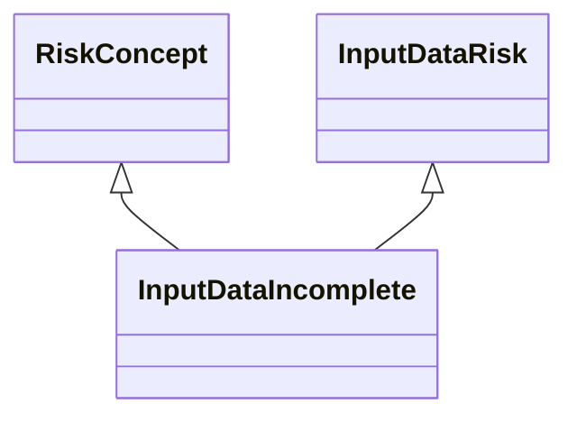

---
search:
  boost: 10.0
---

# Class: InputDataIncomplete 


_Concept representing input data being incomplete_


<div data-search-exclude markdown="1">


URI: [ai:InputDataIncomplete](https://w3id.org/lmodel/dpv/ai/InputDataIncomplete)





## Inheritance
* [RiskConcept](RiskConcept.md)
    * [DataRisk](DataRisk.md)
        * [InputDataRisk](InputDataRisk.md) [ [RiskConcept](RiskConcept.md)]
            * **InputDataIncomplete** [ [RiskConcept](RiskConcept.md)]


## Class Properties

| Property | Value |
| --- | --- |
| Class URI | [ai:InputDataIncomplete](https://w3id.org/lmodel/dpv/ai/InputDataIncomplete) |


## Slots

| Name | Cardinality and Range | Description | Inheritance |
| ---  | --- | --- | --- |


## In Subsets


* [AiSubset](AiSubset.md)


## Aliases


* Input Data Incomplete


## Identifier and Mapping Information


### Annotations

| property | value |
| --- | --- |
| upstream_iri | https://w3id.org/dpv/ai/owl#InputDataIncomplete |
| dpv_extension_slug | ai |


### Schema Source


* from schema: https://w3id.org/lmodel/dpv/ai


## Mappings

| Mapping Type | Mapped Value |
| ---  | ---  |
| self | ai:InputDataIncomplete |
| native | ai:InputDataIncomplete |
| exact | dpv_ai:InputDataIncomplete, dpv_ai_owl:InputDataIncomplete |


## LinkML Source

<!-- TODO: investigate https://stackoverflow.com/questions/37606292/how-to-create-tabbed-code-blocks-in-mkdocs-or-sphinx -->

### Direct

<details>
```yaml
name: InputDataIncomplete
annotations:
  upstream_iri:
    tag: upstream_iri
    value: https://w3id.org/dpv/ai/owl#InputDataIncomplete
  dpv_extension_slug:
    tag: dpv_extension_slug
    value: ai
description: Concept representing input data being incomplete
in_subset:
- ai_subset
from_schema: https://w3id.org/lmodel/dpv/ai
aliases:
- Input Data Incomplete
exact_mappings:
- dpv_ai:InputDataIncomplete
- dpv_ai_owl:InputDataIncomplete
is_a: InputDataRisk
mixins:
- RiskConcept
class_uri: ai:InputDataIncomplete

```
</details>

### Induced

<details>
```yaml
name: InputDataIncomplete
annotations:
  upstream_iri:
    tag: upstream_iri
    value: https://w3id.org/dpv/ai/owl#InputDataIncomplete
  dpv_extension_slug:
    tag: dpv_extension_slug
    value: ai
description: Concept representing input data being incomplete
in_subset:
- ai_subset
from_schema: https://w3id.org/lmodel/dpv/ai
aliases:
- Input Data Incomplete
exact_mappings:
- dpv_ai:InputDataIncomplete
- dpv_ai_owl:InputDataIncomplete
is_a: InputDataRisk
mixins:
- RiskConcept
class_uri: ai:InputDataIncomplete

```
</details></div>