---
search:
  boost: 10.0
---

# Class: InputDataRisk 


_Risks and risk concepts related to input data_


<div data-search-exclude markdown="1">


URI: [ai:InputDataRisk](https://w3id.org/lmodel/dpv/ai/InputDataRisk)

```mermaid
 classDiagram
    class InputDataRisk
    click InputDataRisk href "../InputDataRisk/"
      RiskConcept <|-- InputDataRisk
        click RiskConcept href "../RiskConcept/"
      DataRisk <|-- InputDataRisk
        click DataRisk href "../DataRisk/"
      

      InputDataRisk <|-- InputDataBias
        click InputDataBias href "../InputDataBias/"
      InputDataRisk <|-- InputDataInaccurate
        click InputDataInaccurate href "../InputDataInaccurate/"
      InputDataRisk <|-- InputDataInappropriate
        click InputDataInappropriate href "../InputDataInappropriate/"
      InputDataRisk <|-- InputDataIncomplete
        click InputDataIncomplete href "../InputDataIncomplete/"
      InputDataRisk <|-- InputDataInconsistent
        click InputDataInconsistent href "../InputDataInconsistent/"
      InputDataRisk <|-- InputDataMisclassified
        click InputDataMisclassified href "../InputDataMisclassified/"
      InputDataRisk <|-- InputDataMisinterpretation
        click InputDataMisinterpretation href "../InputDataMisinterpretation/"
      InputDataRisk <|-- InputDataNoise
        click InputDataNoise href "../InputDataNoise/"
      InputDataRisk <|-- InputDataOutdated
        click InputDataOutdated href "../InputDataOutdated/"
      InputDataRisk <|-- InputDataSelectionError
        click InputDataSelectionError href "../InputDataSelectionError/"
      InputDataRisk <|-- InputDataSparse
        click InputDataSparse href "../InputDataSparse/"
      InputDataRisk <|-- InputDataUnrepresentative
        click InputDataUnrepresentative href "../InputDataUnrepresentative/"
      InputDataRisk <|-- InputDataUnstructured
        click InputDataUnstructured href "../InputDataUnstructured/"
      InputDataRisk <|-- InputDataUnverified
        click InputDataUnverified href "../InputDataUnverified/"
      

      
```





## Inheritance
* [RiskConcept](RiskConcept.md)
    * [DataRisk](DataRisk.md)
        * **InputDataRisk** [ [RiskConcept](RiskConcept.md)]
            * [InputDataBias](InputDataBias.md) [ [RiskConcept](RiskConcept.md)]
            * [InputDataInaccurate](InputDataInaccurate.md) [ [RiskConcept](RiskConcept.md)]
            * [InputDataInappropriate](InputDataInappropriate.md) [ [RiskConcept](RiskConcept.md)]
            * [InputDataIncomplete](InputDataIncomplete.md) [ [RiskConcept](RiskConcept.md)]
            * [InputDataInconsistent](InputDataInconsistent.md) [ [RiskConcept](RiskConcept.md)]
            * [InputDataMisclassified](InputDataMisclassified.md) [ [RiskConcept](RiskConcept.md)]
            * [InputDataMisinterpretation](InputDataMisinterpretation.md) [ [RiskConcept](RiskConcept.md)]
            * [InputDataNoise](InputDataNoise.md) [ [RiskConcept](RiskConcept.md)]
            * [InputDataOutdated](InputDataOutdated.md) [ [RiskConcept](RiskConcept.md)]
            * [InputDataSelectionError](InputDataSelectionError.md) [ [RiskConcept](RiskConcept.md)]
            * [InputDataSparse](InputDataSparse.md) [ [RiskConcept](RiskConcept.md)]
            * [InputDataUnrepresentative](InputDataUnrepresentative.md) [ [RiskConcept](RiskConcept.md)]
            * [InputDataUnstructured](InputDataUnstructured.md) [ [RiskConcept](RiskConcept.md)]
            * [InputDataUnverified](InputDataUnverified.md) [ [RiskConcept](RiskConcept.md)]


## Class Properties

| Property | Value |
| --- | --- |
| Class URI | [ai:InputDataRisk](https://w3id.org/lmodel/dpv/ai/InputDataRisk) |


## Slots

| Name | Cardinality and Range | Description | Inheritance |
| ---  | --- | --- | --- |


## In Subsets


* [AiSubset](AiSubset.md)


## Aliases


* Input Data Risk


## Identifier and Mapping Information


### Annotations

| property | value |
| --- | --- |
| upstream_iri | https://w3id.org/dpv/ai/owl#InputDataRisk |
| dpv_extension_slug | ai |


### Schema Source


* from schema: https://w3id.org/lmodel/dpv/ai


## Mappings

| Mapping Type | Mapped Value |
| ---  | ---  |
| self | ai:InputDataRisk |
| native | ai:InputDataRisk |
| exact | dpv_ai:InputDataRisk, dpv_ai_owl:InputDataRisk |


## LinkML Source

<!-- TODO: investigate https://stackoverflow.com/questions/37606292/how-to-create-tabbed-code-blocks-in-mkdocs-or-sphinx -->

### Direct

<details>
```yaml
name: InputDataRisk
annotations:
  upstream_iri:
    tag: upstream_iri
    value: https://w3id.org/dpv/ai/owl#InputDataRisk
  dpv_extension_slug:
    tag: dpv_extension_slug
    value: ai
description: Risks and risk concepts related to input data
in_subset:
- ai_subset
from_schema: https://w3id.org/lmodel/dpv/ai
aliases:
- Input Data Risk
exact_mappings:
- dpv_ai:InputDataRisk
- dpv_ai_owl:InputDataRisk
is_a: DataRisk
mixins:
- RiskConcept
class_uri: ai:InputDataRisk

```
</details>

### Induced

<details>
```yaml
name: InputDataRisk
annotations:
  upstream_iri:
    tag: upstream_iri
    value: https://w3id.org/dpv/ai/owl#InputDataRisk
  dpv_extension_slug:
    tag: dpv_extension_slug
    value: ai
description: Risks and risk concepts related to input data
in_subset:
- ai_subset
from_schema: https://w3id.org/lmodel/dpv/ai
aliases:
- Input Data Risk
exact_mappings:
- dpv_ai:InputDataRisk
- dpv_ai_owl:InputDataRisk
is_a: DataRisk
mixins:
- RiskConcept
class_uri: ai:InputDataRisk

```
</details></div>