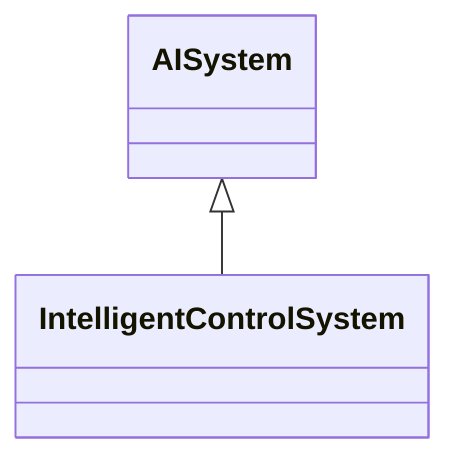

---
search:
  boost: 10.0
---

# Class: IntelligentControlSystem 


_Category of AI systems which implement intelligent control principles_

_for real-world applications by using AI capabilities and techniques_


<div data-search-exclude markdown="1">


URI: [ai:IntelligentControlSystem](https://w3id.org/lmodel/dpv/ai/IntelligentControlSystem)





## Inheritance
* [AI](AI.md)
    * [AISystem](AISystem.md)
        * **IntelligentControlSystem**


## Class Properties

| Property | Value |
| --- | --- |
| Class URI | [ai:IntelligentControlSystem](https://w3id.org/lmodel/dpv/ai/IntelligentControlSystem) |


## Slots

| Name | Cardinality and Range | Description | Inheritance |
| ---  | --- | --- | --- |


## In Subsets


* [AiSubset](AiSubset.md)


## Aliases


* Intelligent Control System


## Identifier and Mapping Information


### Annotations

| property | value |
| --- | --- |
| dct_source |  Defining Artificial Intelligence 2.0 |
| upstream_iri | https://w3id.org/dpv/ai/owl#IntelligentControlSystem |
| dpv_extension_slug | ai |


### Schema Source


* from schema: https://w3id.org/lmodel/dpv/ai


## Mappings

| Mapping Type | Mapped Value |
| ---  | ---  |
| self | ai:IntelligentControlSystem |
| native | ai:IntelligentControlSystem |
| exact | dpv_ai:IntelligentControlSystem, dpv_ai_owl:IntelligentControlSystem |


## LinkML Source

<!-- TODO: investigate https://stackoverflow.com/questions/37606292/how-to-create-tabbed-code-blocks-in-mkdocs-or-sphinx -->

### Direct

<details>
```yaml
name: IntelligentControlSystem
annotations:
  dct_source:
    tag: dct_source
    value: ' Defining Artificial Intelligence 2.0'
  upstream_iri:
    tag: upstream_iri
    value: https://w3id.org/dpv/ai/owl#IntelligentControlSystem
  dpv_extension_slug:
    tag: dpv_extension_slug
    value: ai
description: 'Category of AI systems which implement intelligent control principles

  for real-world applications by using AI capabilities and techniques'
in_subset:
- ai_subset
from_schema: https://w3id.org/lmodel/dpv/ai
aliases:
- Intelligent Control System
exact_mappings:
- dpv_ai:IntelligentControlSystem
- dpv_ai_owl:IntelligentControlSystem
is_a: AISystem
class_uri: ai:IntelligentControlSystem

```
</details>

### Induced

<details>
```yaml
name: IntelligentControlSystem
annotations:
  dct_source:
    tag: dct_source
    value: ' Defining Artificial Intelligence 2.0'
  upstream_iri:
    tag: upstream_iri
    value: https://w3id.org/dpv/ai/owl#IntelligentControlSystem
  dpv_extension_slug:
    tag: dpv_extension_slug
    value: ai
description: 'Category of AI systems which implement intelligent control principles

  for real-world applications by using AI capabilities and techniques'
in_subset:
- ai_subset
from_schema: https://w3id.org/lmodel/dpv/ai
aliases:
- Intelligent Control System
exact_mappings:
- dpv_ai:IntelligentControlSystem
- dpv_ai_owl:IntelligentControlSystem
is_a: AISystem
class_uri: ai:IntelligentControlSystem

```
</details></div>