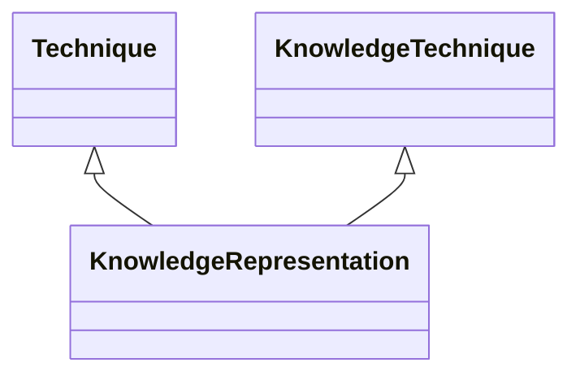

---
search:
  boost: 10.0
---

# Class: KnowledgeRepresentation 


_Encoding knowledge in a formal language or in a form that can be used_

_for computer-based problem solving_


<div data-search-exclude markdown="1">


URI: [ai:KnowledgeRepresentation](https://w3id.org/lmodel/dpv/ai/KnowledgeRepresentation)





## Inheritance
* [AI](AI.md)
    * [Technique](Technique.md)
        * [KnowledgeTechnique](KnowledgeTechnique.md)
            * **KnowledgeRepresentation** [ [Technique](Technique.md)]


## Class Properties

| Property | Value |
| --- | --- |
| Class URI | [ai:KnowledgeRepresentation](https://w3id.org/lmodel/dpv/ai/KnowledgeRepresentation) |


## Slots

| Name | Cardinality and Range | Description | Inheritance |
| ---  | --- | --- | --- |


## In Subsets


* [AiSubset](AiSubset.md)


## Aliases


* Knowledge Representation


## Identifier and Mapping Information


### Annotations

| property | value |
| --- | --- |
| upstream_iri | https://w3id.org/dpv/ai/owl#KnowledgeRepresentation |
| dpv_extension_slug | ai |


### Schema Source


* from schema: https://w3id.org/lmodel/dpv/ai


## Mappings

| Mapping Type | Mapped Value |
| ---  | ---  |
| self | ai:KnowledgeRepresentation |
| native | ai:KnowledgeRepresentation |
| exact | dpv_ai:KnowledgeRepresentation, dpv_ai_owl:KnowledgeRepresentation |


## LinkML Source

<!-- TODO: investigate https://stackoverflow.com/questions/37606292/how-to-create-tabbed-code-blocks-in-mkdocs-or-sphinx -->

### Direct

<details>
```yaml
name: KnowledgeRepresentation
annotations:
  upstream_iri:
    tag: upstream_iri
    value: https://w3id.org/dpv/ai/owl#KnowledgeRepresentation
  dpv_extension_slug:
    tag: dpv_extension_slug
    value: ai
description: 'Encoding knowledge in a formal language or in a form that can be used

  for computer-based problem solving'
in_subset:
- ai_subset
from_schema: https://w3id.org/lmodel/dpv/ai
aliases:
- Knowledge Representation
exact_mappings:
- dpv_ai:KnowledgeRepresentation
- dpv_ai_owl:KnowledgeRepresentation
is_a: KnowledgeTechnique
mixins:
- Technique
class_uri: ai:KnowledgeRepresentation

```
</details>

### Induced

<details>
```yaml
name: KnowledgeRepresentation
annotations:
  upstream_iri:
    tag: upstream_iri
    value: https://w3id.org/dpv/ai/owl#KnowledgeRepresentation
  dpv_extension_slug:
    tag: dpv_extension_slug
    value: ai
description: 'Encoding knowledge in a formal language or in a form that can be used

  for computer-based problem solving'
in_subset:
- ai_subset
from_schema: https://w3id.org/lmodel/dpv/ai
aliases:
- Knowledge Representation
exact_mappings:
- dpv_ai:KnowledgeRepresentation
- dpv_ai_owl:KnowledgeRepresentation
is_a: KnowledgeTechnique
mixins:
- Technique
class_uri: ai:KnowledgeRepresentation

```
</details></div>