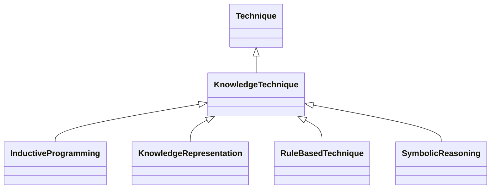

---
search:
  boost: 10.0
---

# Class: KnowledgeTechnique 


_Techniques based on the use of knowledge bases_


<div data-search-exclude markdown="1">


URI: [ai:KnowledgeTechnique](https://w3id.org/lmodel/dpv/ai/KnowledgeTechnique)





## Inheritance
* [AI](AI.md)
    * [Technique](Technique.md)
        * **KnowledgeTechnique**
            * [InductiveProgramming](InductiveProgramming.md) [ [Technique](Technique.md)]
            * [KnowledgeRepresentation](KnowledgeRepresentation.md) [ [Technique](Technique.md)]
            * [RuleBasedTechnique](RuleBasedTechnique.md) [ [Technique](Technique.md)]
            * [SymbolicReasoning](SymbolicReasoning.md) [ [Technique](Technique.md)]


## Class Properties

| Property | Value |
| --- | --- |
| Class URI | [ai:KnowledgeTechnique](https://w3id.org/lmodel/dpv/ai/KnowledgeTechnique) |


## Slots

| Name | Cardinality and Range | Description | Inheritance |
| ---  | --- | --- | --- |


## In Subsets


* [AiSubset](AiSubset.md)


## Aliases


* Knowledge Technique


## Comments

* Also known as Knowledge-based AI in the EU Vocabularies' AI Taxonomy
http://data.europa.eu/8s8/ai-taxonomy


## Identifier and Mapping Information


### Annotations

| property | value |
| --- | --- |
| upstream_iri | https://w3id.org/dpv/ai/owl#KnowledgeTechnique |
| dpv_extension_slug | ai |


### Schema Source


* from schema: https://w3id.org/lmodel/dpv/ai


## Mappings

| Mapping Type | Mapped Value |
| ---  | ---  |
| self | ai:KnowledgeTechnique |
| native | ai:KnowledgeTechnique |
| exact | dpv_ai:KnowledgeTechnique, dpv_ai_owl:KnowledgeTechnique |


## LinkML Source

<!-- TODO: investigate https://stackoverflow.com/questions/37606292/how-to-create-tabbed-code-blocks-in-mkdocs-or-sphinx -->

### Direct

<details>
```yaml
name: KnowledgeTechnique
annotations:
  upstream_iri:
    tag: upstream_iri
    value: https://w3id.org/dpv/ai/owl#KnowledgeTechnique
  dpv_extension_slug:
    tag: dpv_extension_slug
    value: ai
description: Techniques based on the use of knowledge bases
comments:
- 'Also known as Knowledge-based AI in the EU Vocabularies'' AI Taxonomy

  http://data.europa.eu/8s8/ai-taxonomy'
in_subset:
- ai_subset
from_schema: https://w3id.org/lmodel/dpv/ai
aliases:
- Knowledge Technique
exact_mappings:
- dpv_ai:KnowledgeTechnique
- dpv_ai_owl:KnowledgeTechnique
is_a: Technique
class_uri: ai:KnowledgeTechnique

```
</details>

### Induced

<details>
```yaml
name: KnowledgeTechnique
annotations:
  upstream_iri:
    tag: upstream_iri
    value: https://w3id.org/dpv/ai/owl#KnowledgeTechnique
  dpv_extension_slug:
    tag: dpv_extension_slug
    value: ai
description: Techniques based on the use of knowledge bases
comments:
- 'Also known as Knowledge-based AI in the EU Vocabularies'' AI Taxonomy

  http://data.europa.eu/8s8/ai-taxonomy'
in_subset:
- ai_subset
from_schema: https://w3id.org/lmodel/dpv/ai
aliases:
- Knowledge Technique
exact_mappings:
- dpv_ai:KnowledgeTechnique
- dpv_ai_owl:KnowledgeTechnique
is_a: Technique
class_uri: ai:KnowledgeTechnique

```
</details></div>