---
search:
  boost: 10.0
---

# Class: LifecycleStage 


_A stage in the lifecycle of AI_


<div data-search-exclude markdown="1">


URI: [ai:LifecycleStage](https://w3id.org/lmodel/dpv/ai/LifecycleStage)

```mermaid
 classDiagram
    class LifecycleStage
    click LifecycleStage href "../LifecycleStage/"
      LifecycleStage <|-- ContinuousValidationStage
        click ContinuousValidationStage href "../ContinuousValidationStage/"
      LifecycleStage <|-- DecommissionStage
        click DecommissionStage href "../DecommissionStage/"
      LifecycleStage <|-- DeploymentStage
        click DeploymentStage href "../DeploymentStage/"
      LifecycleStage <|-- DesignStage
        click DesignStage href "../DesignStage/"
      LifecycleStage <|-- DevelopmentStage
        click DevelopmentStage href "../DevelopmentStage/"
      LifecycleStage <|-- DiscardStage
        click DiscardStage href "../DiscardStage/"
      LifecycleStage <|-- InceptionStage
        click InceptionStage href "../InceptionStage/"
      LifecycleStage <|-- IncidentMonitoringStage
        click IncidentMonitoringStage href "../IncidentMonitoringStage/"
      LifecycleStage <|-- OperationStage
        click OperationStage href "../OperationStage/"
      LifecycleStage <|-- ReevaluationStage
        click ReevaluationStage href "../ReevaluationStage/"
      LifecycleStage <|-- RepairStage
        click RepairStage href "../RepairStage/"
      LifecycleStage <|-- ReplaceStage
        click ReplaceStage href "../ReplaceStage/"
      LifecycleStage <|-- RetirementStage
        click RetirementStage href "../RetirementStage/"
      LifecycleStage <|-- UpdateStage
        click UpdateStage href "../UpdateStage/"
      LifecycleStage <|-- ValidationStage
        click ValidationStage href "../ValidationStage/"
      LifecycleStage <|-- VerificationStage
        click VerificationStage href "../VerificationStage/"
      
      
```





## Inheritance
* **LifecycleStage**
    * [ContinuousValidationStage](ContinuousValidationStage.md)
    * [DeploymentStage](DeploymentStage.md)
    * [DesignStage](DesignStage.md)
    * [DevelopmentStage](DevelopmentStage.md)
    * [InceptionStage](InceptionStage.md)
    * [OperationStage](OperationStage.md)
    * [ReevaluationStage](ReevaluationStage.md)
    * [RetirementStage](RetirementStage.md)
    * [ValidationStage](ValidationStage.md)
    * [VerificationStage](VerificationStage.md)


## Class Properties

| Property | Value |
| --- | --- |
| Class URI | [ai:LifecycleStage](https://w3id.org/lmodel/dpv/ai/LifecycleStage) |


## Slots

| Name | Cardinality and Range | Description | Inheritance |
| ---  | --- | --- | --- |


## In Subsets


* [AiSubset](AiSubset.md)


## Aliases


* Lifecycle Stage


## Identifier and Mapping Information


### Annotations

| property | value |
| --- | --- |
| upstream_iri | https://w3id.org/dpv/ai/owl#LifecycleStage |
| dpv_extension_slug | ai |


### Schema Source


* from schema: https://w3id.org/lmodel/dpv/ai


## Mappings

| Mapping Type | Mapped Value |
| ---  | ---  |
| self | ai:LifecycleStage |
| native | ai:LifecycleStage |
| exact | dpv_ai:LifecycleStage, dpv_ai_owl:LifecycleStage |


## LinkML Source

<!-- TODO: investigate https://stackoverflow.com/questions/37606292/how-to-create-tabbed-code-blocks-in-mkdocs-or-sphinx -->

### Direct

<details>
```yaml
name: LifecycleStage
annotations:
  upstream_iri:
    tag: upstream_iri
    value: https://w3id.org/dpv/ai/owl#LifecycleStage
  dpv_extension_slug:
    tag: dpv_extension_slug
    value: ai
description: A stage in the lifecycle of AI
in_subset:
- ai_subset
from_schema: https://w3id.org/lmodel/dpv/ai
aliases:
- Lifecycle Stage
exact_mappings:
- dpv_ai:LifecycleStage
- dpv_ai_owl:LifecycleStage
class_uri: ai:LifecycleStage

```
</details>

### Induced

<details>
```yaml
name: LifecycleStage
annotations:
  upstream_iri:
    tag: upstream_iri
    value: https://w3id.org/dpv/ai/owl#LifecycleStage
  dpv_extension_slug:
    tag: dpv_extension_slug
    value: ai
description: A stage in the lifecycle of AI
in_subset:
- ai_subset
from_schema: https://w3id.org/lmodel/dpv/ai
aliases:
- Lifecycle Stage
exact_mappings:
- dpv_ai:LifecycleStage
- dpv_ai_owl:LifecycleStage
class_uri: ai:LifecycleStage

```
</details></div>