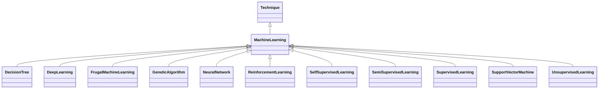

---
search:
  boost: 10.0
---

# Class: MachineLearning 


_Process of optimising model parameters through computational techniques,_

_such that the model's behaviour reflects the data or experience_


<div data-search-exclude markdown="1">


URI: [ai:MachineLearning](https://w3id.org/lmodel/dpv/ai/MachineLearning)





## Inheritance
* [AI](AI.md)
    * [Technique](Technique.md)
        * **MachineLearning**
            * [DecisionTree](DecisionTree.md) [ [Technique](Technique.md)]
            * [DeepLearning](DeepLearning.md) [ [TrainingTechnique](TrainingTechnique.md)]
            * [FrugalMachineLearning](FrugalMachineLearning.md) [ [TrainingTechnique](TrainingTechnique.md)]
            * [GeneticAlgorithm](GeneticAlgorithm.md) [ [TrainingTechnique](TrainingTechnique.md)]
            * [NeuralNetwork](NeuralNetwork.md) [ [TrainingTechnique](TrainingTechnique.md)]
            * [ReinforcementLearning](ReinforcementLearning.md) [ [TrainingTechnique](TrainingTechnique.md)]
            * [SelfSupervisedLearning](SelfSupervisedLearning.md) [ [TrainingTechnique](TrainingTechnique.md)]
            * [SemiSupervisedLearning](SemiSupervisedLearning.md) [ [TrainingTechnique](TrainingTechnique.md)]
            * [SupervisedLearning](SupervisedLearning.md) [ [TrainingTechnique](TrainingTechnique.md)]
            * [SupportVectorMachine](SupportVectorMachine.md) [ [TrainingTechnique](TrainingTechnique.md)]
            * [UnsupervisedLearning](UnsupervisedLearning.md) [ [TrainingTechnique](TrainingTechnique.md)]


## Class Properties

| Property | Value |
| --- | --- |
| Class URI | [ai:MachineLearning](https://w3id.org/lmodel/dpv/ai/MachineLearning) |


## Slots

| Name | Cardinality and Range | Description | Inheritance |
| ---  | --- | --- | --- |


## In Subsets


* [AiSubset](AiSubset.md)


## Aliases


* Machine Learning


## Identifier and Mapping Information


### Annotations

| property | value |
| --- | --- |
| dct_source | ISO/IEC 22989:2022 3.3.5 |
| upstream_iri | https://w3id.org/dpv/ai/owl#MachineLearning |
| dpv_extension_slug | ai |


### Schema Source


* from schema: https://w3id.org/lmodel/dpv/ai


## Mappings

| Mapping Type | Mapped Value |
| ---  | ---  |
| self | ai:MachineLearning |
| native | ai:MachineLearning |
| exact | dpv_ai:MachineLearning, dpv_ai_owl:MachineLearning |


## LinkML Source

<!-- TODO: investigate https://stackoverflow.com/questions/37606292/how-to-create-tabbed-code-blocks-in-mkdocs-or-sphinx -->

### Direct

<details>
```yaml
name: MachineLearning
annotations:
  dct_source:
    tag: dct_source
    value: ISO/IEC 22989:2022 3.3.5
  upstream_iri:
    tag: upstream_iri
    value: https://w3id.org/dpv/ai/owl#MachineLearning
  dpv_extension_slug:
    tag: dpv_extension_slug
    value: ai
description: 'Process of optimising model parameters through computational techniques,

  such that the model''s behaviour reflects the data or experience'
in_subset:
- ai_subset
from_schema: https://w3id.org/lmodel/dpv/ai
aliases:
- Machine Learning
exact_mappings:
- dpv_ai:MachineLearning
- dpv_ai_owl:MachineLearning
is_a: Technique
class_uri: ai:MachineLearning

```
</details>

### Induced

<details>
```yaml
name: MachineLearning
annotations:
  dct_source:
    tag: dct_source
    value: ISO/IEC 22989:2022 3.3.5
  upstream_iri:
    tag: upstream_iri
    value: https://w3id.org/dpv/ai/owl#MachineLearning
  dpv_extension_slug:
    tag: dpv_extension_slug
    value: ai
description: 'Process of optimising model parameters through computational techniques,

  such that the model''s behaviour reflects the data or experience'
in_subset:
- ai_subset
from_schema: https://w3id.org/lmodel/dpv/ai
aliases:
- Machine Learning
exact_mappings:
- dpv_ai:MachineLearning
- dpv_ai_owl:MachineLearning
is_a: Technique
class_uri: ai:MachineLearning

```
</details></div>