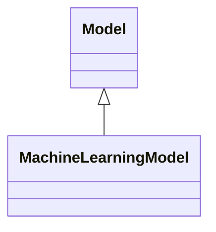

---
search:
  boost: 10.0
---

# Class: MachineLearningModel 


_Mathematical construct that generates an inference or prediction based_

_on input data or information_


<div data-search-exclude markdown="1">


URI: [ai:MachineLearningModel](https://w3id.org/lmodel/dpv/ai/MachineLearningModel)





## Inheritance
* [AI](AI.md)
    * [Model](Model.md)
        * **MachineLearningModel**


## Class Properties

| Property | Value |
| --- | --- |
| Class URI | [ai:MachineLearningModel](https://w3id.org/lmodel/dpv/ai/MachineLearningModel) |


## Slots

| Name | Cardinality and Range | Description | Inheritance |
| ---  | --- | --- | --- |


## In Subsets


* [AiSubset](AiSubset.md)


## Aliases


* Machine Learning Model


## Identifier and Mapping Information


### Annotations

| property | value |
| --- | --- |
| dct_source | ISO/IEC 22989:2022 3.3.7 |
| upstream_iri | https://w3id.org/dpv/ai/owl#MachineLearningModel |
| dpv_extension_slug | ai |


### Schema Source


* from schema: https://w3id.org/lmodel/dpv/ai


## Mappings

| Mapping Type | Mapped Value |
| ---  | ---  |
| self | ai:MachineLearningModel |
| native | ai:MachineLearningModel |
| exact | dpv_ai:MachineLearningModel, dpv_ai_owl:MachineLearningModel |


## LinkML Source

<!-- TODO: investigate https://stackoverflow.com/questions/37606292/how-to-create-tabbed-code-blocks-in-mkdocs-or-sphinx -->

### Direct

<details>
```yaml
name: MachineLearningModel
annotations:
  dct_source:
    tag: dct_source
    value: ISO/IEC 22989:2022 3.3.7
  upstream_iri:
    tag: upstream_iri
    value: https://w3id.org/dpv/ai/owl#MachineLearningModel
  dpv_extension_slug:
    tag: dpv_extension_slug
    value: ai
description: 'Mathematical construct that generates an inference or prediction based

  on input data or information'
in_subset:
- ai_subset
from_schema: https://w3id.org/lmodel/dpv/ai
aliases:
- Machine Learning Model
exact_mappings:
- dpv_ai:MachineLearningModel
- dpv_ai_owl:MachineLearningModel
is_a: Model
class_uri: ai:MachineLearningModel

```
</details>

### Induced

<details>
```yaml
name: MachineLearningModel
annotations:
  dct_source:
    tag: dct_source
    value: ISO/IEC 22989:2022 3.3.7
  upstream_iri:
    tag: upstream_iri
    value: https://w3id.org/dpv/ai/owl#MachineLearningModel
  dpv_extension_slug:
    tag: dpv_extension_slug
    value: ai
description: 'Mathematical construct that generates an inference or prediction based

  on input data or information'
in_subset:
- ai_subset
from_schema: https://w3id.org/lmodel/dpv/ai
aliases:
- Machine Learning Model
exact_mappings:
- dpv_ai:MachineLearningModel
- dpv_ai_owl:MachineLearningModel
is_a: Model
class_uri: ai:MachineLearningModel

```
</details></div>