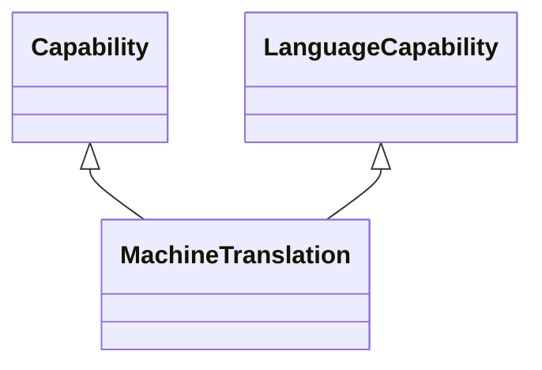

---
search:
  boost: 10.0
---

# Class: MachineTranslation 


_Capability for automated translation of text or speech from one natural_

_language to another using a computer system_


<div data-search-exclude markdown="1">


URI: [ai:MachineTranslation](https://w3id.org/lmodel/dpv/ai/MachineTranslation)





## Inheritance
* [AI](AI.md)
    * [Capability](Capability.md)
        * [LanguageCapability](LanguageCapability.md)
            * **MachineTranslation** [ [Capability](Capability.md)]


## Class Properties

| Property | Value |
| --- | --- |
| Class URI | [ai:MachineTranslation](https://w3id.org/lmodel/dpv/ai/MachineTranslation) |


## Slots

| Name | Cardinality and Range | Description | Inheritance |
| ---  | --- | --- | --- |


## In Subsets


* [AiSubset](AiSubset.md)


## Aliases


* Machine Translation


## Identifier and Mapping Information


### Annotations

| property | value |
| --- | --- |
| dct_source | ISO/IEC 22989:2022 3.6.5 |
| upstream_iri | https://w3id.org/dpv/ai/owl#MachineTranslation |
| dpv_extension_slug | ai |


### Schema Source


* from schema: https://w3id.org/lmodel/dpv/ai


## Mappings

| Mapping Type | Mapped Value |
| ---  | ---  |
| self | ai:MachineTranslation |
| native | ai:MachineTranslation |
| exact | dpv_ai:MachineTranslation, dpv_ai_owl:MachineTranslation |


## LinkML Source

<!-- TODO: investigate https://stackoverflow.com/questions/37606292/how-to-create-tabbed-code-blocks-in-mkdocs-or-sphinx -->

### Direct

<details>
```yaml
name: MachineTranslation
annotations:
  dct_source:
    tag: dct_source
    value: ISO/IEC 22989:2022 3.6.5
  upstream_iri:
    tag: upstream_iri
    value: https://w3id.org/dpv/ai/owl#MachineTranslation
  dpv_extension_slug:
    tag: dpv_extension_slug
    value: ai
description: 'Capability for automated translation of text or speech from one natural

  language to another using a computer system'
in_subset:
- ai_subset
from_schema: https://w3id.org/lmodel/dpv/ai
aliases:
- Machine Translation
exact_mappings:
- dpv_ai:MachineTranslation
- dpv_ai_owl:MachineTranslation
is_a: LanguageCapability
mixins:
- Capability
class_uri: ai:MachineTranslation

```
</details>

### Induced

<details>
```yaml
name: MachineTranslation
annotations:
  dct_source:
    tag: dct_source
    value: ISO/IEC 22989:2022 3.6.5
  upstream_iri:
    tag: upstream_iri
    value: https://w3id.org/dpv/ai/owl#MachineTranslation
  dpv_extension_slug:
    tag: dpv_extension_slug
    value: ai
description: 'Capability for automated translation of text or speech from one natural

  language to another using a computer system'
in_subset:
- ai_subset
from_schema: https://w3id.org/lmodel/dpv/ai
aliases:
- Machine Translation
exact_mappings:
- dpv_ai:MachineTranslation
- dpv_ai_owl:MachineTranslation
is_a: LanguageCapability
mixins:
- Capability
class_uri: ai:MachineTranslation

```
</details></div>