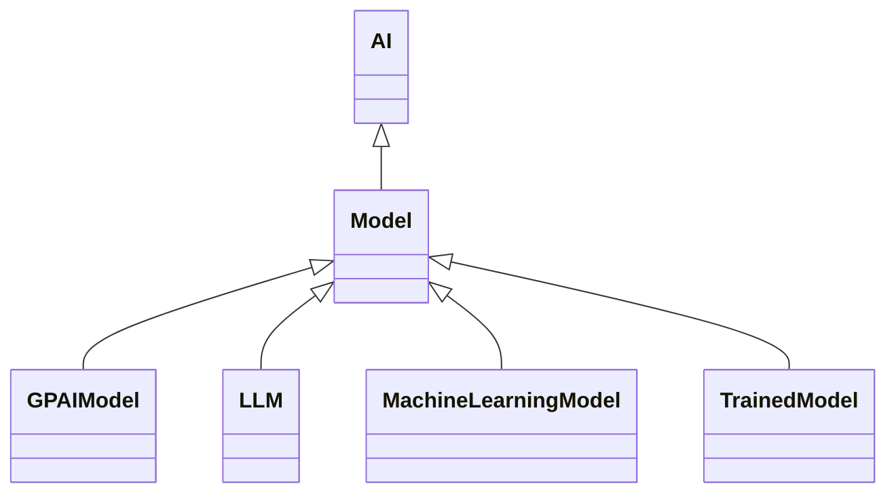

---
search:
  boost: 10.0
---

# Class: Model 


_Physical, mathematical or otherwise logical representation of a system,_

_entity, phenomenon, process or data involving the use of AI techniques_


<div data-search-exclude markdown="1">


URI: [ai:Model](https://w3id.org/lmodel/dpv/ai/Model)





## Inheritance
* [AI](AI.md)
    * **Model**
        * [GPAIModel](GPAIModel.md)
        * [LLM](LLM.md)
        * [MachineLearningModel](MachineLearningModel.md)
        * [TrainedModel](TrainedModel.md)


## Class Properties

| Property | Value |
| --- | --- |
| Class URI | [ai:Model](https://w3id.org/lmodel/dpv/ai/Model) |


## Slots

| Name | Cardinality and Range | Description | Inheritance |
| ---  | --- | --- | --- |


## In Subsets


* [AiSubset](AiSubset.md)


## Aliases


* Model


## Identifier and Mapping Information


### Annotations

| property | value |
| --- | --- |
| dct_source |  ISO/IEC 22989:2022 |
| upstream_iri | https://w3id.org/dpv/ai/owl#Model |
| dpv_extension_slug | ai |


### Schema Source


* from schema: https://w3id.org/lmodel/dpv/ai


## Mappings

| Mapping Type | Mapped Value |
| ---  | ---  |
| self | ai:Model |
| native | ai:Model |
| exact | dpv_ai:Model, dpv_ai_owl:Model |


## LinkML Source

<!-- TODO: investigate https://stackoverflow.com/questions/37606292/how-to-create-tabbed-code-blocks-in-mkdocs-or-sphinx -->

### Direct

<details>
```yaml
name: Model
annotations:
  dct_source:
    tag: dct_source
    value: ' ISO/IEC 22989:2022'
  upstream_iri:
    tag: upstream_iri
    value: https://w3id.org/dpv/ai/owl#Model
  dpv_extension_slug:
    tag: dpv_extension_slug
    value: ai
description: 'Physical, mathematical or otherwise logical representation of a system,

  entity, phenomenon, process or data involving the use of AI techniques'
in_subset:
- ai_subset
from_schema: https://w3id.org/lmodel/dpv/ai
aliases:
- Model
exact_mappings:
- dpv_ai:Model
- dpv_ai_owl:Model
is_a: AI
class_uri: ai:Model

```
</details>

### Induced

<details>
```yaml
name: Model
annotations:
  dct_source:
    tag: dct_source
    value: ' ISO/IEC 22989:2022'
  upstream_iri:
    tag: upstream_iri
    value: https://w3id.org/dpv/ai/owl#Model
  dpv_extension_slug:
    tag: dpv_extension_slug
    value: ai
description: 'Physical, mathematical or otherwise logical representation of a system,

  entity, phenomenon, process or data involving the use of AI techniques'
in_subset:
- ai_subset
from_schema: https://w3id.org/lmodel/dpv/ai
aliases:
- Model
exact_mappings:
- dpv_ai:Model
- dpv_ai_owl:Model
is_a: AI
class_uri: ai:Model

```
</details></div>