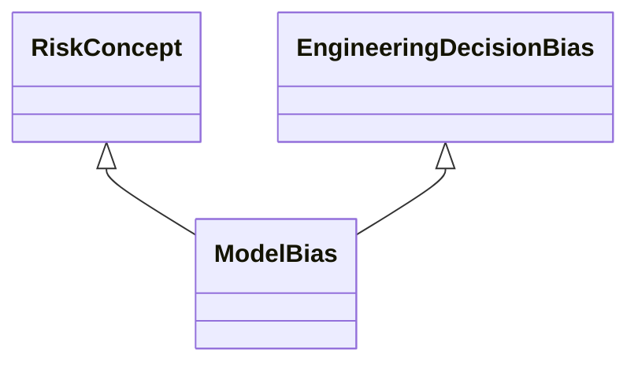

---
search:
  boost: 10.0
---

# Class: ModelBias 


_Bias that occurs when ML uses functions like a maximum likelihood_

_estimator to determine parameters, and there is data skew or_

_under-representation present in the data, where the maximum likelihood_

_estimation tends to amplify any underlying bias in the distribution_


<div data-search-exclude markdown="1">


URI: [ai:ModelBias](https://w3id.org/lmodel/dpv/ai/ModelBias)





## Inheritance
* [RiskConcept](RiskConcept.md)
    * [AIBias](AIBias.md)
        * [EngineeringDecisionBias](EngineeringDecisionBias.md) [ [RiskConcept](RiskConcept.md)]
            * **ModelBias** [ [RiskConcept](RiskConcept.md)]


## Class Properties

| Property | Value |
| --- | --- |
| Class URI | [ai:ModelBias](https://w3id.org/lmodel/dpv/ai/ModelBias) |


## Slots

| Name | Cardinality and Range | Description | Inheritance |
| ---  | --- | --- | --- |


## In Subsets


* [AiSubset](AiSubset.md)


## Aliases


* Model Bias


## Identifier and Mapping Information


### Annotations

| property | value |
| --- | --- |
| dct_source | ISO/IEC 24027:2021 |
| upstream_iri | https://w3id.org/dpv/ai/owl#ModelBias |
| dpv_extension_slug | ai |


### Schema Source


* from schema: https://w3id.org/lmodel/dpv/ai


## Mappings

| Mapping Type | Mapped Value |
| ---  | ---  |
| self | ai:ModelBias |
| native | ai:ModelBias |
| exact | dpv_ai:ModelBias, dpv_ai_owl:ModelBias |


## LinkML Source

<!-- TODO: investigate https://stackoverflow.com/questions/37606292/how-to-create-tabbed-code-blocks-in-mkdocs-or-sphinx -->

### Direct

<details>
```yaml
name: ModelBias
annotations:
  dct_source:
    tag: dct_source
    value: ISO/IEC 24027:2021
  upstream_iri:
    tag: upstream_iri
    value: https://w3id.org/dpv/ai/owl#ModelBias
  dpv_extension_slug:
    tag: dpv_extension_slug
    value: ai
description: 'Bias that occurs when ML uses functions like a maximum likelihood

  estimator to determine parameters, and there is data skew or

  under-representation present in the data, where the maximum likelihood

  estimation tends to amplify any underlying bias in the distribution'
in_subset:
- ai_subset
from_schema: https://w3id.org/lmodel/dpv/ai
aliases:
- Model Bias
exact_mappings:
- dpv_ai:ModelBias
- dpv_ai_owl:ModelBias
is_a: EngineeringDecisionBias
mixins:
- RiskConcept
class_uri: ai:ModelBias

```
</details>

### Induced

<details>
```yaml
name: ModelBias
annotations:
  dct_source:
    tag: dct_source
    value: ISO/IEC 24027:2021
  upstream_iri:
    tag: upstream_iri
    value: https://w3id.org/dpv/ai/owl#ModelBias
  dpv_extension_slug:
    tag: dpv_extension_slug
    value: ai
description: 'Bias that occurs when ML uses functions like a maximum likelihood

  estimator to determine parameters, and there is data skew or

  under-representation present in the data, where the maximum likelihood

  estimation tends to amplify any underlying bias in the distribution'
in_subset:
- ai_subset
from_schema: https://w3id.org/lmodel/dpv/ai
aliases:
- Model Bias
exact_mappings:
- dpv_ai:ModelBias
- dpv_ai_owl:ModelBias
is_a: EngineeringDecisionBias
mixins:
- RiskConcept
class_uri: ai:ModelBias

```
</details></div>