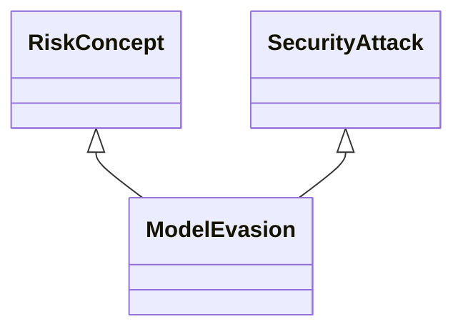

---
search:
  boost: 10.0
---

# Class: ModelEvasion 


_An input, which seems normal for a human but is wrongly classified by ML_

_models_


<div data-search-exclude markdown="1">


URI: [ai:ModelEvasion](https://w3id.org/lmodel/dpv/ai/ModelEvasion)





## Inheritance
* [RiskConcept](RiskConcept.md)
    * [SecurityAttack](SecurityAttack.md)
        * **ModelEvasion** [ [RiskConcept](RiskConcept.md)]


## Class Properties

| Property | Value |
| --- | --- |
| Class URI | [ai:ModelEvasion](https://w3id.org/lmodel/dpv/ai/ModelEvasion) |


## Slots

| Name | Cardinality and Range | Description | Inheritance |
| ---  | --- | --- | --- |


## In Subsets


* [AiSubset](AiSubset.md)


## Aliases


* Model Evasion


## Comments

* (The EU Assessment List for Trustworthy AI
(ALTAI),https://data.europa.eu/doi/10.2759/002360)


## Identifier and Mapping Information


### Annotations

| property | value |
| --- | --- |
| upstream_iri | https://w3id.org/dpv/ai/owl#ModelEvasion |
| dpv_extension_slug | ai |


### Schema Source


* from schema: https://w3id.org/lmodel/dpv/ai


## Mappings

| Mapping Type | Mapped Value |
| ---  | ---  |
| self | ai:ModelEvasion |
| native | ai:ModelEvasion |
| exact | dpv_ai:ModelEvasion, dpv_ai_owl:ModelEvasion |


## LinkML Source

<!-- TODO: investigate https://stackoverflow.com/questions/37606292/how-to-create-tabbed-code-blocks-in-mkdocs-or-sphinx -->

### Direct

<details>
```yaml
name: ModelEvasion
annotations:
  upstream_iri:
    tag: upstream_iri
    value: https://w3id.org/dpv/ai/owl#ModelEvasion
  dpv_extension_slug:
    tag: dpv_extension_slug
    value: ai
description: 'An input, which seems normal for a human but is wrongly classified by
  ML

  models'
comments:
- '(The EU Assessment List for Trustworthy AI

  (ALTAI),https://data.europa.eu/doi/10.2759/002360)'
in_subset:
- ai_subset
from_schema: https://w3id.org/lmodel/dpv/ai
aliases:
- Model Evasion
exact_mappings:
- dpv_ai:ModelEvasion
- dpv_ai_owl:ModelEvasion
is_a: SecurityAttack
mixins:
- RiskConcept
class_uri: ai:ModelEvasion

```
</details>

### Induced

<details>
```yaml
name: ModelEvasion
annotations:
  upstream_iri:
    tag: upstream_iri
    value: https://w3id.org/dpv/ai/owl#ModelEvasion
  dpv_extension_slug:
    tag: dpv_extension_slug
    value: ai
description: 'An input, which seems normal for a human but is wrongly classified by
  ML

  models'
comments:
- '(The EU Assessment List for Trustworthy AI

  (ALTAI),https://data.europa.eu/doi/10.2759/002360)'
in_subset:
- ai_subset
from_schema: https://w3id.org/lmodel/dpv/ai
aliases:
- Model Evasion
exact_mappings:
- dpv_ai:ModelEvasion
- dpv_ai_owl:ModelEvasion
is_a: SecurityAttack
mixins:
- RiskConcept
class_uri: ai:ModelEvasion

```
</details></div>