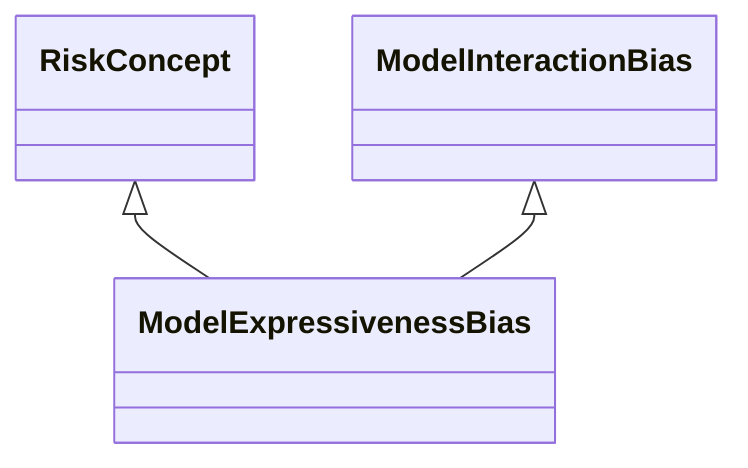

---
search:
  boost: 10.0
---

# Class: ModelExpressivenessBias 


_Bias that occurs from the number and nature of parameters in a model as_

_well as the neural network topology which affect the expressiveness of_

_the model and any feature that affects model expressiveness differently_

_across groups_


<div data-search-exclude markdown="1">


URI: [ai:ModelExpressivenessBias](https://w3id.org/lmodel/dpv/ai/ModelExpressivenessBias)





## Inheritance
* [RiskConcept](RiskConcept.md)
    * [AIBias](AIBias.md)
        * [EngineeringDecisionBias](EngineeringDecisionBias.md) [ [RiskConcept](RiskConcept.md)]
            * [ModelInteractionBias](ModelInteractionBias.md) [ [RiskConcept](RiskConcept.md)]
                * **ModelExpressivenessBias** [ [RiskConcept](RiskConcept.md)]


## Class Properties

| Property | Value |
| --- | --- |
| Class URI | [ai:ModelExpressivenessBias](https://w3id.org/lmodel/dpv/ai/ModelExpressivenessBias) |


## Slots

| Name | Cardinality and Range | Description | Inheritance |
| ---  | --- | --- | --- |


## In Subsets


* [AiSubset](AiSubset.md)


## Aliases


* Model Expressiveness Bias


## Identifier and Mapping Information


### Annotations

| property | value |
| --- | --- |
| dct_source | ISO/IEC 24027:2021 |
| upstream_iri | https://w3id.org/dpv/ai/owl#ModelExpressivenessBias |
| dpv_extension_slug | ai |


### Schema Source


* from schema: https://w3id.org/lmodel/dpv/ai


## Mappings

| Mapping Type | Mapped Value |
| ---  | ---  |
| self | ai:ModelExpressivenessBias |
| native | ai:ModelExpressivenessBias |
| exact | dpv_ai:ModelExpressivenessBias, dpv_ai_owl:ModelExpressivenessBias |


## LinkML Source

<!-- TODO: investigate https://stackoverflow.com/questions/37606292/how-to-create-tabbed-code-blocks-in-mkdocs-or-sphinx -->

### Direct

<details>
```yaml
name: ModelExpressivenessBias
annotations:
  dct_source:
    tag: dct_source
    value: ISO/IEC 24027:2021
  upstream_iri:
    tag: upstream_iri
    value: https://w3id.org/dpv/ai/owl#ModelExpressivenessBias
  dpv_extension_slug:
    tag: dpv_extension_slug
    value: ai
description: 'Bias that occurs from the number and nature of parameters in a model
  as

  well as the neural network topology which affect the expressiveness of

  the model and any feature that affects model expressiveness differently

  across groups'
in_subset:
- ai_subset
from_schema: https://w3id.org/lmodel/dpv/ai
aliases:
- Model Expressiveness Bias
exact_mappings:
- dpv_ai:ModelExpressivenessBias
- dpv_ai_owl:ModelExpressivenessBias
is_a: ModelInteractionBias
mixins:
- RiskConcept
class_uri: ai:ModelExpressivenessBias

```
</details>

### Induced

<details>
```yaml
name: ModelExpressivenessBias
annotations:
  dct_source:
    tag: dct_source
    value: ISO/IEC 24027:2021
  upstream_iri:
    tag: upstream_iri
    value: https://w3id.org/dpv/ai/owl#ModelExpressivenessBias
  dpv_extension_slug:
    tag: dpv_extension_slug
    value: ai
description: 'Bias that occurs from the number and nature of parameters in a model
  as

  well as the neural network topology which affect the expressiveness of

  the model and any feature that affects model expressiveness differently

  across groups'
in_subset:
- ai_subset
from_schema: https://w3id.org/lmodel/dpv/ai
aliases:
- Model Expressiveness Bias
exact_mappings:
- dpv_ai:ModelExpressivenessBias
- dpv_ai_owl:ModelExpressivenessBias
is_a: ModelInteractionBias
mixins:
- RiskConcept
class_uri: ai:ModelExpressivenessBias

```
</details></div>