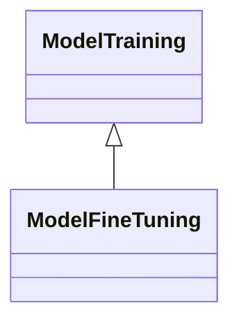

---
search:
  boost: 10.0
---

# Class: ModelTraining 


_Process to determine or to improve the parameters of a machine learning_

_model based on a machine learning technique by using training data_


<div data-search-exclude markdown="1">


URI: [ai:ModelTraining](https://w3id.org/lmodel/dpv/ai/ModelTraining)





## Inheritance
* **ModelTraining**
    * [ModelFineTuning](ModelFineTuning.md)


## Class Properties

| Property | Value |
| --- | --- |
| Class URI | [ai:ModelTraining](https://w3id.org/lmodel/dpv/ai/ModelTraining) |


## Slots

| Name | Cardinality and Range | Description | Inheritance |
| ---  | --- | --- | --- |


## In Subsets


* [AiSubset](AiSubset.md)


## Aliases


* Model Training


## Identifier and Mapping Information


### Annotations

| property | value |
| --- | --- |
| upstream_iri | https://w3id.org/dpv/ai/owl#ModelTraining |
| dpv_extension_slug | ai |


### Schema Source


* from schema: https://w3id.org/lmodel/dpv/ai


## Mappings

| Mapping Type | Mapped Value |
| ---  | ---  |
| self | ai:ModelTraining |
| native | ai:ModelTraining |
| exact | dpv_ai:ModelTraining, dpv_ai_owl:ModelTraining |


## LinkML Source

<!-- TODO: investigate https://stackoverflow.com/questions/37606292/how-to-create-tabbed-code-blocks-in-mkdocs-or-sphinx -->

### Direct

<details>
```yaml
name: ModelTraining
annotations:
  upstream_iri:
    tag: upstream_iri
    value: https://w3id.org/dpv/ai/owl#ModelTraining
  dpv_extension_slug:
    tag: dpv_extension_slug
    value: ai
description: 'Process to determine or to improve the parameters of a machine learning

  model based on a machine learning technique by using training data'
in_subset:
- ai_subset
from_schema: https://w3id.org/lmodel/dpv/ai
aliases:
- Model Training
exact_mappings:
- dpv_ai:ModelTraining
- dpv_ai_owl:ModelTraining
class_uri: ai:ModelTraining

```
</details>

### Induced

<details>
```yaml
name: ModelTraining
annotations:
  upstream_iri:
    tag: upstream_iri
    value: https://w3id.org/dpv/ai/owl#ModelTraining
  dpv_extension_slug:
    tag: dpv_extension_slug
    value: ai
description: 'Process to determine or to improve the parameters of a machine learning

  model based on a machine learning technique by using training data'
in_subset:
- ai_subset
from_schema: https://w3id.org/lmodel/dpv/ai
aliases:
- Model Training
exact_mappings:
- dpv_ai:ModelTraining
- dpv_ai_owl:ModelTraining
class_uri: ai:ModelTraining

```
</details></div>