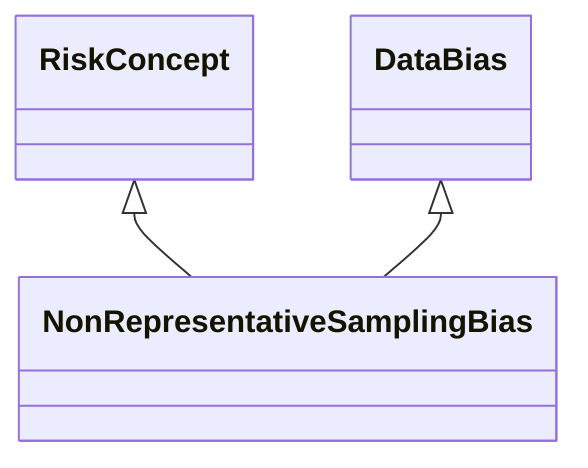

---
search:
  boost: 10.0
---

# Class: NonRepresentativeSamplingBias 


_Bias that occurs if a dataset is not representative of the intended_

_deployment environment, where the model learns biases based on the ways_

_in which the data is non-representative_


<div data-search-exclude markdown="1">


URI: [ai:NonRepresentativeSamplingBias](https://w3id.org/lmodel/dpv/ai/NonRepresentativeSamplingBias)





## Inheritance
* [RiskConcept](RiskConcept.md)
    * [AIBias](AIBias.md)
        * [DataBias](DataBias.md) [ [RiskConcept](RiskConcept.md)]
            * **NonRepresentativeSamplingBias** [ [RiskConcept](RiskConcept.md)]


## Class Properties

| Property | Value |
| --- | --- |
| Class URI | [ai:NonRepresentativeSamplingBias](https://w3id.org/lmodel/dpv/ai/NonRepresentativeSamplingBias) |


## Slots

| Name | Cardinality and Range | Description | Inheritance |
| ---  | --- | --- | --- |


## In Subsets


* [AiSubset](AiSubset.md)


## Aliases


* Non-Representative Sampling Bias


## Identifier and Mapping Information


### Annotations

| property | value |
| --- | --- |
| dct_source | ISO/IEC 24027:2021 |
| upstream_iri | https://w3id.org/dpv/ai/owl#NonRepresentativeSamplingBias |
| dpv_extension_slug | ai |


### Schema Source


* from schema: https://w3id.org/lmodel/dpv/ai


## Mappings

| Mapping Type | Mapped Value |
| ---  | ---  |
| self | ai:NonRepresentativeSamplingBias |
| native | ai:NonRepresentativeSamplingBias |
| exact | dpv_ai:NonRepresentativeSamplingBias, dpv_ai_owl:NonRepresentativeSamplingBias |


## LinkML Source

<!-- TODO: investigate https://stackoverflow.com/questions/37606292/how-to-create-tabbed-code-blocks-in-mkdocs-or-sphinx -->

### Direct

<details>
```yaml
name: NonRepresentativeSamplingBias
annotations:
  dct_source:
    tag: dct_source
    value: ISO/IEC 24027:2021
  upstream_iri:
    tag: upstream_iri
    value: https://w3id.org/dpv/ai/owl#NonRepresentativeSamplingBias
  dpv_extension_slug:
    tag: dpv_extension_slug
    value: ai
description: 'Bias that occurs if a dataset is not representative of the intended

  deployment environment, where the model learns biases based on the ways

  in which the data is non-representative'
in_subset:
- ai_subset
from_schema: https://w3id.org/lmodel/dpv/ai
aliases:
- Non-Representative Sampling Bias
exact_mappings:
- dpv_ai:NonRepresentativeSamplingBias
- dpv_ai_owl:NonRepresentativeSamplingBias
is_a: DataBias
mixins:
- RiskConcept
class_uri: ai:NonRepresentativeSamplingBias

```
</details>

### Induced

<details>
```yaml
name: NonRepresentativeSamplingBias
annotations:
  dct_source:
    tag: dct_source
    value: ISO/IEC 24027:2021
  upstream_iri:
    tag: upstream_iri
    value: https://w3id.org/dpv/ai/owl#NonRepresentativeSamplingBias
  dpv_extension_slug:
    tag: dpv_extension_slug
    value: ai
description: 'Bias that occurs if a dataset is not representative of the intended

  deployment environment, where the model learns biases based on the ways

  in which the data is non-representative'
in_subset:
- ai_subset
from_schema: https://w3id.org/lmodel/dpv/ai
aliases:
- Non-Representative Sampling Bias
exact_mappings:
- dpv_ai:NonRepresentativeSamplingBias
- dpv_ai_owl:NonRepresentativeSamplingBias
is_a: DataBias
mixins:
- RiskConcept
class_uri: ai:NonRepresentativeSamplingBias

```
</details></div>