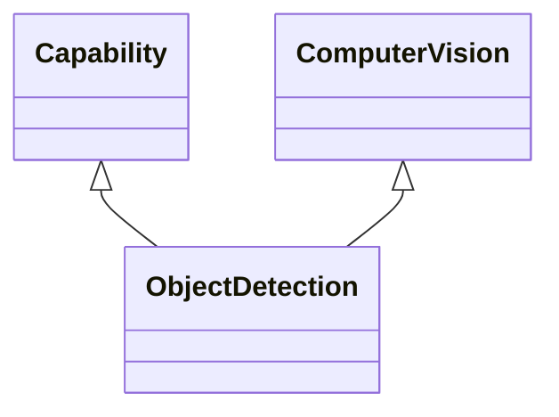

---
search:
  boost: 10.0
---

# Class: ObjectDetection 


_computer vision technology that detects instances of semantic objects in_

_digital images and videos, covering domains like face detection and_

_pedestrian detection, with applications spanning image retrieval and_

_video surveillance_


<div data-search-exclude markdown="1">


URI: [ai:ObjectDetection](https://w3id.org/lmodel/dpv/ai/ObjectDetection)





## Inheritance
* [AI](AI.md)
    * [Capability](Capability.md)
        * [ComputerVision](ComputerVision.md)
            * **ObjectDetection** [ [Capability](Capability.md)]


## Class Properties

| Property | Value |
| --- | --- |
| Class URI | [ai:ObjectDetection](https://w3id.org/lmodel/dpv/ai/ObjectDetection) |


## Slots

| Name | Cardinality and Range | Description | Inheritance |
| ---  | --- | --- | --- |


## In Subsets


* [AiSubset](AiSubset.md)


## Aliases


* Object Detection


## Identifier and Mapping Information


### Annotations

| property | value |
| --- | --- |
| upstream_iri | https://w3id.org/dpv/ai/owl#ObjectDetection |
| dpv_extension_slug | ai |


### Schema Source


* from schema: https://w3id.org/lmodel/dpv/ai


## Mappings

| Mapping Type | Mapped Value |
| ---  | ---  |
| self | ai:ObjectDetection |
| native | ai:ObjectDetection |
| exact | dpv_ai:ObjectDetection, dpv_ai_owl:ObjectDetection |


## LinkML Source

<!-- TODO: investigate https://stackoverflow.com/questions/37606292/how-to-create-tabbed-code-blocks-in-mkdocs-or-sphinx -->

### Direct

<details>
```yaml
name: ObjectDetection
annotations:
  upstream_iri:
    tag: upstream_iri
    value: https://w3id.org/dpv/ai/owl#ObjectDetection
  dpv_extension_slug:
    tag: dpv_extension_slug
    value: ai
description: 'computer vision technology that detects instances of semantic objects
  in

  digital images and videos, covering domains like face detection and

  pedestrian detection, with applications spanning image retrieval and

  video surveillance'
in_subset:
- ai_subset
from_schema: https://w3id.org/lmodel/dpv/ai
aliases:
- Object Detection
exact_mappings:
- dpv_ai:ObjectDetection
- dpv_ai_owl:ObjectDetection
is_a: ComputerVision
mixins:
- Capability
class_uri: ai:ObjectDetection

```
</details>

### Induced

<details>
```yaml
name: ObjectDetection
annotations:
  upstream_iri:
    tag: upstream_iri
    value: https://w3id.org/dpv/ai/owl#ObjectDetection
  dpv_extension_slug:
    tag: dpv_extension_slug
    value: ai
description: 'computer vision technology that detects instances of semantic objects
  in

  digital images and videos, covering domains like face detection and

  pedestrian detection, with applications spanning image retrieval and

  video surveillance'
in_subset:
- ai_subset
from_schema: https://w3id.org/lmodel/dpv/ai
aliases:
- Object Detection
exact_mappings:
- dpv_ai:ObjectDetection
- dpv_ai_owl:ObjectDetection
is_a: ComputerVision
mixins:
- Capability
class_uri: ai:ObjectDetection

```
</details></div>