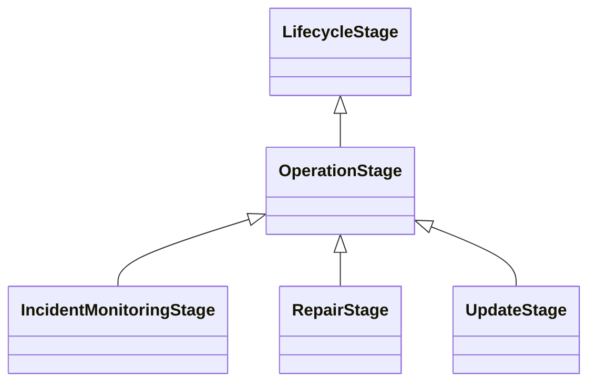

---
search:
  boost: 10.0
---

# Class: OperationStage 


_The stage in the lifecycle where an AI system is running and generally_

_available for operations_


<div data-search-exclude markdown="1">


URI: [ai:OperationStage](https://w3id.org/lmodel/dpv/ai/OperationStage)





## Inheritance
* [LifecycleStage](LifecycleStage.md)
    * **OperationStage**
        * [IncidentMonitoringStage](IncidentMonitoringStage.md) [ [LifecycleStage](LifecycleStage.md)]
        * [RepairStage](RepairStage.md) [ [LifecycleStage](LifecycleStage.md)]
        * [UpdateStage](UpdateStage.md) [ [LifecycleStage](LifecycleStage.md)]


## Class Properties

| Property | Value |
| --- | --- |
| Class URI | [ai:OperationStage](https://w3id.org/lmodel/dpv/ai/OperationStage) |


## Slots

| Name | Cardinality and Range | Description | Inheritance |
| ---  | --- | --- | --- |


## In Subsets


* [AiSubset](AiSubset.md)


## Aliases


* Operation Stage


## Identifier and Mapping Information


### Annotations

| property | value |
| --- | --- |
| dct_source | ISO/IEC 22989:2022 |
| upstream_iri | https://w3id.org/dpv/ai/owl#OperationStage |
| dpv_extension_slug | ai |


### Schema Source


* from schema: https://w3id.org/lmodel/dpv/ai


## Mappings

| Mapping Type | Mapped Value |
| ---  | ---  |
| self | ai:OperationStage |
| native | ai:OperationStage |
| exact | dpv_ai:OperationStage, dpv_ai_owl:OperationStage |


## LinkML Source

<!-- TODO: investigate https://stackoverflow.com/questions/37606292/how-to-create-tabbed-code-blocks-in-mkdocs-or-sphinx -->

### Direct

<details>
```yaml
name: OperationStage
annotations:
  dct_source:
    tag: dct_source
    value: ISO/IEC 22989:2022
  upstream_iri:
    tag: upstream_iri
    value: https://w3id.org/dpv/ai/owl#OperationStage
  dpv_extension_slug:
    tag: dpv_extension_slug
    value: ai
description: 'The stage in the lifecycle where an AI system is running and generally

  available for operations'
in_subset:
- ai_subset
from_schema: https://w3id.org/lmodel/dpv/ai
aliases:
- Operation Stage
exact_mappings:
- dpv_ai:OperationStage
- dpv_ai_owl:OperationStage
is_a: LifecycleStage
class_uri: ai:OperationStage

```
</details>

### Induced

<details>
```yaml
name: OperationStage
annotations:
  dct_source:
    tag: dct_source
    value: ISO/IEC 22989:2022
  upstream_iri:
    tag: upstream_iri
    value: https://w3id.org/dpv/ai/owl#OperationStage
  dpv_extension_slug:
    tag: dpv_extension_slug
    value: ai
description: 'The stage in the lifecycle where an AI system is running and generally

  available for operations'
in_subset:
- ai_subset
from_schema: https://w3id.org/lmodel/dpv/ai
aliases:
- Operation Stage
exact_mappings:
- dpv_ai:OperationStage
- dpv_ai_owl:OperationStage
is_a: LifecycleStage
class_uri: ai:OperationStage

```
</details></div>