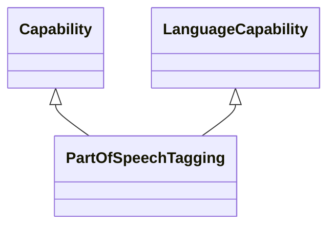

---
search:
  boost: 10.0
---

# Class: PartOfSpeechTagging 


_Capability for assigning a category (e.g. verb, noun, adjective) to a_

_word based on its grammatical properties_


<div data-search-exclude markdown="1">


URI: [ai:PartOfSpeechTagging](https://w3id.org/lmodel/dpv/ai/PartOfSpeechTagging)





## Inheritance
* [AI](AI.md)
    * [Capability](Capability.md)
        * [LanguageCapability](LanguageCapability.md)
            * **PartOfSpeechTagging** [ [Capability](Capability.md)]


## Class Properties

| Property | Value |
| --- | --- |
| Class URI | [ai:PartOfSpeechTagging](https://w3id.org/lmodel/dpv/ai/PartOfSpeechTagging) |


## Slots

| Name | Cardinality and Range | Description | Inheritance |
| ---  | --- | --- | --- |


## In Subsets


* [AiSubset](AiSubset.md)


## Aliases


* Part Of Speech Tagging


## Identifier and Mapping Information


### Annotations

| property | value |
| --- | --- |
| dct_source | ISO/IEC 22989:2022 3.6.13 |
| upstream_iri | https://w3id.org/dpv/ai/owl#PartOfSpeechTagging |
| dpv_extension_slug | ai |


### Schema Source


* from schema: https://w3id.org/lmodel/dpv/ai


## Mappings

| Mapping Type | Mapped Value |
| ---  | ---  |
| self | ai:PartOfSpeechTagging |
| native | ai:PartOfSpeechTagging |
| exact | dpv_ai:PartOfSpeechTagging, dpv_ai_owl:PartOfSpeechTagging |


## LinkML Source

<!-- TODO: investigate https://stackoverflow.com/questions/37606292/how-to-create-tabbed-code-blocks-in-mkdocs-or-sphinx -->

### Direct

<details>
```yaml
name: PartOfSpeechTagging
annotations:
  dct_source:
    tag: dct_source
    value: ISO/IEC 22989:2022 3.6.13
  upstream_iri:
    tag: upstream_iri
    value: https://w3id.org/dpv/ai/owl#PartOfSpeechTagging
  dpv_extension_slug:
    tag: dpv_extension_slug
    value: ai
description: 'Capability for assigning a category (e.g. verb, noun, adjective) to
  a

  word based on its grammatical properties'
in_subset:
- ai_subset
from_schema: https://w3id.org/lmodel/dpv/ai
aliases:
- Part Of Speech Tagging
exact_mappings:
- dpv_ai:PartOfSpeechTagging
- dpv_ai_owl:PartOfSpeechTagging
is_a: LanguageCapability
mixins:
- Capability
class_uri: ai:PartOfSpeechTagging

```
</details>

### Induced

<details>
```yaml
name: PartOfSpeechTagging
annotations:
  dct_source:
    tag: dct_source
    value: ISO/IEC 22989:2022 3.6.13
  upstream_iri:
    tag: upstream_iri
    value: https://w3id.org/dpv/ai/owl#PartOfSpeechTagging
  dpv_extension_slug:
    tag: dpv_extension_slug
    value: ai
description: 'Capability for assigning a category (e.g. verb, noun, adjective) to
  a

  word based on its grammatical properties'
in_subset:
- ai_subset
from_schema: https://w3id.org/lmodel/dpv/ai
aliases:
- Part Of Speech Tagging
exact_mappings:
- dpv_ai:PartOfSpeechTagging
- dpv_ai_owl:PartOfSpeechTagging
is_a: LanguageCapability
mixins:
- Capability
class_uri: ai:PartOfSpeechTagging

```
</details></div>