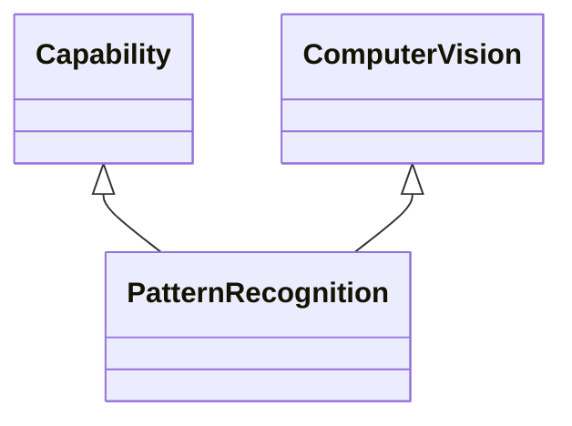

---
search:
  boost: 10.0
---

# Class: PatternRecognition 


_Capability for automated identification of patterns and regularities in_

_data, utilising algorithms to detect patterns or regularities for_

_categorising data into distinct groups, encompassing diverse_

_applications such as image analysis, speech processing, and biometric_

_authentication_


<div data-search-exclude markdown="1">


URI: [ai:PatternRecognition](https://w3id.org/lmodel/dpv/ai/PatternRecognition)





## Inheritance
* [AI](AI.md)
    * [Capability](Capability.md)
        * [ComputerVision](ComputerVision.md)
            * **PatternRecognition** [ [Capability](Capability.md)]


## Class Properties

| Property | Value |
| --- | --- |
| Class URI | [ai:PatternRecognition](https://w3id.org/lmodel/dpv/ai/PatternRecognition) |


## Slots

| Name | Cardinality and Range | Description | Inheritance |
| ---  | --- | --- | --- |


## In Subsets


* [AiSubset](AiSubset.md)


## Aliases


* Pattern Recognition


## Identifier and Mapping Information


### Annotations

| property | value |
| --- | --- |
| upstream_iri | https://w3id.org/dpv/ai/owl#PatternRecognition |
| dpv_extension_slug | ai |


### Schema Source


* from schema: https://w3id.org/lmodel/dpv/ai


## Mappings

| Mapping Type | Mapped Value |
| ---  | ---  |
| self | ai:PatternRecognition |
| native | ai:PatternRecognition |
| exact | dpv_ai:PatternRecognition, dpv_ai_owl:PatternRecognition |


## LinkML Source

<!-- TODO: investigate https://stackoverflow.com/questions/37606292/how-to-create-tabbed-code-blocks-in-mkdocs-or-sphinx -->

### Direct

<details>
```yaml
name: PatternRecognition
annotations:
  upstream_iri:
    tag: upstream_iri
    value: https://w3id.org/dpv/ai/owl#PatternRecognition
  dpv_extension_slug:
    tag: dpv_extension_slug
    value: ai
description: 'Capability for automated identification of patterns and regularities
  in

  data, utilising algorithms to detect patterns or regularities for

  categorising data into distinct groups, encompassing diverse

  applications such as image analysis, speech processing, and biometric

  authentication'
in_subset:
- ai_subset
from_schema: https://w3id.org/lmodel/dpv/ai
aliases:
- Pattern Recognition
exact_mappings:
- dpv_ai:PatternRecognition
- dpv_ai_owl:PatternRecognition
is_a: ComputerVision
mixins:
- Capability
class_uri: ai:PatternRecognition

```
</details>

### Induced

<details>
```yaml
name: PatternRecognition
annotations:
  upstream_iri:
    tag: upstream_iri
    value: https://w3id.org/dpv/ai/owl#PatternRecognition
  dpv_extension_slug:
    tag: dpv_extension_slug
    value: ai
description: 'Capability for automated identification of patterns and regularities
  in

  data, utilising algorithms to detect patterns or regularities for

  categorising data into distinct groups, encompassing diverse

  applications such as image analysis, speech processing, and biometric

  authentication'
in_subset:
- ai_subset
from_schema: https://w3id.org/lmodel/dpv/ai
aliases:
- Pattern Recognition
exact_mappings:
- dpv_ai:PatternRecognition
- dpv_ai_owl:PatternRecognition
is_a: ComputerVision
mixins:
- Capability
class_uri: ai:PatternRecognition

```
</details></div>