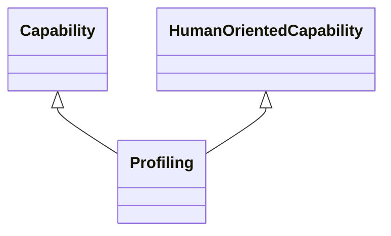

---
search:
  boost: 10.0
---

# Class: Profiling 


_Capability where AI is used to construct a profile of an individual_

_(human) or a group of individuals_


<div data-search-exclude markdown="1">


URI: [ai:Profiling](https://w3id.org/lmodel/dpv/ai/Profiling)





## Inheritance
* [AI](AI.md)
    * [Capability](Capability.md)
        * [HumanOrientedCapability](HumanOrientedCapability.md)
            * **Profiling** [ [Capability](Capability.md)]


## Class Properties

| Property | Value |
| --- | --- |
| Class URI | [ai:Profiling](https://w3id.org/lmodel/dpv/ai/Profiling) |


## Slots

| Name | Cardinality and Range | Description | Inheritance |
| ---  | --- | --- | --- |


## In Subsets


* [AiSubset](AiSubset.md)


## Aliases


* Profiling


## Identifier and Mapping Information


### Annotations

| property | value |
| --- | --- |
| upstream_iri | https://w3id.org/dpv/ai/owl#Profiling |
| dpv_extension_slug | ai |


### Schema Source


* from schema: https://w3id.org/lmodel/dpv/ai


## Mappings

| Mapping Type | Mapped Value |
| ---  | ---  |
| self | ai:Profiling |
| native | ai:Profiling |
| exact | dpv_ai:Profiling, dpv_ai_owl:Profiling |


## LinkML Source

<!-- TODO: investigate https://stackoverflow.com/questions/37606292/how-to-create-tabbed-code-blocks-in-mkdocs-or-sphinx -->

### Direct

<details>
```yaml
name: Profiling
annotations:
  upstream_iri:
    tag: upstream_iri
    value: https://w3id.org/dpv/ai/owl#Profiling
  dpv_extension_slug:
    tag: dpv_extension_slug
    value: ai
description: 'Capability where AI is used to construct a profile of an individual

  (human) or a group of individuals'
in_subset:
- ai_subset
from_schema: https://w3id.org/lmodel/dpv/ai
aliases:
- Profiling
exact_mappings:
- dpv_ai:Profiling
- dpv_ai_owl:Profiling
is_a: HumanOrientedCapability
mixins:
- Capability
class_uri: ai:Profiling

```
</details>

### Induced

<details>
```yaml
name: Profiling
annotations:
  upstream_iri:
    tag: upstream_iri
    value: https://w3id.org/dpv/ai/owl#Profiling
  dpv_extension_slug:
    tag: dpv_extension_slug
    value: ai
description: 'Capability where AI is used to construct a profile of an individual

  (human) or a group of individuals'
in_subset:
- ai_subset
from_schema: https://w3id.org/lmodel/dpv/ai
aliases:
- Profiling
exact_mappings:
- dpv_ai:Profiling
- dpv_ai_owl:Profiling
is_a: HumanOrientedCapability
mixins:
- Capability
class_uri: ai:Profiling

```
</details></div>