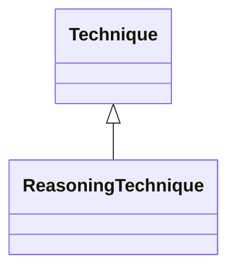

---
search:
  boost: 10.0
---

# Class: ReasoningTechnique 


_Refers to reasoning techniques_


<div data-search-exclude markdown="1">


URI: [ai:ReasoningTechnique](https://w3id.org/lmodel/dpv/ai/ReasoningTechnique)





## Inheritance
* [AI](AI.md)
    * [Technique](Technique.md)
        * **ReasoningTechnique**


## Class Properties

| Property | Value |
| --- | --- |
| Class URI | [ai:ReasoningTechnique](https://w3id.org/lmodel/dpv/ai/ReasoningTechnique) |


## Slots

| Name | Cardinality and Range | Description | Inheritance |
| ---  | --- | --- | --- |


## In Subsets


* [AiSubset](AiSubset.md)


## Aliases


* Reasoning Technique


## Identifier and Mapping Information


### Annotations

| property | value |
| --- | --- |
| upstream_iri | https://w3id.org/dpv/ai/owl#ReasoningTechnique |
| dpv_extension_slug | ai |


### Schema Source


* from schema: https://w3id.org/lmodel/dpv/ai


## Mappings

| Mapping Type | Mapped Value |
| ---  | ---  |
| self | ai:ReasoningTechnique |
| native | ai:ReasoningTechnique |
| exact | dpv_ai:ReasoningTechnique, dpv_ai_owl:ReasoningTechnique |


## LinkML Source

<!-- TODO: investigate https://stackoverflow.com/questions/37606292/how-to-create-tabbed-code-blocks-in-mkdocs-or-sphinx -->

### Direct

<details>
```yaml
name: ReasoningTechnique
annotations:
  upstream_iri:
    tag: upstream_iri
    value: https://w3id.org/dpv/ai/owl#ReasoningTechnique
  dpv_extension_slug:
    tag: dpv_extension_slug
    value: ai
description: Refers to reasoning techniques
in_subset:
- ai_subset
from_schema: https://w3id.org/lmodel/dpv/ai
aliases:
- Reasoning Technique
exact_mappings:
- dpv_ai:ReasoningTechnique
- dpv_ai_owl:ReasoningTechnique
is_a: Technique
class_uri: ai:ReasoningTechnique

```
</details>

### Induced

<details>
```yaml
name: ReasoningTechnique
annotations:
  upstream_iri:
    tag: upstream_iri
    value: https://w3id.org/dpv/ai/owl#ReasoningTechnique
  dpv_extension_slug:
    tag: dpv_extension_slug
    value: ai
description: Refers to reasoning techniques
in_subset:
- ai_subset
from_schema: https://w3id.org/lmodel/dpv/ai
aliases:
- Reasoning Technique
exact_mappings:
- dpv_ai:ReasoningTechnique
- dpv_ai_owl:ReasoningTechnique
is_a: Technique
class_uri: ai:ReasoningTechnique

```
</details></div>