---
search:
  boost: 10.0
---

# Class: RiskConcept 


_Risk concepts such as risk sources, risks, consequences, and impacts_

_associated specifically with development, use, or operation of AI_


<div data-search-exclude markdown="1">


URI: [ai:RiskConcept](https://w3id.org/lmodel/dpv/ai/RiskConcept)

```mermaid
 classDiagram
    class RiskConcept
    click RiskConcept href "../RiskConcept/"
      RiskConcept <|-- AIBias
        click AIBias href "../AIBias/"
      RiskConcept <|-- AISystemRisk
        click AISystemRisk href "../AISystemRisk/"
      RiskConcept <|-- AdversarialAttack
        click AdversarialAttack href "../AdversarialAttack/"
      RiskConcept <|-- AlgorithmSelectionBias
        click AlgorithmSelectionBias href "../AlgorithmSelectionBias/"
      RiskConcept <|-- AutomationBias
        click AutomationBias href "../AutomationBias/"
      RiskConcept <|-- DataAggregationBias
        click DataAggregationBias href "../DataAggregationBias/"
      RiskConcept <|-- DataBias
        click DataBias href "../DataBias/"
      RiskConcept <|-- DataLabellingProcessBias
        click DataLabellingProcessBias href "../DataLabellingProcessBias/"
      RiskConcept <|-- DataPoisoning
        click DataPoisoning href "../DataPoisoning/"
      RiskConcept <|-- DataRisk
        click DataRisk href "../DataRisk/"
      RiskConcept <|-- DistributedTrainingBias
        click DistributedTrainingBias href "../DistributedTrainingBias/"
      RiskConcept <|-- EngineeringDecisionBias
        click EngineeringDecisionBias href "../EngineeringDecisionBias/"
      RiskConcept <|-- ExplainabilityRisk
        click ExplainabilityRisk href "../ExplainabilityRisk/"
      RiskConcept <|-- FeatureEngineeringBias
        click FeatureEngineeringBias href "../FeatureEngineeringBias/"
      RiskConcept <|-- HyperparameterTuningBias
        click HyperparameterTuningBias href "../HyperparameterTuningBias/"
      RiskConcept <|-- InformativenessBias
        click InformativenessBias href "../InformativenessBias/"
      RiskConcept <|-- InputDataBias
        click InputDataBias href "../InputDataBias/"
      RiskConcept <|-- InputDataInaccurate
        click InputDataInaccurate href "../InputDataInaccurate/"
      RiskConcept <|-- InputDataInappropriate
        click InputDataInappropriate href "../InputDataInappropriate/"
      RiskConcept <|-- InputDataIncomplete
        click InputDataIncomplete href "../InputDataIncomplete/"
      RiskConcept <|-- InputDataInconsistent
        click InputDataInconsistent href "../InputDataInconsistent/"
      RiskConcept <|-- InputDataMisclassified
        click InputDataMisclassified href "../InputDataMisclassified/"
      RiskConcept <|-- InputDataMisinterpretation
        click InputDataMisinterpretation href "../InputDataMisinterpretation/"
      RiskConcept <|-- InputDataNoise
        click InputDataNoise href "../InputDataNoise/"
      RiskConcept <|-- InputDataOutdated
        click InputDataOutdated href "../InputDataOutdated/"
      RiskConcept <|-- InputDataRisk
        click InputDataRisk href "../InputDataRisk/"
      RiskConcept <|-- InputDataSelectionError
        click InputDataSelectionError href "../InputDataSelectionError/"
      RiskConcept <|-- InputDataSparse
        click InputDataSparse href "../InputDataSparse/"
      RiskConcept <|-- InputDataUnrepresentative
        click InputDataUnrepresentative href "../InputDataUnrepresentative/"
      RiskConcept <|-- InputDataUnstructured
        click InputDataUnstructured href "../InputDataUnstructured/"
      RiskConcept <|-- InputDataUnverified
        click InputDataUnverified href "../InputDataUnverified/"
      RiskConcept <|-- MissingFeaturesBias
        click MissingFeaturesBias href "../MissingFeaturesBias/"
      RiskConcept <|-- ModelBias
        click ModelBias href "../ModelBias/"
      RiskConcept <|-- ModelEvasion
        click ModelEvasion href "../ModelEvasion/"
      RiskConcept <|-- ModelExpressivenessBias
        click ModelExpressivenessBias href "../ModelExpressivenessBias/"
      RiskConcept <|-- ModelInteractionBias
        click ModelInteractionBias href "../ModelInteractionBias/"
      RiskConcept <|-- ModelInversion
        click ModelInversion href "../ModelInversion/"
      RiskConcept <|-- ModelRisk
        click ModelRisk href "../ModelRisk/"
      RiskConcept <|-- NonRepresentativeSamplingBias
        click NonRepresentativeSamplingBias href "../NonRepresentativeSamplingBias/"
      RiskConcept <|-- SecurityAttack
        click SecurityAttack href "../SecurityAttack/"
      RiskConcept <|-- TestingDataBias
        click TestingDataBias href "../TestingDataBias/"
      RiskConcept <|-- TestingDataInaccurate
        click TestingDataInaccurate href "../TestingDataInaccurate/"
      RiskConcept <|-- TestingDataInappropriate
        click TestingDataInappropriate href "../TestingDataInappropriate/"
      RiskConcept <|-- TestingDataIncomplete
        click TestingDataIncomplete href "../TestingDataIncomplete/"
      RiskConcept <|-- TestingDataInconsistent
        click TestingDataInconsistent href "../TestingDataInconsistent/"
      RiskConcept <|-- TestingDataMisclassified
        click TestingDataMisclassified href "../TestingDataMisclassified/"
      RiskConcept <|-- TestingDataMisinterpretation
        click TestingDataMisinterpretation href "../TestingDataMisinterpretation/"
      RiskConcept <|-- TestingDataNoise
        click TestingDataNoise href "../TestingDataNoise/"
      RiskConcept <|-- TestingDataOutdated
        click TestingDataOutdated href "../TestingDataOutdated/"
      RiskConcept <|-- TestingDataRisk
        click TestingDataRisk href "../TestingDataRisk/"
      RiskConcept <|-- TestingDataSelectionError
        click TestingDataSelectionError href "../TestingDataSelectionError/"
      RiskConcept <|-- TestingDataSparse
        click TestingDataSparse href "../TestingDataSparse/"
      RiskConcept <|-- TestingDataUnrepresentative
        click TestingDataUnrepresentative href "../TestingDataUnrepresentative/"
      RiskConcept <|-- TestingDataUnstructured
        click TestingDataUnstructured href "../TestingDataUnstructured/"
      RiskConcept <|-- TestingDataUnverified
        click TestingDataUnverified href "../TestingDataUnverified/"
      RiskConcept <|-- TransparencyRisk
        click TransparencyRisk href "../TransparencyRisk/"
      RiskConcept <|-- UserRisk
        click UserRisk href "../UserRisk/"
      RiskConcept <|-- ValidationDataBias
        click ValidationDataBias href "../ValidationDataBias/"
      RiskConcept <|-- ValidationDataInaccurate
        click ValidationDataInaccurate href "../ValidationDataInaccurate/"
      RiskConcept <|-- ValidationDataInappropriate
        click ValidationDataInappropriate href "../ValidationDataInappropriate/"
      RiskConcept <|-- ValidationDataIncomplete
        click ValidationDataIncomplete href "../ValidationDataIncomplete/"
      RiskConcept <|-- ValidationDataInconsistent
        click ValidationDataInconsistent href "../ValidationDataInconsistent/"
      RiskConcept <|-- ValidationDataMisclassified
        click ValidationDataMisclassified href "../ValidationDataMisclassified/"
      RiskConcept <|-- ValidationDataMisinterpretation
        click ValidationDataMisinterpretation href "../ValidationDataMisinterpretation/"
      RiskConcept <|-- ValidationDataNoise
        click ValidationDataNoise href "../ValidationDataNoise/"
      RiskConcept <|-- ValidationDataOutdated
        click ValidationDataOutdated href "../ValidationDataOutdated/"
      RiskConcept <|-- ValidationDataRisk
        click ValidationDataRisk href "../ValidationDataRisk/"
      RiskConcept <|-- ValidationDataSelectionError
        click ValidationDataSelectionError href "../ValidationDataSelectionError/"
      RiskConcept <|-- ValidationDataSparse
        click ValidationDataSparse href "../ValidationDataSparse/"
      RiskConcept <|-- ValidationDataUnrepresentative
        click ValidationDataUnrepresentative href "../ValidationDataUnrepresentative/"
      RiskConcept <|-- ValidationDataUnstructured
        click ValidationDataUnstructured href "../ValidationDataUnstructured/"
      RiskConcept <|-- ValidationDataUnverified
        click ValidationDataUnverified href "../ValidationDataUnverified/"
      
      
```





## Inheritance
* **RiskConcept**
    * [AIBias](AIBias.md)
    * [AISystemRisk](AISystemRisk.md)
    * [DataRisk](DataRisk.md)
    * [ExplainabilityRisk](ExplainabilityRisk.md)
    * [ModelRisk](ModelRisk.md)
    * [SecurityAttack](SecurityAttack.md)
    * [TransparencyRisk](TransparencyRisk.md)
    * [UserRisk](UserRisk.md)


## Class Properties

| Property | Value |
| --- | --- |
| Class URI | [ai:RiskConcept](https://w3id.org/lmodel/dpv/ai/RiskConcept) |


## Slots

| Name | Cardinality and Range | Description | Inheritance |
| ---  | --- | --- | --- |


## In Subsets


* [AiSubset](AiSubset.md)


## Aliases


* RiskConcept


## Identifier and Mapping Information


### Annotations

| property | value |
| --- | --- |
| upstream_iri | https://w3id.org/dpv/ai/owl#RiskConcept |
| dpv_extension_slug | ai |


### Schema Source


* from schema: https://w3id.org/lmodel/dpv/ai


## Mappings

| Mapping Type | Mapped Value |
| ---  | ---  |
| self | ai:RiskConcept |
| native | ai:RiskConcept |
| exact | dpv_ai:RiskConcept, dpv_ai_owl:RiskConcept |


## LinkML Source

<!-- TODO: investigate https://stackoverflow.com/questions/37606292/how-to-create-tabbed-code-blocks-in-mkdocs-or-sphinx -->

### Direct

<details>
```yaml
name: RiskConcept
annotations:
  upstream_iri:
    tag: upstream_iri
    value: https://w3id.org/dpv/ai/owl#RiskConcept
  dpv_extension_slug:
    tag: dpv_extension_slug
    value: ai
description: 'Risk concepts such as risk sources, risks, consequences, and impacts

  associated specifically with development, use, or operation of AI'
in_subset:
- ai_subset
from_schema: https://w3id.org/lmodel/dpv/ai
aliases:
- RiskConcept
exact_mappings:
- dpv_ai:RiskConcept
- dpv_ai_owl:RiskConcept
class_uri: ai:RiskConcept

```
</details>

### Induced

<details>
```yaml
name: RiskConcept
annotations:
  upstream_iri:
    tag: upstream_iri
    value: https://w3id.org/dpv/ai/owl#RiskConcept
  dpv_extension_slug:
    tag: dpv_extension_slug
    value: ai
description: 'Risk concepts such as risk sources, risks, consequences, and impacts

  associated specifically with development, use, or operation of AI'
in_subset:
- ai_subset
from_schema: https://w3id.org/lmodel/dpv/ai
aliases:
- RiskConcept
exact_mappings:
- dpv_ai:RiskConcept
- dpv_ai_owl:RiskConcept
class_uri: ai:RiskConcept

```
</details></div>