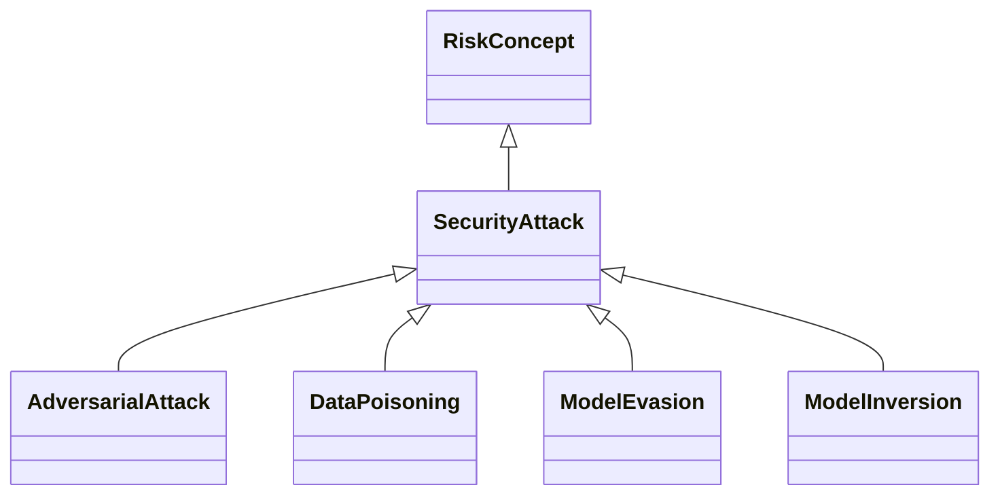

---
search:
  boost: 10.0
---

# Class: SecurityAttack 


_Risks or issues associated with security attacks related to AI_

_technologies, models, and systems_


<div data-search-exclude markdown="1">


URI: [ai:SecurityAttack](https://w3id.org/lmodel/dpv/ai/SecurityAttack)





## Inheritance
* [RiskConcept](RiskConcept.md)
    * **SecurityAttack**
        * [AdversarialAttack](AdversarialAttack.md) [ [RiskConcept](RiskConcept.md)]
        * [DataPoisoning](DataPoisoning.md) [ [RiskConcept](RiskConcept.md)]
        * [ModelEvasion](ModelEvasion.md) [ [RiskConcept](RiskConcept.md)]
        * [ModelInversion](ModelInversion.md) [ [RiskConcept](RiskConcept.md)]


## Class Properties

| Property | Value |
| --- | --- |
| Class URI | [ai:SecurityAttack](https://w3id.org/lmodel/dpv/ai/SecurityAttack) |


## Slots

| Name | Cardinality and Range | Description | Inheritance |
| ---  | --- | --- | --- |


## In Subsets


* [AiSubset](AiSubset.md)


## Aliases


* Security Attack


## Identifier and Mapping Information


### Annotations

| property | value |
| --- | --- |
| upstream_iri | https://w3id.org/dpv/ai/owl#SecurityAttack |
| dpv_extension_slug | ai |


### Schema Source


* from schema: https://w3id.org/lmodel/dpv/ai


## Mappings

| Mapping Type | Mapped Value |
| ---  | ---  |
| self | ai:SecurityAttack |
| native | ai:SecurityAttack |
| exact | dpv_ai:SecurityAttack, dpv_ai_owl:SecurityAttack |


## LinkML Source

<!-- TODO: investigate https://stackoverflow.com/questions/37606292/how-to-create-tabbed-code-blocks-in-mkdocs-or-sphinx -->

### Direct

<details>
```yaml
name: SecurityAttack
annotations:
  upstream_iri:
    tag: upstream_iri
    value: https://w3id.org/dpv/ai/owl#SecurityAttack
  dpv_extension_slug:
    tag: dpv_extension_slug
    value: ai
description: 'Risks or issues associated with security attacks related to AI

  technologies, models, and systems'
in_subset:
- ai_subset
from_schema: https://w3id.org/lmodel/dpv/ai
aliases:
- Security Attack
exact_mappings:
- dpv_ai:SecurityAttack
- dpv_ai_owl:SecurityAttack
is_a: RiskConcept
class_uri: ai:SecurityAttack

```
</details>

### Induced

<details>
```yaml
name: SecurityAttack
annotations:
  upstream_iri:
    tag: upstream_iri
    value: https://w3id.org/dpv/ai/owl#SecurityAttack
  dpv_extension_slug:
    tag: dpv_extension_slug
    value: ai
description: 'Risks or issues associated with security attacks related to AI

  technologies, models, and systems'
in_subset:
- ai_subset
from_schema: https://w3id.org/lmodel/dpv/ai
aliases:
- Security Attack
exact_mappings:
- dpv_ai:SecurityAttack
- dpv_ai_owl:SecurityAttack
is_a: RiskConcept
class_uri: ai:SecurityAttack

```
</details></div>