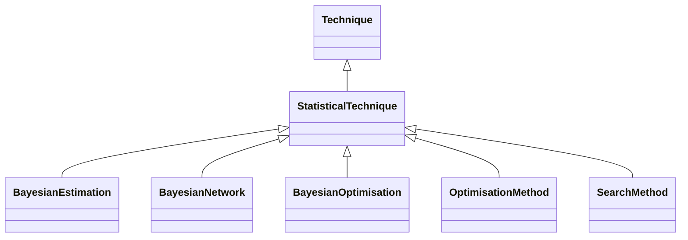

---
search:
  boost: 10.0
---

# Class: StatisticalTechnique 


_Refers to techniques that are based on statistics_


<div data-search-exclude markdown="1">


URI: [ai:StatisticalTechnique](https://w3id.org/lmodel/dpv/ai/StatisticalTechnique)





## Inheritance
* [AI](AI.md)
    * [Technique](Technique.md)
        * **StatisticalTechnique**
            * [BayesianEstimation](BayesianEstimation.md) [ [Technique](Technique.md)]
            * [BayesianNetwork](BayesianNetwork.md) [ [Technique](Technique.md)]
            * [BayesianOptimisation](BayesianOptimisation.md) [ [Technique](Technique.md)]
            * [OptimisationMethod](OptimisationMethod.md) [ [Technique](Technique.md)]
            * [SearchMethod](SearchMethod.md) [ [Technique](Technique.md)]


## Class Properties

| Property | Value |
| --- | --- |
| Class URI | [ai:StatisticalTechnique](https://w3id.org/lmodel/dpv/ai/StatisticalTechnique) |


## Slots

| Name | Cardinality and Range | Description | Inheritance |
| ---  | --- | --- | --- |


## In Subsets


* [AiSubset](AiSubset.md)


## Aliases


* Statistical Technique


## Identifier and Mapping Information


### Annotations

| property | value |
| --- | --- |
| upstream_iri | https://w3id.org/dpv/ai/owl#StatisticalTechnique |
| dpv_extension_slug | ai |


### Schema Source


* from schema: https://w3id.org/lmodel/dpv/ai


## Mappings

| Mapping Type | Mapped Value |
| ---  | ---  |
| self | ai:StatisticalTechnique |
| native | ai:StatisticalTechnique |
| exact | dpv_ai:StatisticalTechnique, dpv_ai_owl:StatisticalTechnique |


## LinkML Source

<!-- TODO: investigate https://stackoverflow.com/questions/37606292/how-to-create-tabbed-code-blocks-in-mkdocs-or-sphinx -->

### Direct

<details>
```yaml
name: StatisticalTechnique
annotations:
  upstream_iri:
    tag: upstream_iri
    value: https://w3id.org/dpv/ai/owl#StatisticalTechnique
  dpv_extension_slug:
    tag: dpv_extension_slug
    value: ai
description: Refers to techniques that are based on statistics
in_subset:
- ai_subset
from_schema: https://w3id.org/lmodel/dpv/ai
aliases:
- Statistical Technique
exact_mappings:
- dpv_ai:StatisticalTechnique
- dpv_ai_owl:StatisticalTechnique
is_a: Technique
class_uri: ai:StatisticalTechnique

```
</details>

### Induced

<details>
```yaml
name: StatisticalTechnique
annotations:
  upstream_iri:
    tag: upstream_iri
    value: https://w3id.org/dpv/ai/owl#StatisticalTechnique
  dpv_extension_slug:
    tag: dpv_extension_slug
    value: ai
description: Refers to techniques that are based on statistics
in_subset:
- ai_subset
from_schema: https://w3id.org/lmodel/dpv/ai
aliases:
- Statistical Technique
exact_mappings:
- dpv_ai:StatisticalTechnique
- dpv_ai_owl:StatisticalTechnique
is_a: Technique
class_uri: ai:StatisticalTechnique

```
</details></div>