---
search:
  boost: 10.0
---

# Class: Technique 


_The underlying technological algorithm, method, or process that forms_

_the technique for using or applying AI_


<div data-search-exclude markdown="1">


URI: [ai:Technique](https://w3id.org/lmodel/dpv/ai/Technique)

```mermaid
 classDiagram
    class Technique
    click Technique href "../Technique/"
      AI <|-- Technique
        click AI href "../AI/"
      

      Technique <|-- AudioProcessing
        click AudioProcessing href "../AudioProcessing/"
      Technique <|-- BayesianEstimation
        click BayesianEstimation href "../BayesianEstimation/"
      Technique <|-- BayesianNetwork
        click BayesianNetwork href "../BayesianNetwork/"
      Technique <|-- BayesianOptimisation
        click BayesianOptimisation href "../BayesianOptimisation/"
      Technique <|-- DecisionTree
        click DecisionTree href "../DecisionTree/"
      Technique <|-- HeuristicProgramming
        click HeuristicProgramming href "../HeuristicProgramming/"
      Technique <|-- InductiveProgramming
        click InductiveProgramming href "../InductiveProgramming/"
      Technique <|-- KnowledgeRepresentation
        click KnowledgeRepresentation href "../KnowledgeRepresentation/"
      Technique <|-- KnowledgeTechnique
        click KnowledgeTechnique href "../KnowledgeTechnique/"
      Technique <|-- LogicTechnique
        click LogicTechnique href "../LogicTechnique/"
      Technique <|-- MachineLearning
        click MachineLearning href "../MachineLearning/"
      Technique <|-- OptimisationMethod
        click OptimisationMethod href "../OptimisationMethod/"
      Technique <|-- ReasoningTechnique
        click ReasoningTechnique href "../ReasoningTechnique/"
      Technique <|-- RuleBasedTechnique
        click RuleBasedTechnique href "../RuleBasedTechnique/"
      Technique <|-- SearchMethod
        click SearchMethod href "../SearchMethod/"
      Technique <|-- StatisticalTechnique
        click StatisticalTechnique href "../StatisticalTechnique/"
      Technique <|-- SymbolicReasoning
        click SymbolicReasoning href "../SymbolicReasoning/"
      

      
```





## Inheritance
* [AI](AI.md)
    * **Technique**
        * [AudioProcessing](AudioProcessing.md)
        * [KnowledgeTechnique](KnowledgeTechnique.md)
        * [LogicTechnique](LogicTechnique.md)
        * [MachineLearning](MachineLearning.md)
        * [ReasoningTechnique](ReasoningTechnique.md)
        * [StatisticalTechnique](StatisticalTechnique.md)


## Class Properties

| Property | Value |
| --- | --- |
| Class URI | [ai:Technique](https://w3id.org/lmodel/dpv/ai/Technique) |


## Slots

| Name | Cardinality and Range | Description | Inheritance |
| ---  | --- | --- | --- |


## In Subsets


* [AiSubset](AiSubset.md)


## Aliases


* Technique


## Comments

* This concept refers to the foundational computational implementation and
is necessary to distinguish the 'algorithm' (ai:Technique) from the
'application' (ai:Capability) and 'goal' (dpv:Purpose)


## Identifier and Mapping Information


### Annotations

| property | value |
| --- | --- |
| upstream_iri | https://w3id.org/dpv/ai/owl#Technique |
| dpv_extension_slug | ai |


### Schema Source


* from schema: https://w3id.org/lmodel/dpv/ai


## Mappings

| Mapping Type | Mapped Value |
| ---  | ---  |
| self | ai:Technique |
| native | ai:Technique |
| exact | dpv_ai:Technique, dpv_ai_owl:Technique |


## LinkML Source

<!-- TODO: investigate https://stackoverflow.com/questions/37606292/how-to-create-tabbed-code-blocks-in-mkdocs-or-sphinx -->

### Direct

<details>
```yaml
name: Technique
annotations:
  upstream_iri:
    tag: upstream_iri
    value: https://w3id.org/dpv/ai/owl#Technique
  dpv_extension_slug:
    tag: dpv_extension_slug
    value: ai
description: 'The underlying technological algorithm, method, or process that forms

  the technique for using or applying AI'
comments:
- 'This concept refers to the foundational computational implementation and

  is necessary to distinguish the ''algorithm'' (ai:Technique) from the

  ''application'' (ai:Capability) and ''goal'' (dpv:Purpose)'
in_subset:
- ai_subset
from_schema: https://w3id.org/lmodel/dpv/ai
aliases:
- Technique
exact_mappings:
- dpv_ai:Technique
- dpv_ai_owl:Technique
is_a: AI
class_uri: ai:Technique

```
</details>

### Induced

<details>
```yaml
name: Technique
annotations:
  upstream_iri:
    tag: upstream_iri
    value: https://w3id.org/dpv/ai/owl#Technique
  dpv_extension_slug:
    tag: dpv_extension_slug
    value: ai
description: 'The underlying technological algorithm, method, or process that forms

  the technique for using or applying AI'
comments:
- 'This concept refers to the foundational computational implementation and

  is necessary to distinguish the ''algorithm'' (ai:Technique) from the

  ''application'' (ai:Capability) and ''goal'' (dpv:Purpose)'
in_subset:
- ai_subset
from_schema: https://w3id.org/lmodel/dpv/ai
aliases:
- Technique
exact_mappings:
- dpv_ai:Technique
- dpv_ai_owl:Technique
is_a: AI
class_uri: ai:Technique

```
</details></div>