---
search:
  boost: 10.0
---

# Class: TestingDataRisk 


_Risks and risk concepts related to testing data_


<div data-search-exclude markdown="1">


URI: [ai:TestingDataRisk](https://w3id.org/lmodel/dpv/ai/TestingDataRisk)

```mermaid
 classDiagram
    class TestingDataRisk
    click TestingDataRisk href "../TestingDataRisk/"
      RiskConcept <|-- TestingDataRisk
        click RiskConcept href "../RiskConcept/"
      DataRisk <|-- TestingDataRisk
        click DataRisk href "../DataRisk/"
      

      TestingDataRisk <|-- TestingDataBias
        click TestingDataBias href "../TestingDataBias/"
      TestingDataRisk <|-- TestingDataInaccurate
        click TestingDataInaccurate href "../TestingDataInaccurate/"
      TestingDataRisk <|-- TestingDataInappropriate
        click TestingDataInappropriate href "../TestingDataInappropriate/"
      TestingDataRisk <|-- TestingDataIncomplete
        click TestingDataIncomplete href "../TestingDataIncomplete/"
      TestingDataRisk <|-- TestingDataInconsistent
        click TestingDataInconsistent href "../TestingDataInconsistent/"
      TestingDataRisk <|-- TestingDataMisclassified
        click TestingDataMisclassified href "../TestingDataMisclassified/"
      TestingDataRisk <|-- TestingDataMisinterpretation
        click TestingDataMisinterpretation href "../TestingDataMisinterpretation/"
      TestingDataRisk <|-- TestingDataNoise
        click TestingDataNoise href "../TestingDataNoise/"
      TestingDataRisk <|-- TestingDataOutdated
        click TestingDataOutdated href "../TestingDataOutdated/"
      TestingDataRisk <|-- TestingDataSelectionError
        click TestingDataSelectionError href "../TestingDataSelectionError/"
      TestingDataRisk <|-- TestingDataSparse
        click TestingDataSparse href "../TestingDataSparse/"
      TestingDataRisk <|-- TestingDataUnrepresentative
        click TestingDataUnrepresentative href "../TestingDataUnrepresentative/"
      TestingDataRisk <|-- TestingDataUnstructured
        click TestingDataUnstructured href "../TestingDataUnstructured/"
      TestingDataRisk <|-- TestingDataUnverified
        click TestingDataUnverified href "../TestingDataUnverified/"
      

      
```





## Inheritance
* [RiskConcept](RiskConcept.md)
    * [DataRisk](DataRisk.md)
        * **TestingDataRisk** [ [RiskConcept](RiskConcept.md)]
            * [TestingDataBias](TestingDataBias.md) [ [RiskConcept](RiskConcept.md)]
            * [TestingDataInaccurate](TestingDataInaccurate.md) [ [RiskConcept](RiskConcept.md)]
            * [TestingDataInappropriate](TestingDataInappropriate.md) [ [RiskConcept](RiskConcept.md)]
            * [TestingDataIncomplete](TestingDataIncomplete.md) [ [RiskConcept](RiskConcept.md)]
            * [TestingDataInconsistent](TestingDataInconsistent.md) [ [RiskConcept](RiskConcept.md)]
            * [TestingDataMisclassified](TestingDataMisclassified.md) [ [RiskConcept](RiskConcept.md)]
            * [TestingDataMisinterpretation](TestingDataMisinterpretation.md) [ [RiskConcept](RiskConcept.md)]
            * [TestingDataNoise](TestingDataNoise.md) [ [RiskConcept](RiskConcept.md)]
            * [TestingDataOutdated](TestingDataOutdated.md) [ [RiskConcept](RiskConcept.md)]
            * [TestingDataSelectionError](TestingDataSelectionError.md) [ [RiskConcept](RiskConcept.md)]
            * [TestingDataSparse](TestingDataSparse.md) [ [RiskConcept](RiskConcept.md)]
            * [TestingDataUnrepresentative](TestingDataUnrepresentative.md) [ [RiskConcept](RiskConcept.md)]
            * [TestingDataUnstructured](TestingDataUnstructured.md) [ [RiskConcept](RiskConcept.md)]
            * [TestingDataUnverified](TestingDataUnverified.md) [ [RiskConcept](RiskConcept.md)]


## Class Properties

| Property | Value |
| --- | --- |
| Class URI | [ai:TestingDataRisk](https://w3id.org/lmodel/dpv/ai/TestingDataRisk) |


## Slots

| Name | Cardinality and Range | Description | Inheritance |
| ---  | --- | --- | --- |


## In Subsets


* [AiSubset](AiSubset.md)


## Aliases


* Testing Data Risk


## Identifier and Mapping Information


### Annotations

| property | value |
| --- | --- |
| upstream_iri | https://w3id.org/dpv/ai/owl#TestingDataRisk |
| dpv_extension_slug | ai |


### Schema Source


* from schema: https://w3id.org/lmodel/dpv/ai


## Mappings

| Mapping Type | Mapped Value |
| ---  | ---  |
| self | ai:TestingDataRisk |
| native | ai:TestingDataRisk |
| exact | dpv_ai:TestingDataRisk, dpv_ai_owl:TestingDataRisk |


## LinkML Source

<!-- TODO: investigate https://stackoverflow.com/questions/37606292/how-to-create-tabbed-code-blocks-in-mkdocs-or-sphinx -->

### Direct

<details>
```yaml
name: TestingDataRisk
annotations:
  upstream_iri:
    tag: upstream_iri
    value: https://w3id.org/dpv/ai/owl#TestingDataRisk
  dpv_extension_slug:
    tag: dpv_extension_slug
    value: ai
description: Risks and risk concepts related to testing data
in_subset:
- ai_subset
from_schema: https://w3id.org/lmodel/dpv/ai
aliases:
- Testing Data Risk
exact_mappings:
- dpv_ai:TestingDataRisk
- dpv_ai_owl:TestingDataRisk
is_a: DataRisk
mixins:
- RiskConcept
class_uri: ai:TestingDataRisk

```
</details>

### Induced

<details>
```yaml
name: TestingDataRisk
annotations:
  upstream_iri:
    tag: upstream_iri
    value: https://w3id.org/dpv/ai/owl#TestingDataRisk
  dpv_extension_slug:
    tag: dpv_extension_slug
    value: ai
description: Risks and risk concepts related to testing data
in_subset:
- ai_subset
from_schema: https://w3id.org/lmodel/dpv/ai
aliases:
- Testing Data Risk
exact_mappings:
- dpv_ai:TestingDataRisk
- dpv_ai_owl:TestingDataRisk
is_a: DataRisk
mixins:
- RiskConcept
class_uri: ai:TestingDataRisk

```
</details></div>