---
search:
  boost: 10.0
---

# Class: TrainingTechnique 


_Process to determine or to improve the parameters of a machine learning_

_model based on a machine learning algorithm by using training data_


<div data-search-exclude markdown="1">


URI: [ai:TrainingTechnique](https://w3id.org/lmodel/dpv/ai/TrainingTechnique)

```mermaid
 classDiagram
    class TrainingTechnique
    click TrainingTechnique href "../TrainingTechnique/"
      TrainingTechnique <|-- ConvolutionalNeuralNetwork
        click ConvolutionalNeuralNetwork href "../ConvolutionalNeuralNetwork/"
      TrainingTechnique <|-- DeepLearning
        click DeepLearning href "../DeepLearning/"
      TrainingTechnique <|-- FeedForwardNeuralNetwork
        click FeedForwardNeuralNetwork href "../FeedForwardNeuralNetwork/"
      TrainingTechnique <|-- FrugalMachineLearning
        click FrugalMachineLearning href "../FrugalMachineLearning/"
      TrainingTechnique <|-- GeneticAlgorithm
        click GeneticAlgorithm href "../GeneticAlgorithm/"
      TrainingTechnique <|-- LongShortTermMemory
        click LongShortTermMemory href "../LongShortTermMemory/"
      TrainingTechnique <|-- NeuralNetwork
        click NeuralNetwork href "../NeuralNetwork/"
      TrainingTechnique <|-- RecurrentNeuralNetwork
        click RecurrentNeuralNetwork href "../RecurrentNeuralNetwork/"
      TrainingTechnique <|-- ReinforcementLearning
        click ReinforcementLearning href "../ReinforcementLearning/"
      TrainingTechnique <|-- SelfSupervisedLearning
        click SelfSupervisedLearning href "../SelfSupervisedLearning/"
      TrainingTechnique <|-- SemiSupervisedLearning
        click SemiSupervisedLearning href "../SemiSupervisedLearning/"
      TrainingTechnique <|-- SupervisedLearning
        click SupervisedLearning href "../SupervisedLearning/"
      TrainingTechnique <|-- SupportVectorMachine
        click SupportVectorMachine href "../SupportVectorMachine/"
      TrainingTechnique <|-- TransferLearning
        click TransferLearning href "../TransferLearning/"
      TrainingTechnique <|-- UnsupervisedLearning
        click UnsupervisedLearning href "../UnsupervisedLearning/"
      
      
```





<!-- no inheritance hierarchy -->

## Class Properties

| Property | Value |
| --- | --- |
| Class URI | [ai:TrainingTechnique](https://w3id.org/lmodel/dpv/ai/TrainingTechnique) |


## Slots

| Name | Cardinality and Range | Description | Inheritance |
| ---  | --- | --- | --- |


## In Subsets


* [AiSubset](AiSubset.md)


## Aliases


* Training Technique


## Identifier and Mapping Information


### Annotations

| property | value |
| --- | --- |
| dct_source | ISO/IEC 22989:2022 3.3.15 |
| upstream_iri | https://w3id.org/dpv/ai/owl#TrainingTechnique |
| dpv_extension_slug | ai |


### Schema Source


* from schema: https://w3id.org/lmodel/dpv/ai


## Mappings

| Mapping Type | Mapped Value |
| ---  | ---  |
| self | ai:TrainingTechnique |
| native | ai:TrainingTechnique |
| exact | dpv_ai:TrainingTechnique, dpv_ai_owl:TrainingTechnique |


## LinkML Source

<!-- TODO: investigate https://stackoverflow.com/questions/37606292/how-to-create-tabbed-code-blocks-in-mkdocs-or-sphinx -->

### Direct

<details>
```yaml
name: TrainingTechnique
annotations:
  dct_source:
    tag: dct_source
    value: ISO/IEC 22989:2022 3.3.15
  upstream_iri:
    tag: upstream_iri
    value: https://w3id.org/dpv/ai/owl#TrainingTechnique
  dpv_extension_slug:
    tag: dpv_extension_slug
    value: ai
description: 'Process to determine or to improve the parameters of a machine learning

  model based on a machine learning algorithm by using training data'
in_subset:
- ai_subset
from_schema: https://w3id.org/lmodel/dpv/ai
aliases:
- Training Technique
exact_mappings:
- dpv_ai:TrainingTechnique
- dpv_ai_owl:TrainingTechnique
class_uri: ai:TrainingTechnique

```
</details>

### Induced

<details>
```yaml
name: TrainingTechnique
annotations:
  dct_source:
    tag: dct_source
    value: ISO/IEC 22989:2022 3.3.15
  upstream_iri:
    tag: upstream_iri
    value: https://w3id.org/dpv/ai/owl#TrainingTechnique
  dpv_extension_slug:
    tag: dpv_extension_slug
    value: ai
description: 'Process to determine or to improve the parameters of a machine learning

  model based on a machine learning algorithm by using training data'
in_subset:
- ai_subset
from_schema: https://w3id.org/lmodel/dpv/ai
aliases:
- Training Technique
exact_mappings:
- dpv_ai:TrainingTechnique
- dpv_ai_owl:TrainingTechnique
class_uri: ai:TrainingTechnique

```
</details></div>