---
search:
  boost: 10.0
---

# Class: ValidationDataRisk 


_Risks and risk concepts related to validation data_


<div data-search-exclude markdown="1">


URI: [ai:ValidationDataRisk](https://w3id.org/lmodel/dpv/ai/ValidationDataRisk)

```mermaid
 classDiagram
    class ValidationDataRisk
    click ValidationDataRisk href "../ValidationDataRisk/"
      RiskConcept <|-- ValidationDataRisk
        click RiskConcept href "../RiskConcept/"
      DataRisk <|-- ValidationDataRisk
        click DataRisk href "../DataRisk/"
      

      ValidationDataRisk <|-- ValidationDataBias
        click ValidationDataBias href "../ValidationDataBias/"
      ValidationDataRisk <|-- ValidationDataInaccurate
        click ValidationDataInaccurate href "../ValidationDataInaccurate/"
      ValidationDataRisk <|-- ValidationDataInappropriate
        click ValidationDataInappropriate href "../ValidationDataInappropriate/"
      ValidationDataRisk <|-- ValidationDataIncomplete
        click ValidationDataIncomplete href "../ValidationDataIncomplete/"
      ValidationDataRisk <|-- ValidationDataInconsistent
        click ValidationDataInconsistent href "../ValidationDataInconsistent/"
      ValidationDataRisk <|-- ValidationDataMisclassified
        click ValidationDataMisclassified href "../ValidationDataMisclassified/"
      ValidationDataRisk <|-- ValidationDataMisinterpretation
        click ValidationDataMisinterpretation href "../ValidationDataMisinterpretation/"
      ValidationDataRisk <|-- ValidationDataNoise
        click ValidationDataNoise href "../ValidationDataNoise/"
      ValidationDataRisk <|-- ValidationDataOutdated
        click ValidationDataOutdated href "../ValidationDataOutdated/"
      ValidationDataRisk <|-- ValidationDataSelectionError
        click ValidationDataSelectionError href "../ValidationDataSelectionError/"
      ValidationDataRisk <|-- ValidationDataSparse
        click ValidationDataSparse href "../ValidationDataSparse/"
      ValidationDataRisk <|-- ValidationDataUnrepresentative
        click ValidationDataUnrepresentative href "../ValidationDataUnrepresentative/"
      ValidationDataRisk <|-- ValidationDataUnstructured
        click ValidationDataUnstructured href "../ValidationDataUnstructured/"
      ValidationDataRisk <|-- ValidationDataUnverified
        click ValidationDataUnverified href "../ValidationDataUnverified/"
      

      
```





## Inheritance
* [RiskConcept](RiskConcept.md)
    * [DataRisk](DataRisk.md)
        * **ValidationDataRisk** [ [RiskConcept](RiskConcept.md)]
            * [ValidationDataBias](ValidationDataBias.md) [ [RiskConcept](RiskConcept.md)]
            * [ValidationDataInaccurate](ValidationDataInaccurate.md) [ [RiskConcept](RiskConcept.md)]
            * [ValidationDataInappropriate](ValidationDataInappropriate.md) [ [RiskConcept](RiskConcept.md)]
            * [ValidationDataIncomplete](ValidationDataIncomplete.md) [ [RiskConcept](RiskConcept.md)]
            * [ValidationDataInconsistent](ValidationDataInconsistent.md) [ [RiskConcept](RiskConcept.md)]
            * [ValidationDataMisclassified](ValidationDataMisclassified.md) [ [RiskConcept](RiskConcept.md)]
            * [ValidationDataMisinterpretation](ValidationDataMisinterpretation.md) [ [RiskConcept](RiskConcept.md)]
            * [ValidationDataNoise](ValidationDataNoise.md) [ [RiskConcept](RiskConcept.md)]
            * [ValidationDataOutdated](ValidationDataOutdated.md) [ [RiskConcept](RiskConcept.md)]
            * [ValidationDataSelectionError](ValidationDataSelectionError.md) [ [RiskConcept](RiskConcept.md)]
            * [ValidationDataSparse](ValidationDataSparse.md) [ [RiskConcept](RiskConcept.md)]
            * [ValidationDataUnrepresentative](ValidationDataUnrepresentative.md) [ [RiskConcept](RiskConcept.md)]
            * [ValidationDataUnstructured](ValidationDataUnstructured.md) [ [RiskConcept](RiskConcept.md)]
            * [ValidationDataUnverified](ValidationDataUnverified.md) [ [RiskConcept](RiskConcept.md)]


## Class Properties

| Property | Value |
| --- | --- |
| Class URI | [ai:ValidationDataRisk](https://w3id.org/lmodel/dpv/ai/ValidationDataRisk) |


## Slots

| Name | Cardinality and Range | Description | Inheritance |
| ---  | --- | --- | --- |


## In Subsets


* [AiSubset](AiSubset.md)


## Aliases


* Validation Data Risk


## Identifier and Mapping Information


### Annotations

| property | value |
| --- | --- |
| upstream_iri | https://w3id.org/dpv/ai/owl#ValidationDataRisk |
| dpv_extension_slug | ai |


### Schema Source


* from schema: https://w3id.org/lmodel/dpv/ai


## Mappings

| Mapping Type | Mapped Value |
| ---  | ---  |
| self | ai:ValidationDataRisk |
| native | ai:ValidationDataRisk |
| exact | dpv_ai:ValidationDataRisk, dpv_ai_owl:ValidationDataRisk |


## LinkML Source

<!-- TODO: investigate https://stackoverflow.com/questions/37606292/how-to-create-tabbed-code-blocks-in-mkdocs-or-sphinx -->

### Direct

<details>
```yaml
name: ValidationDataRisk
annotations:
  upstream_iri:
    tag: upstream_iri
    value: https://w3id.org/dpv/ai/owl#ValidationDataRisk
  dpv_extension_slug:
    tag: dpv_extension_slug
    value: ai
description: Risks and risk concepts related to validation data
in_subset:
- ai_subset
from_schema: https://w3id.org/lmodel/dpv/ai
aliases:
- Validation Data Risk
exact_mappings:
- dpv_ai:ValidationDataRisk
- dpv_ai_owl:ValidationDataRisk
is_a: DataRisk
mixins:
- RiskConcept
class_uri: ai:ValidationDataRisk

```
</details>

### Induced

<details>
```yaml
name: ValidationDataRisk
annotations:
  upstream_iri:
    tag: upstream_iri
    value: https://w3id.org/dpv/ai/owl#ValidationDataRisk
  dpv_extension_slug:
    tag: dpv_extension_slug
    value: ai
description: Risks and risk concepts related to validation data
in_subset:
- ai_subset
from_schema: https://w3id.org/lmodel/dpv/ai
aliases:
- Validation Data Risk
exact_mappings:
- dpv_ai:ValidationDataRisk
- dpv_ai_owl:ValidationDataRisk
is_a: DataRisk
mixins:
- RiskConcept
class_uri: ai:ValidationDataRisk

```
</details></div>